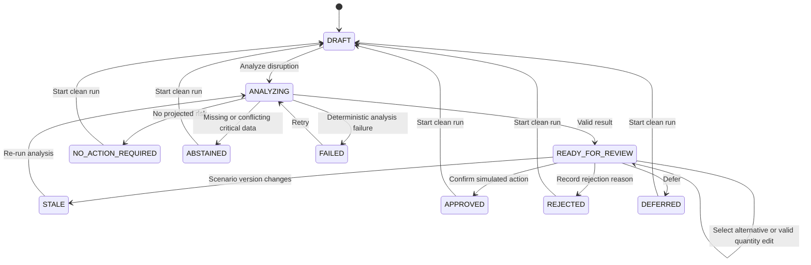

# 01 — Product and UX Specification

**Authority:** Normative product behavior and interaction contract  
**Depends on:** `00_BUILD_CONTRACT.md`  
**Target surface:** Desktop web application at 1440 × 1024  

---

## 0. Phase 1 core-flow override (2026-07-17)

This section is the normative Phase 1 contract and supersedes any older requirement below that would make the primary workspace resemble an analyst console. Compare, Audit, evidence, and technical trace remain available, but they are secondary Records surfaces rather than co-equal tasks.

### 0.1 Representative persona — Jordan

Jordan is a food-bank operations coordinator who is frequently interrupted during receiving, inventory, and distribution work. Jordan understands pounds, deliveries, cold storage, category coverage, and budget constraints, but does not want to operate an AI console or interpret a forecasting dashboard.

Jordan's immediate questions are always:

1. What is wrong?
2. What should I do?
3. Is it safe to approve?

Design implications:

- use plain operational language before technical terms;
- show one active task, one relevant visual, and one primary action at a time;
- keep evidence, assumptions, model metadata, and agent stages behind progressive disclosure;
- preserve the exact simulation notice and repeat the no-external-action consequence at approval and result;
- make interruptions recoverable: the active step and recorded decision must be obvious on return;
- target issue recognition within 10 seconds, recommendation understanding within 30 seconds, and safe approval within two minutes.

This persona remains a design assumption until validated with food-bank staff.

### 0.1.1 Adaptive starting point

The product starts at `/`, not inside a remembered scenario. Home is an adaptive operations briefing with two complementary lanes:

1. a prominent composer for a question or issue Jordan already has; and
2. one verified work item at a time when the system has found something that may need a decision.

The assistant may answer a verified-data question and route Jordan into the matching decision workflow. It may not approve, silently mutate a run, invent a case, or replace the structured review and confirmation steps. Chat is therefore a supporting lane, not the application shell and not the only way to work.

Home uses operational titles such as `Protein coverage may fall below the safe minimum.` Scenario letters, fixture names, partner aliases, and demo memory tests never appear as the task label. `Continue to next item` advances the briefing without adding a card grid or queue dashboard.

### 0.1.2 Agent-first decision contract

The UI distinguishes three things Jordan should never have to infer:

1. **Verified issue queue:** Home shows detected issues and blocking records only. It does not show a recommendation before an agent review has run.
2. **Agent recommendation:** after evaluation, the Nourish Decision Agent turns the verified candidate package into the recommendation Jordan reviews. The surface names the effective agent mode, verified record count, safety check, and human-approval boundary.
3. **Human decision:** approval, edit, reject, and defer remain explicit manager actions. The agent cannot submit them or perform an external action.

The Ask route uses the open-source assistant-ui thread/composer pattern. Every request sends up to the last twelve user/assistant messages plus the current matched work item. The typed operations-agent result is one of `ANSWER`, `CLARIFY`, `DECISION`, or `SAFE_STOP`; it may select only a verified work-item ID. The backend, not the model, renders operational facts from the matched presentation contract. An unrelated or ambiguous request returns `CLARIFY` with no silently selected scenario. The conversation and matched work item survive a browser refresh within the tab.

Live-provider output is labeled `Live agent · verified`. Provider failure produces the same work path through a visible `Verified fallback`; it never changes quantities, rankings, constraints, or approval authority. Scenario E is an agent-matched safe stop followed by a policy lock, with a direct `Ask agent how to resolve this` recovery path and no approval control.

### 0.2 Three-step journey

The UI derives the active step from the backend run state; it does not persist a second workflow state.

| Run state | Visible journey |
|---|---|
| `DRAFT` | Step 1 `Understand the issue` is active; `Check impact` is the sole primary action. |
| Request-local `ANALYZING` | Remain in Step 1 with calm progress copy; technical stages are disclosed on demand. |
| `READY_FOR_REVIEW` | Step 1 is complete, Step 2 `Choose a response` is active, and Step 3 `Confirm` is pending. |
| Approval dialog | Repeats action, quantity, cost, timing, manager reason when applicable, and the simulation consequence. Final action is `Approve simulated action`. |
| `APPROVED` | All steps are complete; lead with `Action completed in simulation`, one before/after visual, and `No external action was taken.` |
| `REJECTED` / `DEFERRED` | Record the decision and unchanged risk without success styling. |
| `ABSTAINED` | Step 1 is complete, Step 2 is blocked, Step 3 is unavailable, and no approval control renders. |

### 0.3 Progressive disclosure

The active recommendation shows only the action, quantity, simulated cost, timing when relevant, operational effect, and `Review and approve`.

- `Show other options` reveals verified feasible alternatives and selection controls.
- `Why did the agent suggest this?` reveals concise rationale and uncertainty.
- `More details` reveals confidence, constraints, rejected options, evidence titles, source IDs, and technical assumptions.
- Reject and Defer live under `More actions`.
- Quantity editing appears only when the backend marks the action editable. A custom amount is previewed by `POST /runs/{runId}/action-previews` before approval; offline mode permits only frozen evaluated quantities.
- Selecting an alternative or edited quantity requires a manager reason and updates the visible recommendation summary.

### 0.4 Shell and navigation

The Phase 1 shell contains `Nourish Ops`, `Home`, `Ask`, `Records`, and an overflow menu. Home owns the adaptive briefing; Ask opens the focused assistant; Records points to the current run's Audit/Compare surfaces. Demo fixtures are developer controls under overflow and are never the primary navigation model. Run ID, connection mode, source IDs, versions, and technical context live under `Decision details` or Records. Existing run route URLs remain unchanged.

### 0.5 Scenario explanation contract

Each decision uses no more than one compact verified visual, always paired with a plain-language summary and an expandable exact-value table.

| Scenario | Explanation |
|---|---|
| A | Four-week coverage bars, 1.5-week minimum, Aug 10 breach, and simulated recovery from 1.3 to 3.0 weeks. |
| B | 50,000 lb full acceptance, 40,000 lb refrigerated capacity, and the recommended partial acceptance staying within capacity. |
| C | 12,000 lb offer versus 6,000 lb target, with the full 12,000 lb redirect as useful disposition. |
| D | $13,000 available, $9,600 response, $3,400 remaining, $22,350 combined need, and $9,350 shortfall. |
| E | A source-comparison surface for conflicting records; no chart and no recommendation. |

### 0.6 Result and feedback

After approval, outcome feedback (`Did the action work?`) is the first optional question. Recommendation-quality feedback is behind `Give feedback on this recommendation`. Receipt IDs, adapter names, and target-system information remain under `Decision details`. Existing backend endpoints and recorded states are preserved.

### 0.7 General case templates

The A–E scenarios are frozen regression fixtures, not user-facing templates. The reusable templates are semantic operational archetypes:

| Archetype | Reusable skeleton |
|---|---|
| `INBOUND_DISRUPTION` | Coverage risk caused by an inbound change; date, category, minimum, recovery, and response are filled from verified analysis. |
| `PERISHABLE_CAPACITY` | Perishable offer versus cold-storage/usable-life constraints. |
| `DONATION_DISPOSITION` | Donation fit, local target, and useful disposition. |
| `RESOURCE_TRADEOFF` | Available resource versus competing needs and residual risk. |
| `DATA_RECONCILIATION` | Conflicting or missing records that block safe action. |

The backend emits one typed `DecisionPresentation` for issue, recommendation, visual, result, questions, and details. The generic frontend renders that contract and does not branch on Scenario A–E. Adding a new package that matches an existing archetype must require verified data and solver mapping—not new scenario copy in the UI.

## 1. Operator contract

### 1.1 Primary operator

The P0 operator is Jordan, the representative food-bank operations coordinator defined in §0.1.

For the synthetic proof-of-concept, assume the operator:

- reviews supply risk at least weekly and when an inbound disruption or donation offer arrives;
- understands pounds, weekly distribution, inbound status, budget, and storage constraints;
- does not want a forecasting tutorial or an open-ended chatbot;
- needs to know what changed, what is at risk, which response is feasible, why it ranks first, and what remains uncertain;
- can approve, edit, reject, or defer a proposed action;
- expects consequential actions to remain in existing operational systems;
- has approximately two minutes to understand a single recommendation;
- uses a laptop or desktop, sometimes mirrored to a projector.

This persona is a clearly labeled design assumption until validated with a real food-bank operator.

### 1.2 Top jobs

1. **Understand the disruption:** determine which input changed and whether it creates a meaningful category risk.
2. **Choose a response:** compare only the actions actually available under timing, budget, storage, usable-life, and data-quality constraints.
3. **Preserve accountability:** record the human decision, reason, evidence, rules, versions, and simulated outcome.

### 1.3 Trust requirements

The operator must be able to answer these questions without reading generated prose longer than 120 words:

- Which category is at risk, and when?
- Is this based on conservative or expected supply?
- What changed?
- Which records support the conclusion?
- What quantity, timing, and cost are proposed?
- Which hard constraints passed?
- Why did the alternatives rank lower or fail?
- What is assumed or missing?
- What changes after approval?
- Did the application take a real external action?

## 2. Product principles

1. **One decision dominates the screen.** Summary metrics support the decision; they are not the product.
2. **Verified structure beats generated prose.** Use tables, evidence rows, status text, and concise explanations.
3. **Total pounds remain secondary.** Category coverage and the active risk receive stronger hierarchy.
4. **The conservative view is the decision default.** Expected supply is visible as a comparison, never silently substituted.
5. **AI activity is inspectable.** Show completed tool stages and their outputs, not hidden reasoning or theatrical “thinking.”
6. **Every consequential transition is explicit.** Approval always names the action and states that it is simulated.
7. **No result without provenance.** Metrics and claims link to fixture, policy, inbound, action, or engine-version records.
8. **Failure is a designed state.** Missing data, no feasible action, stale analysis, and model failure are first-class experiences.
9. **Calm over clever.** Operational readability, restrained status color, and stable layout matter more than visual novelty.

## 3. Information architecture

The application has an adaptive entry, a supporting assistant, and the existing decision/record destinations.

```text
NourishOps
├── Home                /
├── Ask                 /assistant
├── Decision workspace  /runs/:runId
├── Compare             /runs/:runId/compare
└── Audit               /runs/:runId/audit
```

Global controls:

- scenario selector;
- mode indicator: `Offline verified mode` or `Live explanation mode`;
- current run ID;
- `Start clean run`;
- persistent simulation notice.

The scenario selector changes the proposed new run but does not mutate the current run. Selecting another scenario opens a confirmation before starting it.

### 3.1 Decision workspace

The workspace owns the full P0 loop:

- scenario and disruption context;
- risk detection;
- evidence and assumptions;
- recommendation and alternatives;
- manager decision;
- simulated before/after result.

Overview, category detail, and recommendation review are states of this workspace, not separate routes.

### 3.2 Compare

The comparison view shows the same frozen starting state under:

- no intervention;
- the specified simple-reorder baseline;
- the original agent recommendation;
- `Manager selection`, only when the manager selected a different feasible alternative or valid edited quantity.

It never compares results from different runs, scenario versions, or starting inventories.

The first three policy rows map to golden keys `NO_INTERVENTION`, `SIMPLE_REORDER`, and `AGENT_ACTION`. The UI labels `AGENT_ACTION` as `Original agent recommendation`. Do not add a duplicate manager row when the pending/approved selection is unchanged. If it differs only by action, label the fourth row `Manager-selected alternative`; if quantity differs, label it `Manager-edited plan`. The manager row is derived server-side from the same `analysis_snapshot_hash` and decision/preview revision and is never substituted for the original agent row.

In committed `DRAFT`, `FAILED`, or `ABSTAINED`, or while the current browser request is transiently `ANALYZING`, Compare shows no fabricated policy results. It displays the current state, `Analyze disruption to compare response policies.` when analysis is available, and a link back to Decision. `NO_ACTION_REQUIRED` shows the verified no-intervention result and explains why response-policy rows do not exist.

### 3.3 Audit

The audit view shows append-only events for the selected run, with an optional event-type filter. A run contains exactly one scenario, so there is no redundant scenario filter. It must make the following inspectable:

- timestamps;
- run, scenario, fixture, rules, engine, prompt, and model/fallback versions;
- imported notice and parsed fields;
- detected risk;
- recommendation and alternatives;
- manager selection and edited quantity;
- approval, rejection, or deferral;
- override reason;
- simulated outcome;
- source IDs.

### 3.4 Run identity, bootstrap, and refresh

- Every working route contains the canonical backend `run_id` in the path as shown above.
- Refreshing or directly opening any valid run URL performs only `GET` requests and restores the server-folded state; it never creates a run.
- `/` is a bootstrap route, not a fourth destination. It redirects to the run ID stored in `sessionStorage` when that run still exists. If none exists, it performs one idempotent `POST /api/v1/runs` for Scenario A, stores the returned run ID, and replaces the URL with `/runs/{run_id}`.
- The bootstrap idempotency key is retained in `sessionStorage` until the create response succeeds, so a lost response or reload cannot create a duplicate run.
- An unknown run URL shows a not-found state with an explicit `Start new Scenario A run` control; it does not create a run automatically.
- `Start clean run` and scenario-change confirmation create a new run, store its ID, and navigate to its Decision route.
- Prior runs remain retrievable through their known direct URLs and exports. A run-history browser or cross-run scenario filter is not a P0 feature.

## 4. Primary interaction journey

### 4.1 Clean start

On initial load:

- Scenario A is selected.
- A new `DRAFT` run is created from immutable fixtures.
- The imported synthetic disruption notice is visible but unapplied.
- The baseline category context is visible.
- The only primary action is `Analyze disruption`.
- Recommendation, comparison, and outcome sections do not show fabricated placeholder results.

### 4.2 Analyze disruption

When the operator selects `Analyze disruption`:

1. Disable repeated submission.
2. Show request-local UI state `ANALYZING`; the server retains the last committed state until the atomic evaluation transaction succeeds or fails.
3. Parse or load the cached extraction from the notice.
4. Validate and reconcile the extracted event with the known inbound record.
5. Execute the deterministic tool sequence.
6. If successful, commit `READY_FOR_REVIEW`.
7. If decision-critical data are absent, commit `ABSTAINED`.
8. If the live explanation fails but deterministic analysis succeeds, remain successful and render the offline explanation.
9. If deterministic analysis fails, commit `FAILED` without changing scenario facts.

During analysis, show only completed or active stages:

- `Reading disruption notice`
- `Validating supply records`
- `Projecting four-week coverage`
- `Checking available responses`
- `Preparing decision brief`

Do not invent delays so the animation appears more agentic. In offline mode the stages may complete immediately.

### 4.3 Review recommendation

In `READY_FOR_REVIEW`, the workspace must show:

1. **Decision status:** `Decision ready`.
2. **Risk statement:** category, first breach week, projected weeks of supply, minimum, and gap-to-target.
3. **What changed:** normalized disruption event and original source notice.
4. **Projection:** four forecast weeks with conservative and expected views and minimum/target lines.
5. **Recommended response:** action, quantity, arrival, cost, expected usable quantity, gap reduction, confidence, and score.
6. **Hard constraints:** named pass results.
7. **Other feasible actions:** ordered alternatives with the same comparison fields.
8. **Not feasible in this scenario:** rejected actions and exact constraint reasons.
9. **Evidence and assumptions:** expandable source records and deterministic assumptions.
10. **Human controls:** approve, edit quantity, reject, or defer.

The original agent recommendation remains visually identified after the manager selects an alternative.

### 4.4 Select an alternative

Selecting a feasible alternative:

- changes the pending manager selection, not the original recommendation;
- runs the same simulation and constraint checks;
- updates the pending before/after preview;
- does not create an audit decision event until approve, reject, or defer;
- displays `Manager-selected alternative` near the selected action;
- reveals a required text area labeled `Reason for choosing this alternative` directly below the selected-action summary;
- accepts 1–500 non-whitespace characters, shows `Enter a reason for choosing a non-recommended action.` when empty, and keeps approval disabled until valid.

### 4.5 Edit quantity

`Edit quantity` opens a focused dialog or inline editor showing:

- action name and immutable action ID;
- currently selected quantity;
- minimum, maximum, and increment;
- unit cost and recalculated total cost when applicable;
- capacity and lead-time summary;
- required text area `Reason for changing the recommended quantity`, 1–500 non-whitespace characters;
- `Recheck plan` and `Cancel`.

The only editable field is quantity.

`Recheck plan`:

- calls the non-mutating backend action-preview endpoint; the browser performs no domain calculation;
- validates parsing, range, increment, budget, capacity, usable life, timing, and authorization;
- validates the required edit reason and shows `Enter a reason for changing the recommended quantity.` when empty;
- shows all failures beside the relevant field and keeps approval disabled;
- resimulates the action when valid;
- returns to the review state with `Manager-edited quantity`, the recorded reason, and a before/after preview.

### 4.6 Approve

The primary control reads `Approve simulated action`.

Confirmation title:

> Apply this action to the simulation?

Confirmation body:

> This updates only the current synthetic run. It will not place an order, reserve food, contact a donor, or notify another organization.

The confirmation also repeats the exact selected action ID, quantity, cost, and arrival. When the manager chose a non-top alternative or edited quantity, it shows the entered reason under `Manager reason`. The primary confirmation control remains `Approve simulated action`; the secondary control is `Cancel`.

After confirmation:

- use an idempotency key and disable repeat submission;
- append the manager-decision and simulated-action events;
- recalculate projections from the run's frozen starting state plus the approved event;
- move the run to `APPROVED`;
- show `Simulation updated`;
- show the exact before/after metrics and remaining risks;
- offer `View comparison` and `View audit record`;
- do not offer undo. A clean reset creates another run.

Success note:

> No external action was taken.

### 4.7 Reject

Reject requires a non-empty manager reason.

- Open a confirmation dialog with required text area `Reason for rejecting`, 1–500 non-whitespace characters, inline error `Enter a reason for rejecting this recommendation.`, primary action `Reject recommendation`, and `Cancel`.
- Do not mutate the projection.
- Append the recommendation, selection, rejection, and reason.
- Move the run to `REJECTED`.
- Keep the original risk visible.
- Offer `View audit record` and `Start clean run`.

### 4.8 Defer

Deferral accepts an optional note.

- Open a confirmation dialog with optional text area `Deferral note`, maximum 500 characters, primary action `Defer decision`, and `Cancel`.
- Do not mutate the projection.
- Append the deferral event.
- Move the run to `DEFERRED`.
- Keep the risk unresolved.
- Show `Decision deferred — projection unchanged`.

### 4.9 Start clean run

Control label: `Start clean run`.

Confirmation text:

> Start a new run from the original synthetic fixture? The current run and its audit history will remain unchanged.

The confirmation actions are `Start clean run` and `Cancel`; there is no text field.

On confirmation:

- create a new run ID;
- reload the selected immutable scenario version;
- set state to `DRAFT`;
- never delete prior audit records.

## 5. State model

`ANALYZING` in this journey diagram is browser/request-transient, not a persisted run state. A GET during or after a refresh returns the last committed server state (`DRAFT`, `STALE`, or `FAILED`) until evaluation commits one terminal analysis outcome. Reusing the same evaluation idempotency key safely resumes or replays the request.



### 5.1 Run states

| State | Meaning | Available primary action |
|---|---|---|
| `DRAFT` | Immutable fixture loaded; disruption not analyzed | Analyze disruption |
| `ANALYZING` | Transient browser/request state while parsing and deterministic tools run; never restored as a committed state | None; prevent duplicate submission |
| `READY_FOR_REVIEW` | Valid recommendation and alternatives exist | Approve simulated action |
| `NO_ACTION_REQUIRED` | Analysis found no actionable risk in the four-week horizon | Start clean run |
| `STALE` | Input/rule version changed after analysis | Re-run analysis |
| `APPROVED` | Simulated action applied to this run | View comparison |
| `REJECTED` | Manager rejected the selection | Start clean run |
| `DEFERRED` | Manager deferred; projection unchanged | Start clean run |
| `ABSTAINED` | No valid recommendation may be issued | Start clean run |
| `FAILED` | Deterministic analysis failed | Retry analysis |

### 5.2 Risk states

- `OPEN`
- `PENDING_DECISION`
- `RESOLVED_IN_SIMULATION`
- `DEFERRED`
- `UNRESOLVED_NO_FEASIBLE_ACTION`
- `STALE`

## 6. Workspace content specification

The exact visual layout comes from `02_VISUAL_SYSTEM_AND_SCREEN_REFERENCE.md`. This section controls content and hierarchy.

### 6.1 Persistent application frame

Must contain:

- `NourishOps` wordmark;
- descriptor `Nutrition-Aware Supply Resilience` where space permits;
- navigation for `Decision`, `Compare`, and `Audit`;
- active scenario and run ID;
- mode indicator;
- clean-run control;
- persistent simulation notice.

### 6.2 Draft workspace

Above the fold:

- scenario name and one-sentence setup;
- imported disruption notice with source, received time, and synthetic label;
- baseline total pounds as secondary context;
- category coverage strip or concise table;
- `Analyze disruption`.

Do not show an empty recommendation card.

### 6.3 Review workspace

Above the fold:

- active risk statement;
- breach date and conservative coverage;
- compact four-week projection;
- selected recommendation with quantity, timing, cost, and expected effect;
- `Approve simulated action`.

Supporting information may sit below or in contextual panels:

- notice and evidence;
- tool-stage trace;
- assumptions;
- feasible alternatives;
- rejected options;
- full numeric table.

### 6.4 Result workspace

Above the fold:

- decision outcome;
- selected/edited action;
- before/after minimum coverage;
- before/after gap, cost, storage, and unresolved-risk summary;
- simulation-only note;
- comparison and audit links.

### 6.5 Compare content

Required columns or rows:

- policy;
- selected action, if any;
- first minimum-breach week, or `None in horizon`;
- essential categories above minimum for each of the four weeks, shown as `n of 5`;
- nutrition-weighted coverage;
- stockout weeks;
- purchase cost;
- projected expiry spoilage;
- hard-constraint evaluation (`Not applicable`, `Passed`, or exact violation codes).

The agent policy cannot use a different starting state than the baselines.

### 6.6 Audit content

Use one chronological event surface, not individual cards per event. Each row must reveal a details view with inputs, outputs, source IDs, and versions.

## 7. Scenario-specific UX

### 7.1 Scenario A — USDA delay

- Start in `DRAFT` with the synthetic delay notice.
- Live mode visibly extracts the known inbound ID, revised date, and status.
- Review state emphasizes the week-2 protein breach and fixed purchase recommendation.
- Feasible alternatives are the fixed transfer request and targeted donor request in golden rank order.
- `ACT-A-MONITOR` remains visible under `Not feasible in this scenario` with its deterministic `MONITOR_NOT_SAFE` reason; it is not presented as an alternative.

### 7.2 Scenario B — short-life produce

- Emphasize offered pounds versus safe usable pounds.
- Show remaining usable life, refrigerated headroom, and distribution capacity together.
- The primary recommendation must state the exact partial-accept quantity.
- Full acceptance must appear under `Not feasible in this scenario` with reasons.

### 7.3 Scenario C — donation mismatch

- Show that total pounds increase while staff-defined essential coverage does not.
- Avoid language that calls snacks “bad” or donors “low quality.”
- Use `Does not address a current priority gap`.
- Recommended redirect must name only the synthetic catalog destination.

### 7.4 Scenario D — budget conflict

- Present protein and dairy risks with a shared budget.
- Explain the selected single action and the unresolved consequence for the other category.
- Never imply that the ranking is a clinical or household-level nutrition judgment.

### 7.5 Scenario E — missing/conflicting data

- Render an `ABSTAINED` decision state rather than an empty recommendation.
- State each missing or conflicting field, its source record, and why it affects the decision.
- Primary text: `A safe recommendation cannot be produced from the current data.`
- Do not allow approval.

## 8. Required non-happy states

| Condition | Required behavior and copy |
|---|---|
| No risk found | `No category is projected below its minimum in the four-week conservative view.` Offer evidence and clean reset; do not invent an action. |
| No feasible action | Move to `ABSTAINED` with reason `NO_FEASIBLE_ACTION`. Show `No catalog action satisfies the current constraints.`, every failed rule, and the unresolved risk. Show no approve, reject, or defer control; `Start clean run` is the primary action. |
| Missing critical field | Move to `ABSTAINED`; list the exact field and source record. |
| Conflicting records | Move to `ABSTAINED`; show both values without selecting one. |
| Invalid fixture arithmetic | Block analysis: `This synthetic scenario did not pass validation.` Show record IDs and equations. |
| Live LLM timeout | Continue with cached extraction/templates: `Live explanation unavailable. Showing verified offline analysis.` |
| Invalid LLM output | Discard it, use fallback, and never display unverified text or values. |
| Deterministic service failure | `The simulation could not be completed. No scenario data or decisions were changed.` Offer retry. |
| Database write failure | Keep confirmation unresolved and show `The decision was not recorded. Try again.` Do not show success. |
| Duplicate approval | Return the existing decision and show one success state; do not append a second action. |
| Stale recommendation | Disable approval: `Inputs changed after this analysis. Re-run before deciding.` |
| Invalid edited quantity | Explain range/increment or failed constraints beside the field; keep approval disabled. |
| Empty audit | `No events have been recorded for this run.` |

## 9. Content and formatting rules

### 9.1 Key labels

| Purpose | Required label |
|---|---|
| Primary analysis action | `Analyze disruption` |
| Recommendation heading | `Recommended response` |
| Alternative heading | `Other feasible actions` |
| Rejected options | `Not feasible in this scenario` |
| Evidence section | `Why this is at risk` |
| Tool summary | `What the agent checked` |
| Approval | `Approve simulated action` |
| Quantity edit | `Edit quantity` |
| Reset | `Start clean run` |
| Result success | `Simulation updated` |
| Abstention | `Recommendation withheld` |

### 9.2 Numeric formatting

- Pounds: whole numbers with separators and `lb`, for example `12,000 lb`.
- Weeks of supply: one decimal plus `weeks`, for example `1.4 weeks`.
- Currency: whole dollars in primary UI; retain cents in evidence/API details.
- Percentages and probabilities: whole percentages unless values would collide after rounding.
- Coverage score: whole percentage in UI and four-decimal value in audit details.
- Dates: `Aug 10, 2026` in UI and ISO `2026-08-10` in evidence/audit.
- Week labels: `Week 2 · Aug 10` rather than an unexplained `W2`.
- Negative inventory is never displayed. Show `0 lb` and unmet distribution separately.

### 9.3 Language rules

- Prefer `projected`, `simulated`, `staff-defined`, and `catalog action`.
- Never say `optimal`; use `highest-ranked under these assumptions`.
- Never say `AI decided`; use `the agent recommends` and identify human authority.
- Never call category weights clinical nutrition scores.
- Never call distribution a complete measure of community demand.
- Never expose hidden chain-of-thought. Show sources, rules, tool outputs, and concise explanations.
- Explanations must be skimmable and no more than 120 words in the primary view.

## 10. Data visualization contract

### 10.1 Four-week projection

Must show:

- weeks on the horizontal axis;
- weeks of supply on the vertical axis;
- conservative projection as the visually primary solid series;
- expected projection as a secondary dashed series;
- minimum threshold as a labeled danger line;
- target threshold as a quieter reference line;
- breach point labeled with date and value;
- action-adjusted series only after an action is selected;
- direct labels or a compact legend;
- exact values in tooltips and a table alternative.

Do not use a dual vertical axis.

### 10.2 Scenario comparison

Prefer an aligned table and small before/after bars over radar charts, gauges, or decorative score rings.

### 10.3 Capacity

Use labeled linear utilization bars with current/projected pounds and capacity. Do not rely on red/green alone.

## 11. Accessibility and responsive behavior

Target WCAG 2.2 AA for the P0 flow.

Required:

- full keyboard operation for navigation, scenario selection, evidence disclosure, alternative selection, edit, confirmation, and audit details;
- visible focus that remains visible against every surface;
- semantic headings, landmarks, tables, fields, and dialogs;
- focus moves into dialogs and returns to the invoking control;
- status and errors announced through an appropriate live region without repeated chatter;
- text plus icon/shape for risk, confidence, pass, fail, and uncertainty;
- 4.5:1 body-text contrast and 3:1 large-text/non-text UI contrast;
- minimum 44 × 44 CSS-pixel touch/click targets where practical;
- reduced-motion support;
- chart summaries and accessible data tables;
- no information conveyed through hover alone;
- errors tied programmatically to their fields;
- no horizontal page scrolling at 1280 CSS pixels and 200% zoom for the primary flow;
- core functionality remains usable down to 640 CSS pixels, including a 1280-pixel desktop viewport at 200% zoom, with stacked panels;
- below 900 CSS pixels, a non-blocking `Designed for desktop review` notice may appear, but it must not replace or disable the core flow.

Projector mode must keep risk, recommendation, primary action, and synthetic label readable without browser zoom at 1440 × 1024.

## 12. P1 only after P0 passes

- natural-language questions about already verified results;
- editable policy weights;
- upload of a conforming synthetic file;
- downloadable PDF/CSV decision brief;
- recurring alerts;
- scenario authoring;
- multi-location modeling;
- outreach drafting.

P1 controls must not appear as disabled or fake elements in the P0 interface.
