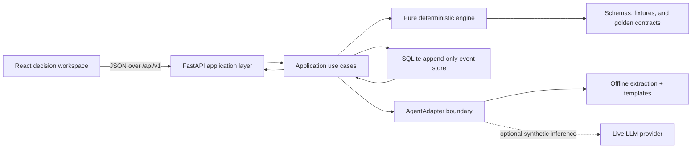

# 05 — Architecture and Runbook

**Status:** Normative for implementation and operation  
**Product:** NourishOps — Nutrition-Aware Supply Resilience  
**System type:** Local-first, synthetic, human-approved proof-of-concept  
**Primary contract:** [`00_BUILD_CONTRACT.md`](./00_BUILD_CONTRACT.md)

---

## 1. Purpose and authority

This document freezes how NourishOps is assembled, run, tested, reset, and observed. It is deliberately optimized for a repeatable hackathon demonstration, transparent behavior, and clean implementation boundaries—not production scale.

The calculation, state-transition, and agent semantics in [`04_DECISION_AND_AGENT_CONTRACT.md`](./04_DECISION_AND_AGENT_CONTRACT.md) remain authoritative. The schemas and synthetic facts in [`03_DATA_AND_SCENARIO_CONTRACT.md`](./03_DATA_AND_SCENARIO_CONTRACT.md), `schemas/`, `fixtures/`, and `golden/` remain authoritative. This file owns module placement, runtime boundaries, API transport, persistence mechanics, configuration, commands, and operational behavior.

If implementation convenience conflicts with a frozen contract, the implementation changes; the contract and golden data do not silently change.

---

## 2. Frozen architecture decisions

| Concern | P0 decision |
|---|---|
| Frontend | React + TypeScript + Vite |
| Frontend styling | Semantic HTML, CSS Modules, and CSS custom properties implementing `02_VISUAL_SYSTEM_AND_SCREEN_REFERENCE.md`; no generic component theme |
| Charts | Recharts, pinned in `package-lock.json`; every chart has an accessible table alternative |
| Backend | Python 3.12 + FastAPI + Pydantic |
| Deterministic engine | Pure Python domain functions with no HTTP, database, clock, random, UI, or LLM dependency |
| Persistence | Local SQLite containing insert-only run metadata, append-only run/decision events, idempotency records, and a version-keyed explanation cache |
| Fixture storage | Versioned JSON under `BUILD_CONTEXT/fixtures/`; no second editable copy |
| Contract storage | JSON Schemas under `BUILD_CONTEXT/schemas/` and golden results under `BUILD_CONTEXT/golden/` |
| Agent | Provider-neutral adapter with one deterministic offline implementation and one optional live provider implementation |
| Default mode | `offline`; no API key or network is required |
| Authentication | None in P0; the server binds to loopback by default |
| External writes | None. Approval changes only the local simulated run and audit event stream |
| Deployment | Local laptop is the supported demo target; a hosted synthetic demo is optional and non-authoritative |

The application is a **durable proof-of-concept**, not a production food-bank system. It contains no real organization, client, donor, vendor, pantry, or shipment data.

---

## 3. Runtime modes

### 3.1 Offline demo mode — required and default

- Loads local fixtures and the cached structured extraction for the hero notice.
- Runs the same deterministic validation, forecasting, risk, action, constraint, simulation, and ranking code used in live mode.
- Creates explanations from deterministic templates populated only with verified output fields.
- Makes no network request after dependencies have been installed.
- Displays `Offline verified mode` in the analysis trace; this is a mode indicator, not an error.
- Must complete the full Scenario A judge path from a clean run.

### 3.2 Live-agent mode — optional

- Requires an explicitly configured provider adapter, model identifier, and secret.
- Sends only synthetic scenario context and the synthetic unstructured notice.
- Allows the model to extract notice fields, select permitted read-only tools, and phrase an explanation within the authority in the agent contract.
- Revalidates extraction and structured output server-side.
- Uses deterministic tool output as the only source of numbers, IDs, evidence, feasibility, scores, rankings, and state transitions.
- Falls back to offline extraction and explanation on timeout, provider error, schema failure, unsupported claim, or version mismatch.

### 3.3 Test mode — required

- Uses an isolated temporary SQLite file per test worker.
- Injects a fixed UTC clock, deterministic ID generator, and scenario seed.
- Uses a mocked agent adapter; tests never require a provider key.
- Disables animations and uses the fixed locale, timezone, fonts, and viewport defined in the visual specification.

### 3.4 Optional hosted demo mode

Hosted execution is permitted only after the local offline verification gate passes. It must use the same built assets and backend, synthetic fixtures, SQLite schema, and test suite. It must not add authentication, production integrations, telemetry containing prompts, or a separate calculation path.

The local path remains the recovery path if hosting fails.

---

## 4. System topology



There are only three trust domains:

1. **Untrusted input:** the synthetic operations notice and any live-model text.
2. **Trusted deterministic core:** validated fixtures, policy, formulas, action catalog, constraints, simulations, rankings, state machine, and source IDs.
3. **Trusted human transition:** a manager action received from an explicit UI control and validated by the backend.

The browser is not trusted to calculate a result or authorize a state transition. The LLM is not trusted to write a decision.

---

## 5. Repository contract

The coding engine must create this structure. It may add small colocated test or support files, but it may not move contract assets or introduce a second domain implementation.

```text
/
├── BUILD_CONTEXT/
│   ├── 00_BUILD_CONTRACT.md
│   ├── 01_PRODUCT_AND_UX_SPEC.md
│   ├── 02_VISUAL_SYSTEM_AND_SCREEN_REFERENCE.md
│   ├── 03_DATA_AND_SCENARIO_CONTRACT.md
│   ├── 04_DECISION_AND_AGENT_CONTRACT.md
│   ├── 05_ARCHITECTURE_AND_RUNBOOK.md
│   ├── 06_ACCEPTANCE_EVALUATION_AND_DEMO.md
│   ├── schemas/
│   ├── fixtures/
│   ├── golden/
│   └── visual-references/
├── apps/
│   └── web/
│       ├── src/
│       │   ├── api/                 # typed HTTP client and response guards
│       │   ├── components/          # visual primitives from the selected system
│       │   ├── features/
│       │   │   ├── workspace/
│       │   │   ├── compare/
│       │   │   └── audit/
│       │   ├── routes/
│       │   ├── styles/
│       │   └── test/
│       ├── e2e/
│       ├── package.json
│       ├── package-lock.json
│       ├── tsconfig.json
│       └── vite.config.ts
├── src/
│   └── nourishops/
│       ├── domain/                  # pure types, formulas, rules, simulations
│       ├── application/             # use cases and state-machine coordination
│       ├── agents/                  # interface, offline adapter, optional live adapter
│       ├── persistence/             # SQLite schema, event store, cache
│       ├── api/                     # FastAPI routes, transport models, error mapping
│       ├── cli/                     # seed, reset, export, doctor commands
│       └── settings.py
├── tests/
│   ├── unit/
│   ├── contracts/
│   ├── golden/
│   ├── integration/
│   └── red_team/
├── scripts/
│   ├── dev.sh
│   ├── start.sh
│   └── verify_clean.sh
├── .env.example
├── .gitignore
├── .python-version
├── Makefile
├── pyproject.toml
├── uv.lock
└── README.md
```

Generated files belong only in `.local/`, `apps/web/dist/`, Python caches, or test-report directories and are gitignored. The application must not rewrite anything under `BUILD_CONTEXT/`.

---

## 6. Module boundaries

### 6.1 Frontend

The frontend owns:

- route and workspace composition;
- rendering server-provided values and provenance;
- interaction drafts, including an unsubmitted edited quantity;
- accessible focus, keyboard behavior, charts, tables, dialogs, notices, and errors;
- sending explicit manager decisions with an idempotency key;
- showing mode, synthetic-data, stale-data, and fallback status.

The frontend may format a server value for display according to the UX spec. It may not recompute inventory, weeks of supply, gaps, scores, feasibility, confidence, quantities, costs, rankings, or simulated effects. It must not optimistically show a consequential decision as saved before the backend responds.

### 6.2 API transport

FastAPI routes own:

- request parsing and schema validation;
- request IDs and idempotency enforcement;
- translating use-case results into versioned response envelopes;
- mapping typed application errors to the status/error matrix;
- never exposing stack traces, secrets, raw provider payloads, or chain-of-thought.

Routes must be thin. Domain calculations do not live in route handlers.

### 6.3 Application layer

Application use cases own:

- creating a `DRAFT` run from an immutable base snapshot plus a separate unapplied staged overlay;
- applying only that staged synthetic overlay to an isolated analysis clone during Evaluate;
- folding events into current run state;
- calling deterministic tools in the allowed state order;
- calling an agent adapter for extraction/orchestration/explanation;
- revalidating live-agent output;
- recording manager transitions and simulated outcomes atomically;
- producing comparison and audit views.

### 6.4 Deterministic domain engine

The engine owns every externally observable fact and result:

- validation;
- four-week forecast and projections;
- conservative and expected views;
- risk and gap detection;
- action generation from the catalog;
- all hard constraints and rejection reasons;
- quantity bounds and edit validation;
- action effects, scoring, confidence, ties, and ranking;
- no-intervention and simple-reorder baselines;
- before/after simulation.

Domain functions accept typed values plus explicit configuration, clock, and seed when needed. They return typed values. They must not import FastAPI, SQLite, a provider SDK, environment variables, or frontend code.

### 6.5 Agent adapters

The interface is:

```text
AgentAdapter
├── extract_notice(untrusted_notice, extraction_contract) -> verified extraction candidate
├── orchestrate(read_only_tool_registry, analysis_goal) -> ordered read-only trace
└── explain(decision_package, explanation_contract) -> structured narrative
```

The final request/response schemas and tool order are defined in `04_DECISION_AND_AGENT_CONTRACT.md`. `record_manager_decision` is never present in the LLM tool registry.

Provider SDK types must not escape the live adapter module.

### 6.6 Persistence

Persistence owns serialization and transactions only. It may not infer current business state, recalculate decisions, or edit a prior event.

---

## 7. Run and decision lifecycle

The canonical committed run states are the durable states in `01_PRODUCT_AND_UX_SPEC.md`:

```text
DRAFT ──atomic evaluate──→ READY_FOR_REVIEW → APPROVED
  │                            ├→ REJECTED
  │                            ├→ DEFERRED
  │                            └→ STALE ──atomic re-evaluate──→ analysis outcome
  ├──────────────────────────→ NO_ACTION_REQUIRED
  ├──────────────────────────→ ABSTAINED
  └──────────────────────────→ FAILED ──atomic retry──→ analysis outcome
```

`ANALYZING` is a browser/request-transient presentation state only. It is not stored or folded from events. While evaluation is in flight, the committed state remains `DRAFT`, `STALE`, or `FAILED`; a refresh returns that state, and the same idempotency key safely resumes or replays the evaluation.

Validation, evaluation, recommendation preparation, manager-decision recording, and simulation are typed events or tool stages; they are not a second state vocabulary. `NO_ACTION_REQUIRED` means the valid four-week analysis found no actionable risk and creates no recommendation. An edit-and-approve outcome has run state `APPROVED` and records `edited_approved` in the decision-event payload. Risk states use the exact vocabulary in Product/UX §5.2.

Important transition rules:

- A run is an immutable scenario snapshot plus an append-only event stream.
- Applying a disruption appends an event; it never rewrites the fixture.
- Analysis is repeatable and idempotent for the same run state and version bundle.
- Editing is a frontend draft until `Edit and approve` is confirmed.
- Approval and edit-and-approval append the manager event and simulated outcome in one SQLite transaction.
- Reject records the required reason and produces no simulated inventory mutation.
- Defer records an optional note and keeps the risk open. P0 does not replace that outcome in the same run; the operator starts a new clean run to make another decision.
- Reset creates a new run from the immutable fixture. Prior runs and events remain queryable.
- An approved, edited-approved, rejected, or deferred manager outcome cannot be replaced in the same P0 run.

---

## 8. Persistence and audit model

### 8.1 SQLite location and connection behavior

The default database is `.local/nourishops.sqlite3`. On startup the backend enables:

- `PRAGMA foreign_keys = ON`;
- `PRAGMA journal_mode = WAL`;
- `PRAGMA busy_timeout = 5000`;
- `PRAGMA synchronous = NORMAL`.

Only the backend process opens write connections. Tests use temporary files, never the demo database.

### 8.2 Required tables

| Table | Purpose | Mutation policy |
|---|---|---|
| `schema_migrations` | Applied local schema versions | Insert only |
| `runs` | Run ID, parent/reset relationship, scenario/data versions, seed, timestamps, immutable base snapshot, staged overlay, `contract_snapshot_hash`, and initial `run_state_hash` | Insert only |
| `run_events` | Disruption, validation, evaluation, recommendation, manager decision, and simulated result events | Append only |
| `idempotency_records` | Route, idempotency key, request hash, stored response | Insert only |
| `agent_cache` | Valid structured extraction/explanation keyed by all relevant versions | Replaceable derived cache; never audit truth |

`run_events` includes at minimum:

- monotonic `sequence_no` within a run;
- stable `event_id`;
- `run_id`;
- `event_type`;
- `occurred_at_utc`;
- `actor_type` (`SYSTEM`, `LLM_ADAPTER`, or `MANAGER_UI`);
- canonical JSON payload and payload hash;
- data, scenario, schema, golden, ruleset, numeric-policy, tool-contract, prompt, agent-output-schema, engine, and applicable notice extraction/reconciliation versions;
- request and idempotency IDs where applicable.

SQLite triggers must reject `UPDATE` and `DELETE` against `runs` and `run_events` through the application connection. A schema migration creates new structures; it does not rewrite past decision content.

### 8.3 Atomicity

Each mutating operation—create run, evaluate/re-evaluate, or manager decision—is one SQLite transaction with its replay record:

1. begin the transaction and load/lock the current folded state where applicable;
2. validate the route/key/request hash and replay an existing canonical response when present;
3. perform all operation-specific validation and deterministic calculation;
4. append every event required by that operation;
5. build the canonical HTTP status/body/headers to be returned;
6. insert the `idempotency_records` row containing the canonical request hash and exact replayable response;
7. commit the events, derived records, and idempotency response together, or roll all of them back.

For an approved manager outcome, the manager-decision event and `SIMULATED_ACTION_APPLIED` event are in that same transaction. Create-run likewise commits the `runs` row, `RUN_CREATED`, `SCENARIO_VALIDATED`, and replay response together. Evaluate/re-evaluate commits the complete analysis event sequence, derived package/outcome, updated committed `run_state_hash`, and replay response together. There is no crash window in which a durable mutation exists without its exact same-key response.

### 8.4 Export

The CLI can export one run's audit stream as JSON and CSV to `.local/exports/`. Export is read-only and includes the version bundle and synthetic-data label. It is a demo convenience, not an external integration.

---

## 9. HTTP API contract

All application endpoints use `/api/v1`. OpenAPI is available from the standard FastAPI schema endpoint for local development.

The build pack freezes endpoint behavior, consequential request fields, domain enums, version fields, and observable outputs; it intentionally does not duplicate them in a second hand-maintained transport-schema tree. During implementation, typed Pydantic models are the transport source, their generated OpenAPI document is checked in as an implementation artifact, and the TypeScript client/response guards are generated or validated from that document. `make test-contracts` fails on OpenAPI/client drift or any consequential request field not authorized by `03`/`04`/this section.

Likewise, the normative agent input/output and audit-event shapes in Decision/Agent §§14–17 must become closed Pydantic/JSON schemas during the first backend slice. They may not remain untyped dictionaries, but the generated schemas are implementation artifacts rather than missing synthetic-data fixtures.

### 9.1 Response envelopes

Success responses include:

```json
{
  "data": {},
  "meta": {
    "request_id": "REQ-…",
    "generated_at_utc": "2026-08-03T13:00:00Z",
    "synthetic": true,
    "agent_mode": "offline",
    "agent_status": "verified",
    "versions": {}
  }
}
```

Error responses include:

```json
{
  "error": {
    "code": "EDIT_QUANTITY_INFEASIBLE",
    "message": "The edited quantity exceeds the allowed action range.",
    "field_errors": [],
    "request_id": "REQ-…",
    "retryable": false
  }
}
```

User-facing messages are fixed in the UX contract. Internal exception text is logged with the request ID but not returned.

### 9.2 Endpoints

| Method and path | Purpose | Idempotency |
|---|---|---|
| `GET /api/v1/health/live` | Process liveness | Not applicable |
| `GET /api/v1/health/ready` | Fixture, schema, database, and engine readiness | Not applicable |
| `GET /api/v1/meta` | Mode, version bundle, synthetic flag, build ID | Not applicable |
| `GET /api/v1/scenarios` | Validated scenario catalog | Not applicable |
| `POST /api/v1/runs` | Create a new clean run from a scenario; optional `parent_run_id` identifies reset ancestry | Required |
| `GET /api/v1/runs/{run_id}` | Fold and return the current run/workspace state | Not applicable |
| `POST /api/v1/runs/{run_id}/evaluate` | Atomically apply the fixture-defined staged notice, validate, analyze, rank, and build the review package or abstention | Required |
| `POST /api/v1/runs/{run_id}/action-previews` | Pure, non-persisting recheck of one catalog action at a manager-entered legal quantity; returns constraints and simulated preview | Not required; request is read-only and keyed by run/revision/body hash |
| `GET /api/v1/runs/{run_id}/comparison` | No intervention, simple reorder, and selected action comparison | Not applicable |
| `POST /api/v1/runs/{run_id}/decisions` | Approve, edit-and-approve, reject, or defer from an explicit manager control | Required |
| `GET /api/v1/runs/{run_id}/events` | Ordered audit events for the run | Not applicable |
| `GET /api/v1/runs/{run_id}/export.json` | Read-only audit export | Not applicable |
| `GET /api/v1/runs/{run_id}/export.csv` | Read-only audit export | Not applicable |

There is no generic event-append endpoint, arbitrary fixture upload endpoint, prompt endpoint, purchasing endpoint, outreach endpoint, or provider passthrough endpoint.

`action-previews` is allowed only in `READY_FOR_REVIEW`. Its request contains the recommendation ID, expected revision, catalog action ID, and requested whole-pound quantity—never replacement cost, timing, probability, evidence, or effect. It appends no domain event, returns a deterministic preview hash, and confers no authority. The decision endpoint independently revalidates and resimulates the same quantity before an approval can commit.

### 9.3 Browser route and run-identity contract

The three destination patterns are `/runs/{run_id}`, `/runs/{run_id}/compare`, and `/runs/{run_id}/audit`. The root `/` is bootstrap-only: it restores the active session run when valid or creates one Scenario A run through the idempotent create-run API, then replaces the URL. Refreshing a run route never posts or creates state. An unknown run ID renders a not-found state until the user explicitly starts a new run. There is no P0 run-list endpoint or history browser; retained prior runs are queryable by known direct URL or export command.

### 9.4 Idempotency rules

Every mutating `POST` requires an `Idempotency-Key` header generated by the frontend/backend boundary, not by the LLM.

- Same route + key + canonical request payload returns the original status and response without a second event.
- Same route + key + different payload returns `409 IDEMPOTENCY_KEY_REUSED`.
- Evaluation also keys its deterministic result by folded run-state hash and version bundle, so a new request key cannot produce a different ranking for unchanged state.
- A decision request against a stale recommendation revision returns `409 STALE_RECOMMENDATION`.
- Browser retries after a lost response are safe.

---

## 10. Configuration and secrets

### 10.1 Files

- `.env.example` is committed and contains safe defaults and descriptions.
- `.env` is local, optional, and gitignored.
- No secret, provider response, or real data is committed.
- Environment variables are read once in `settings.py`, validated into one settings object, and injected downward. Domain modules never read the environment.

### 10.2 Required configuration contract

| Variable | Default | Meaning |
|---|---|---|
| `NOURISHOPS_ENV` | `development` | `development`, `test`, or `demo` |
| `NOURISHOPS_HOST` | `127.0.0.1` | Loopback binding for the supported local mode |
| `NOURISHOPS_PORT` | `8000` | Backend and built-frontend port |
| `NOURISHOPS_DATABASE_PATH` | `.local/nourishops.sqlite3` | Local SQLite path |
| `NOURISHOPS_FIXTURE_ROOT` | `BUILD_CONTEXT/fixtures` | Normative fixture directory |
| `NOURISHOPS_SCHEMA_ROOT` | `BUILD_CONTEXT/schemas` | Normative schema directory |
| `NOURISHOPS_GOLDEN_ROOT` | `BUILD_CONTEXT/golden` | Normative expected-output directory |
| `NOURISHOPS_AGENT_MODE` | `offline` | `offline` or `live` |
| `NOURISHOPS_AGENT_PROVIDER` | empty | Required only for live mode |
| `NOURISHOPS_AGENT_MODEL` | empty | Explicit provider model ID; no silent default |
| `NOURISHOPS_AGENT_TIMEOUT_SECONDS` | `6` | Maximum timeout for one provider request, shortened to the remaining global deadline |
| `NOURISHOPS_AGENT_DEADLINE_SECONDS` | `12` | Monotonic global live-provider deadline for the complete analysis |
| `NOURISHOPS_AGENT_MAX_RETRIES` | `1` | At most one provider retry or structured repair across the complete analysis |
| `NOURISHOPS_LOG_LEVEL` | `INFO` | Structured application log threshold |
| `NOURISHOPS_BUILD_ID` | `local` | Commit/build identifier shown in metadata |

Provider secrets use the provider adapter's documented environment variable, for example `OPENAI_API_KEY`; they never use a `VITE_` prefix and never reach the browser bundle.

Live mode fails closed to offline mode when provider, model, or secret configuration is missing. Startup remains successful and readiness reports `agent_mode=offline_fallback` with a warning.

---

## 11. Determinism, versions, clocks, seeds, and caches

### 11.1 Version bundle

Every run, analysis, recommendation, decision, API response, and audit export records:

- `scenario_version` (`scenario-a/1.0.0` through `scenario-e/1.0.0`) and `data_version = synthetic-base/1.0.0` from the fixture contract;
- `schema_version = data-contract/1.0.0` and `golden_version = golden/1.0.0` from the data contract;
- `ruleset_version = decision-engine/1.0.0`;
- `numeric_policy_version = decimal-policy/1.0.0`;
- `tool_contract_version = agent-tools/1.0.0`;
- `prompt_version = agent-system/1.0.0`;
- `agent_output_schema_version = agent-output/1.0.0`;
- `notice_extraction_schema_version = notice-extraction/1.0.0` and `notice_reconciliation_policy_version = notice-reconciliation/1.0.0` where notice processing applies;
- `engine_version = nourishops-engine/1.0.0` and the runtime `build_id`.

If the finalized machine-readable contracts specify a newer value, those exact asset values control and this prose must be updated in the same change.

### 11.2 Canonical serialization and hashes

Hashes use SHA-256 of UTF-8 canonical JSON with sorted object keys, no insignificant whitespace, ISO timestamps, and the exact numeric serialization specified in the data contract.

The names, payloads, and nullability in Decision/Agent §2.3 are authoritative. Their transport/storage placement is exact:

| Surface | Required hash fields |
|---|---|
| `runs` row and `GET /runs/{run_id}` in `DRAFT` | `contract_snapshot_hash`, always-defined committed `run_state_hash`; other analysis hashes are `null` |
| committed evaluate response and later run GETs | `contract_snapshot_hash`, `normalized_overlay_hash`, `analysis_snapshot_hash`, `input_hash`, deterministic `output_hash`, committed `run_state_hash` |
| deterministic read-only tool result | `analysis_snapshot_hash`, `input_hash`, tool-result `output_hash` |
| Compare response and every policy row | one identical `analysis_snapshot_hash`; response also carries `input_hash` and comparison `output_hash` |
| audit event | applicable contract/overlay/analysis/input/output hashes plus before/after `run_state_hash`; unresolved values are `null`, never renamed |
| golden-runtime harness | derive `input_hash` from canonical fixtures/versions and compare deterministic `output_hash` exactly between offline and mocked-live paths; golden decimal field comparison separately follows the `1e-24` oracle tolerance |

No API, database column, tool, cache, or test may introduce an alias named `snapshot_hash` or `analysis_hash`.

The deterministic analysis cache key is:

```text
sha256(canonical_json({analysis_snapshot_hash, input_hash, canonical_parameters}))
```

The agent cache key is:

```text
sha256(canonical_json({
  input_hash, deterministic_output_hash, tool_contract_version, prompt_version,
  agent_output_schema_version, agent_mode, provider, model, locale
}))
```

`deterministic_output_hash` is the applicable Decision/Agent §2.3 `output_hash`; it is named descriptively in the concatenation to avoid creating another hash type. No cache entry is reused if any component differs. Manager decisions and simulated outcome events are never served from the agent cache. `run_state_hash` is used for optimistic state/revision checks and event identity, not as an analysis starting-state alias.

### 11.3 Time

- Persist timestamps as UTC ISO 8601 with a trailing `Z` and millisecond precision.
- The UI formats them according to `01_PRODUCT_AND_UX_SPEC.md` while preserving an accessible full timestamp.
- The hero run's planning date is the contract date `2026-08-03`; it is scenario time, not the laptop clock.
- System/audit time comes from an injectable UTC clock.
- Tests use the fixed clock declared by the relevant golden case; wall-clock time cannot affect golden output.

### 11.4 Seeds and IDs

- Each scenario fixture declares its seed; the exact seed in `03_DATA_AND_SCENARIO_CONTRACT.md` is authoritative.
- Demo and golden execution may not override a fixture seed from an environment variable.
- Any stochastic helper receives an explicit seeded generator. Global random state is prohibited.
- Runtime run/event/request IDs may be unique, but tests inject stable IDs and golden comparison excludes only the explicitly documented runtime identity fields.

### 11.5 Offline/live parity

For the same verified extraction and `analysis_snapshot_hash`, offline and live paths must return identical canonical JSON for:

- extracted supported notice facts after deterministic validation;
- forecasts, projections, risks, gaps, candidates, constraints, rejection reasons;
- action quantities, costs, scores, confidence, ordering, and evidence IDs;
- baseline and before/after simulated metrics.

Only the explanation wording, trace timing, provider/model metadata, and `agent_status` may differ.

---

## 12. Live-agent timeout and fallback policy

1. Start one monotonic twelve-second deadline before the first live-provider request for the analysis.
2. Give any individual request at most six seconds, shortened to the global time remaining. Successful orchestration turns may continue only while time remains and do not reset the deadline.
3. Spend the one global retry/repair only on timeout, connection failure, HTTP 429, provider 5xx, or one schema-invalid structured response. It is not renewed per extraction, orchestration, explanation, or model turn.
4. Do not retry an authority-violating answer as ordinary text; discard it and fall back immediately.
5. Validate the response schema, allowed IDs, source IDs, and exact equality of any echoed numeric fields.
6. On any final failure, discard the provider payload, use the offline extraction/template, and return the deterministic result with a visible non-blocking fallback notice.
7. Never leave the recommendation page loading indefinitely and never weaken a constraint to recover.

The primary demo should normally run offline. Live mode demonstrates optional orchestration; it is not a dependency for the proof.

---

## 13. Error matrix

| Condition | HTTP / code | UI behavior | Retry/fallback | Audit/log behavior |
|---|---|---|---|---|
| Fixture/schema invalid at startup | Readiness `503 CONTRACT_ASSET_INVALID` | Blocking diagnostic screen; no recommendation controls | No automatic repair | Error with asset path and request/build ID; no secret/content dump |
| Scenario or run not found | `404 RESOURCE_NOT_FOUND` | Calm not-found state with return action | No automatic retry | Info/warn log |
| Invalid request field | `422 REQUEST_VALIDATION_FAILED` | Inline field message; preserve safe draft | User correction | Warn log, no run event |
| Missing decision-critical data | `200`, run state `ABSTAINED` | Abstention state naming exact missing facts | No invention; optional reset | Append evaluated/abstained events |
| Prompt injection in notice | `200`, warning `UNTRUSTED_INSTRUCTION_IGNORED` | Show source warning; normal result or an abstention warranted by separate data findings | Ignore instruction content | Append warning evidence; never log hidden reasoning |
| Live provider missing/unavailable | `200`, `AGENT_OFFLINE_FALLBACK` | Non-blocking fallback banner | Offline adapter | Warn log with provider/error class only |
| Live timeout | `200`, `AGENT_TIMEOUT_FALLBACK` | Same deterministic result, fallback label | One bounded retry, then offline | Duration and fallback log |
| Malformed live output | `200`, `AGENT_OUTPUT_INVALID_FALLBACK` | Same deterministic result, fallback label | At most one structured repair, then offline | Schema error paths, not raw response |
| Live numeric/ID mismatch | `200`, `AGENT_AUTHORITY_VIOLATION_FALLBACK` | Same deterministic result; live wording discarded | Immediate offline fallback | Security warning with mismatched field names |
| Infeasible manager edit | `422 EDIT_QUANTITY_INFEASIBLE` | Inline reason and allowed range/increment; no saved state | Manager edits again | No decision event |
| Stale recommendation revision | `409 STALE_RECOMMENDATION` | Refresh review package; retain draft visibly | Explicit re-review required | Warn log, no decision event |
| Same idempotency key and payload | Original response | No duplicate visual change | Safe replay | No duplicate event |
| Same key, different payload | `409 IDEMPOTENCY_KEY_REUSED` | Stop and ask user to retry action | New generated key after user action | Warn log |
| Final decision already exists | `409 DECISION_ALREADY_FINAL` | Show recorded outcome | No overwrite | Existing audit remains unchanged |
| SQLite busy after five seconds | `503 STORAGE_BUSY` | Retryable operational error, no optimistic success | One UI retry allowed | Error with request/run ID |
| Unexpected engine exception | `500 INTERNAL_ERROR` | Error boundary with reset/new-run action | No silent fallback to invented result | Full local traceback keyed by request ID |
| Frontend render exception | Client error boundary | Preserve banner; offer reload and new clean run | Manual reload | Browser console in development; no remote telemetry |

An error must never expose a provider key, environment dump, stack trace in the browser, raw prompt, chain-of-thought, or a real organization claim.

---

## 14. Logging and observability

### 14.1 Structured logs

Backend logs are JSON lines to stdout. In local demo mode they are also written to `.local/logs/nourishops.jsonl` with rotation. Each request log includes when applicable:

- `timestamp_utc`, `level`, `event_name`;
- `request_id`, `run_id`, `scenario_id`;
- route, method, status, duration;
- run-state hash and version bundle;
- agent mode/status, attempt count, cache hit/miss;
- typed error code and retryability.

Do not log authorization headers, provider keys, full environment variables, chain-of-thought, raw live-provider bodies, or complete notice text. Source IDs and hashes are sufficient for diagnosis.

### 14.2 UI trace

The verified-analysis trace is product evidence, not an internal log console. It shows only allowed steps, tool names, completion status, source IDs, version labels, and human-readable timings. It does not reveal prompts or hidden reasoning.

### 14.3 Health checks

`/health/live` returns success when the process event loop works. `/health/ready` returns success only when:

- contract asset directories exist;
- the base manifest and all five scenario overlays pass schema and hash validation;
- SQLite migrations are current and a read transaction succeeds;
- deterministic engine and fixture/ruleset versions are compatible;
- built frontend assets exist in `start` mode.

Provider availability is reported but does not make readiness fail because offline mode is required.

---

## 15. Security and privacy boundary

- No authentication, accounts, tenant isolation, or authorization framework is implemented.
- The local server binds to `127.0.0.1` by default. Binding to `0.0.0.0` is an explicit deployment choice and displays a startup warning.
- No PII or real operational data is accepted, stored, or transmitted.
- No arbitrary file upload, URL fetch, web search, email action, purchasing action, donor outreach, transfer request, or integration credential exists.
- Synthetic notice text is data, never instructions. It is delimited and passed only to extraction logic.
- Backend response schemas and allowlists prevent an LLM from creating IDs or action types.
- Manager controls invoke local simulation transitions only.
- CSV export protects against spreadsheet formula injection by prefixing cells beginning with `=`, `+`, `-`, or `@`.
- CORS in development allows only the configured local Vite origin. Built mode is same-origin.

This is not a production security design. Introducing real data or a networked operational write requires a separate threat model, authentication, authorization, privacy review, secret-management design, and organizational approval.

---

## 16. Dependency and lock policy

### 16.1 Toolchain

- Python: `3.12.x`, pinned by `.python-version` and constrained in `pyproject.toml` to `>=3.12,<3.13`.
- Python environment/lock: `uv` with committed `uv.lock`.
- Node.js: `22.x`, pinned by `.nvmrc` and `engines` to `>=22,<23`.
- Frontend package manager: `npm` with a committed lockfile version produced by the pinned Node/npm toolchain.

### 16.2 Rules

- Direct frontend dependency versions are exact—no `^`, `~`, `*`, `latest`, git branch, or unpinned URL.
- Python direct dependencies are constrained and fully resolved in `uv.lock`.
- `make install` uses only frozen lock operations: `uv sync --frozen --all-groups` and `npm ci`.
- Runtime and development dependencies are separated.
- Adding a dependency requires a named need; standard-library or existing dependency solutions are preferred.
- Lockfile changes are reviewed with the manifest change that caused them.
- No command in the normal run/test path upgrades dependencies.
- If a frozen dependency fails, fix the manifest and lockfile intentionally; do not silently relax versions.
- Recharts is the only chart library. Its exact version is documented in the README and pinned in `package-lock.json`.

---

## 17. Command contract

The repository root `Makefile` is the single human-facing command surface. Its targets must work from paths containing spaces, including this workspace path.

| Command | Required behavior |
|---|---|
| `make doctor` | Report supported Python, uv, Node, npm, SQLite, ports, fixture directories, and current mode without changing state |
| `make install` | Install frozen Python/frontend dependencies and the pinned Playwright Chromium binary |
| `make seed` | Apply SQLite migrations and validate all contract assets/hashes; repeat is a no-op when schema and assets are unchanged |
| `make reset` | Create a **new** clean Scenario A run from immutable fixtures, retain every prior run/event, and print the new run URL |
| `make reset SCENARIO=SCN-B-SHORT-LIFE-PRODUCE` | Create a new clean run for the requested canonical scenario ID |
| `make dev` | Start FastAPI with reload on `127.0.0.1:8000` and Vite on `127.0.0.1:5173`; proxy `/api` to FastAPI |
| `make build` | Run type checks and produce the frontend `dist/` bundle served by FastAPI |
| `make start` | Start the built same-origin offline application on `127.0.0.1:8000`; never require a provider key |
| `make demo` | Seed, create a new Scenario A run, build, and start the offline application in one command |
| `make test-unit` | Python domain tests and frontend component/unit tests |
| `make test-contracts` | Schema, fixture, API schema, and version-compatibility tests |
| `make test-golden` | Recompute all five scenarios and compare canonical output with `BUILD_CONTEXT/golden/` |
| `make test-integration` | API, SQLite, lifecycle, idempotency, and mocked-agent tests |
| `make test-e2e` | Playwright functional judge path and decision branches in offline mode |
| `make test-a11y` | Automated axe checks plus scripted keyboard/focus checks |
| `make test-visual` | Deterministic screenshot comparison against the approved visual references/baselines |
| `make test` | Lint, format check, type check, unit, contract, golden, integration, E2E, and accessibility tests; no network/key |
| `make verify` | `make test`, production build, visual gate, new-run reset, readiness check, and offline smoke path |
| `make verify-clean` | From a clean checkout: frozen install, verify, and print tool/build/version evidence |
| `make export-audit RUN_ID=…` | Write one synthetic run's JSON and CSV event export to `.local/exports/` |

The implementation may expose lower-level npm, uv, and CLI commands for contributors, but documentation and CI use the Make targets above.

`make reset` must not delete the SQLite file or prior audit events. A developer-only purge is intentionally absent from the P0 command contract. Tests obtain cleanliness through temporary databases; demo cleanliness comes from a new run.

---

## 18. Installation and local demo runbook

### 18.1 First setup

```bash
make doctor
make install
make seed
make verify
```

No `.env` is required for offline mode.

### 18.2 Development

```bash
make dev
```

Open `http://127.0.0.1:5173`. The Vite server proxies `/api/v1` to FastAPI.

### 18.3 Judge-ready local build

```bash
make demo
```

Open the printed `http://127.0.0.1:8000/...` run URL. Built mode is same-origin and independent of the Vite dev server.

### 18.4 Optional live adapter

Create an uncommitted `.env` with the adapter name, explicit model ID, and provider key; then set `NOURISHOPS_AGENT_MODE=live`. Run `make verify` first in offline mode. A live failure must fall back without changing the deterministic result.

### 18.5 Reset between rehearsals

```bash
make reset
```

Use the newly printed run URL. The Audit destination is scoped to that run. Prior runs remain available through retained direct URLs and exports; P0 has no cross-run history browser.

### 18.6 Export after a rehearsal

```bash
make export-audit RUN_ID=<printed-run-id>
```

---

## 19. Supported environment

The required, tested target is:

- macOS 14 or newer on Apple Silicon or x86_64, or Ubuntu 24.04 LTS x86_64;
- Python 3.12.x and `uv`;
- Node.js 22.x and the bundled matching npm;
- current Playwright-managed Chromium installed by `make install`;
- 8 GB RAM minimum;
- 2 GB free disk after dependency/browser installation;
- ports 8000 and 5173 available for development, port 8000 for the built demo;
- 1280 × 720 minimum display, with the selected target viewport defined in the visual specification.

Windows native execution, mobile browsers, Safari-specific behavior, multi-process backend workers, concurrent multi-user editing, and network filesystems are not P0-supported environments.

After `make install`, the offline app, seed/reset flows, tests other than dependency reinstall, and primary demo require no network.

---

## 20. Clean-checkout verification

A clean-handoff reviewer performs these steps on a fresh clone with no `.env`, provider key, database, build output, or dependency directories:

1. Verify only documented toolchain prerequisites are installed.
2. Run `make verify-clean` with network available for frozen dependency download.
3. Confirm both lockfiles were used without modification.
4. Confirm the base manifest, every base fixture, all five scenario overlays, and all five golden files validate against their schemas.
5. Confirm all five golden scenarios reproduce exactly.
6. Confirm unit, integration, red-team, E2E, accessibility, and visual gates pass.
7. Confirm the production frontend builds and FastAPI serves it same-origin.
8. Confirm `make reset` creates a new Scenario A run while the previous run/events remain unchanged.
9. Disconnect the network, unset all provider variables, and run the full Scenario A judge path.
10. Repeat the reset and judge path three times; compare deterministic result hashes.

Pass conditions:

- no generated change appears in tracked files or lockfiles;
- no test is skipped because a key or network is absent;
- each run has a different run ID but the same golden analysis hash before a manager decision;
- the recommendation, evidence, values, ranking, and simulated result match golden output;
- no error, loading state, or stale explanation interrupts the path.

---

## 21. Troubleshooting

| Symptom | Check | Resolution |
|---|---|---|
| Unsupported Python/Node | `make doctor` | Install the pinned major/minor; do not alter constraints |
| Lockfile mismatch | Git status and install output | Restore reviewed lockfiles; run only frozen install commands |
| Port already in use | `make doctor` | Stop the conflicting local process; demo port remains 8000 |
| Fixtures reported invalid | Readiness error asset path/hash | Do not edit around it; reconcile the contract asset and golden output intentionally |
| Golden mismatch | `make test-golden` diff artifact | Fix engine drift or make a reviewed contract change; never update goldens merely to pass |
| Live provider fails | Mode indicator and structured log | Continue in offline verified mode; do not debug live during judging |
| Browser displays stale explanation | Version/cache metadata | Clear only `.local` derived agent cache through the CLI maintenance command; never alter events |
| SQLite busy | Ensure one backend writer | Stop duplicate backend processes and retry once |
| Visual diff on one machine | Font/browser/tool versions | Use installed Playwright Chromium and committed fonts; do not auto-accept the screenshot |
| Need a clean rehearsal | Active run ID | Run `make reset`; never delete prior audit records |

---

## 22. Optional deployment constraints

Deployment is P1 and may not delay P0. If used:

- build one immutable artifact containing FastAPI, the frontend bundle, and the exact contract assets;
- run one backend process and one local SQLite volume or ephemeral file;
- set `NOURISHOPS_ENV=demo` and display the same synthetic banner;
- disable arbitrary CORS origins and debug output;
- expose no real data, upload, integration, or external-action capability;
- keep offline mode enabled even when a live provider is configured;
- record the build ID and contract hashes in `/api/v1/meta`;
- rehearse the local fallback immediately before presenting.

Hosted availability is never part of the impact claim or proof of correctness.

---

## 23. Architecture definition of done

Architecture is implemented only when:

- one pure deterministic engine powers API, tests, offline, and live paths;
- the frontend renders server authority rather than recomputing it;
- all run and manager changes are append-only and idempotent;
- reset creates a new run without deleting history;
- live-agent failures cannot change or block the deterministic recommendation;
- the repository contains both frozen lockfiles and the documented Make targets;
- the clean-checkout verification succeeds without a provider key;
- no PII, authentication framework, production integration, or external write has entered P0.
