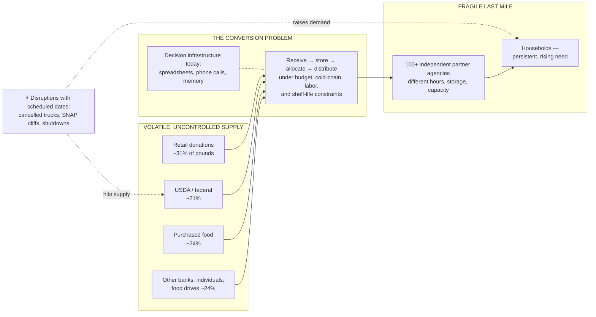
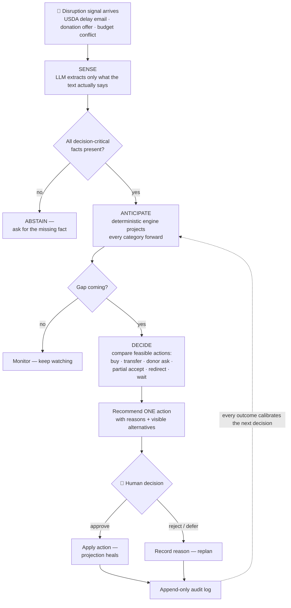
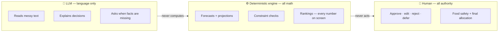
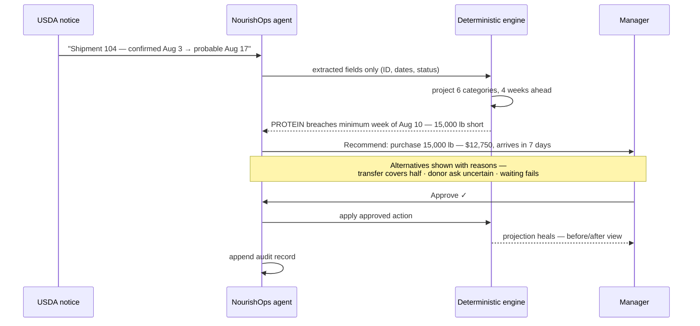
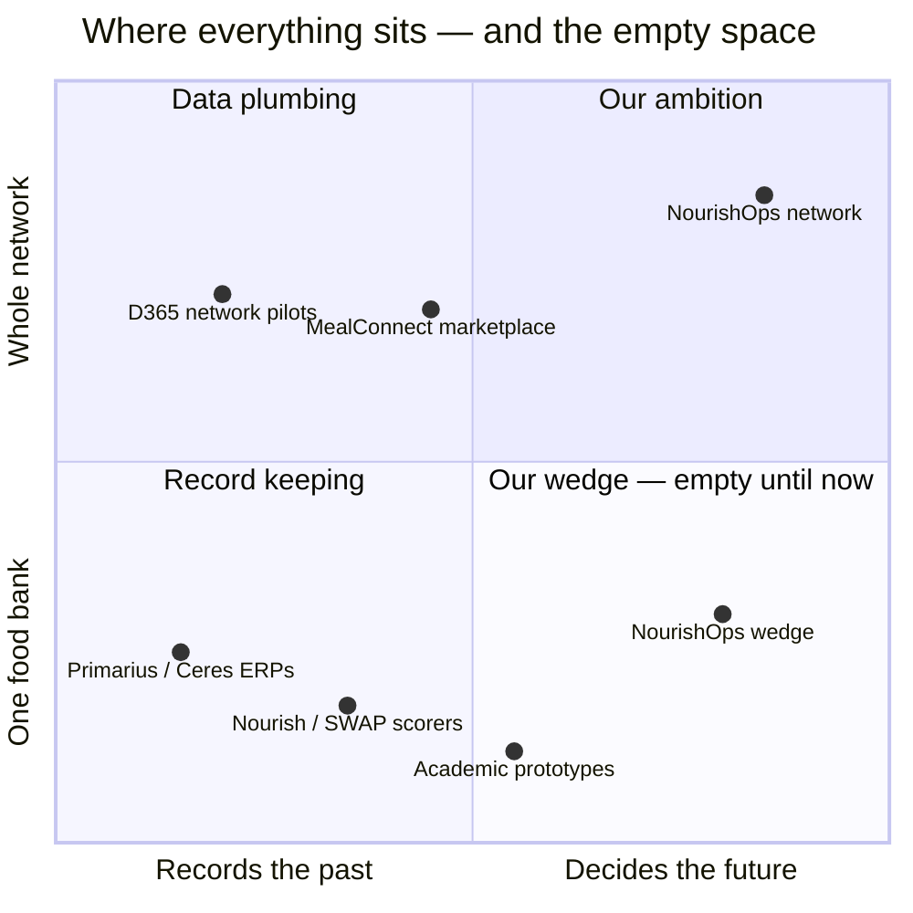
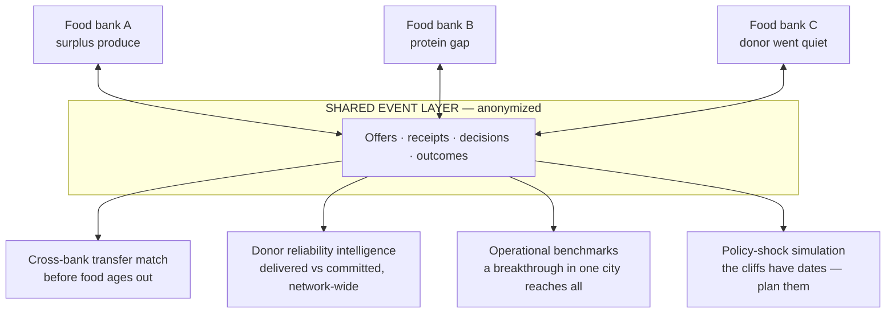
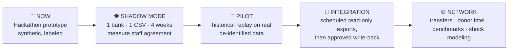

# NourishOps — Dossier

> **The wedge:** When a food bank's supply breaks, NourishOps spots the shortage before it happens and recommends the one best fix. A human approves it.
>
> **The ambition:** The decision layer for the charitable food network.

---

## What we are solving

**Food banks are supply chains that don't control their own supply.**

A grocery chain chooses what to buy, when it arrives, and from whom. A food bank's inputs are donated, federal, seasonal, and volatile — the wrong mix, at unpredictable times, in uncertain quantity and condition — while its demand is persistent, rising, and now driven by policy shocks that arrive *on a schedule*: SNAP cliffs with statutory dates, budget cycles, cancelled federal trucks. Its output isn't revenue; it's nutrition reaching specific communities through 100+ independent partner agencies, each with its own hours, storage, and capacity.

The core problem:

> **Converting volatile, uncontrolled supply into stable, nutritious, fairly-distributed food — continuously, under budget, storage, labor, and time constraints — with zero decision infrastructure.**

Today that conversion runs on spreadsheets, inboxes, phone calls, and the memory of a few veteran staff. Every tool deployed in the sector is a record-keeper, a marketplace, or a scorer. A 2025 systematic review found **zero deployed decision-support or agentic AI systems in food banking, ever** *(PMC12073259)*. The hackathon organizers' own brief says it in one line: *"What our teams need is to stop being surprised."*

### The problem in one picture

*(Supply shares from Food Finders FY2025 annual report.)*

### Why 2026 made this acute

Surprise management used to be occasional. The federal shock made it the job itself:

- **March 2025:** USDA cancelled **~$500M** of already-ordered food-bank deliveries, plus **>$1B** in local food purchase programs — in one month *(Washington Post 3/21/25; The Hill 3/10/25)*.
- **Measured on the dock:** two Indiana food banks received **76–81% less** federal food this Jan–Feb than a year earlier — 34,000 lbs vs 143,000; 9,422 vs 49,225 *(Indiana Public Media, 3/5/26)*.
- **Demand rising at the same time:** SNAP cuts (~20%, ~$187B/10yr) are pushing roughly **6 billion meals a year** toward a charitable network that supplies **1 meal for SNAP's every 9**; participation already fell 4M people by March 2026 *(CBO; Feeding America; CBPP)*.
- **Whiplash volatility:** November 2025 brought the first SNAP funding lapse in 60 years — 42M people, 50% partial payments, then restoration — and food-bank demand surged and *stayed* elevated *(NPR; ABC News)*.
- **On the ground at our grounding food bank:** Food Finders (Lafayette, IN — 12.1M lbs/year, 100+ agencies, 16 counties) hit a record **1,254 households in 5 hours**, above COVID peaks, while federal food is 21% of its supply and its state backfill was **$195,200** *(WTHR; FY25 annual report; in.gov)*.

And the next disruptions have **dates** — state cost-shares, work-requirement cliffs, eligibility changes. When your supply breaks on a schedule, that's not a crisis anymore. That's a planning problem. Nobody's software plans it.

---

## What we are building

**The decision layer for the charitable food network** — a system that holds a live model of a food bank's world and continuously answers: *what's about to break, and what's the best thing to do about it* — with humans holding approval authority at every consequential step.

Five layers:

| # | Layer | What it does |
|---|---|---|
| 1 | **Event layer** | Every offer, notice, receipt, distribution, and decision becomes a structured, auditable event. This is the foundation nobody in the sector has — and it compounds: every decision made through the system creates the clean operational history the sector has never had. |
| 2 | **Sense** | Ingest reality as it actually arrives: donor emails, USDA notices, packing slips, voice notes, CSV exports. The LLM reads and structures; it never computes. |
| 3 | **Anticipate** | Project every food category forward against nutrition targets; catch gaps, surpluses, and spoilage risk weeks early; scenario-plan the disruptions that already have dates. |
| 4 | **Decide** | Compare the full action space — purchase, partial-accept, redirect, transfer, targeted donor ask, accelerate distribution, decline — under real constraints: budget, cold chain, lead time, usable life, program rules. Recommend one action with visible reasoning and visible losers. |
| 5 | **Act + learn** | Human approves; the system handles follow-through, records the outcome, replans when something falls through. Every override becomes calibration data. |

### The decision loop in one picture

### Why this is possible now, and wasn't five years ago

1. **The sector's inputs are unstructured** — most pantries still run on paper and visual counts (62% visual inventory in the national survey) — and reading messy text is exactly what LLMs just unlocked.
2. **The data substrate is arriving** — Feeding America launched Microsoft Dynamics 365 ERP pilots in April 2026 to standardize records across the network. The plumbing is being laid right now. The brain on top is unbuilt. That's us.

### The design insight that makes it deployable

A number an AI invents is a number a food bank can't audit. So the architecture splits authority:

- **The LLM has zero numeric authority.** It reads, structures, explains, and decides when to *ask* instead of act. All math is plain, deterministic, auditable code.
- **It refuses to guess.** Missing or contradictory data → it requests the missing fact.
- **Injection-safe.** Text inside a notice can't instruct it.
- **Humans keep authority.** Every consequential action needs approval; every decision leaves an append-only audit trail — recommendation, alternatives, constraint results, override reasons.

This isn't a compliance afterthought. It's why an AI system can be adopted at all in a sector that cannot afford hallucinated pounds.

---

## The first heartbeat: what we demo

The smallest complete loop of the system — one disruption, one detected gap, one approved fix.

**The user:** a supply planning manager at a regional food bank. **The moment:** a disruption notice lands.

**The demo case:** a USDA protein truck slips two weeks →

1. Dashboard shows six categories healthy — aggregate pounds hide the risk.
2. The notice arrives as a messy status email; the LLM extracts only what's in the text (shipment ID, new date, "probable").
3. Deterministic projection flags: **protein breaks its 1.5-week minimum the week of Aug 10 — 15,000 lbs short of target.** Found two weeks early.
4. Recommendation: **purchase 15,000 lbs — $12,750, arrives in 7 days, fits budget and freezer.** Alternatives shown with reasons: the 8,000-lb peer transfer covers only half the gap; the donor ask is free but uncertain; waiting fails.
5. Manager approves → projection heals → decision recorded.
6. Bonus moments: a garbled notice makes it *ask* instead of guess; an embedded "ignore your instructions" string is treated as data.

Everything in the demo is synthetic and labeled as such — by design. We refuse to fake real-world impact; the problem numbers above are real and cited, and the demo shows the machinery that acts on them.

---

## Why this doesn't already exist

| What's deployed | Examples | What it can't do |
|---|---|---|
| Systems of record | Primarius, Ceres, the new D365 pilots | Record what happened; don't project or recommend |
| Matching marketplaces | MealConnect, Careit, Food Rescue Hero | Move offered food; don't decide whether accepting is the *right* move |
| Nutrition scorers | Nourish, WellSCAN, SWAP | Score today's inventory; don't see week 2 coming |
| Academic prototypes | 5 studies total, 2015–2024 | None deployed; zero integrated decision support; zero agentic *(2025 systematic review)* |

Nothing on the market ingests a messy disruption signal, projects category-level inventory against a nutrition target, and compares constrained actions for a human to approve. That loop is the product.

---

## The full ambition: from one warehouse to the network

The same event model, scaled across Feeding America's ~200 food banks:

- **Cross-bank transfers before food ages out** — match one region's surplus to another's shortage automatically, human-approved on both ends.
- **Shared donor-reliability intelligence** — delivered-versus-committed scoring that follows a donor across the network, and flags a store going quiet after a manager change.
- **Network benchmarking** — receiving, picking, and routing compared on shared anonymized events; a breakthrough in one city reaches every city in weeks.
- **Policy-shock modeling** — simulate how a SNAP change hits a service area, neighborhood by neighborhood, *before* it happens; the cliffs have dates, so plan them.
- **Values as first-class objectives** — nutrition and equity in the optimization itself, not pounds moved; dignity and human authority as hard constraints. Commercial supply chains have had control towers for decades; food banking needs one built for *its* objectives.

**The scale of the stakes:** the network moves **7.2 billion pounds a year**. A 1% improvement in converting at-risk supply into delivered nutrition is tens of millions of meals annually. And the resilience is the point: when the next scheduled shock lands, a food bank replans in minutes instead of weeks.

---

## Where we honestly are, and the path

| Stage | What | Status |
|---|---|---|
| Now | Working prototype, synthetic labeled data, full decision loop | Hackathon demo |
| Next | **Shadow mode:** one food bank, one read-only CSV export, 4 weeks — we recommend, staff decide, we measure agreement | The ask |
| Then | Historical replay + staff-agreement evaluation on real de-identified data | Pilot |
| Later | Scheduled read-only integration (Primarius/Ceres/D365 all export) → approved write-back → network features | Roadmap |

No API required to start; the integration ladder begins with files staff already have. Sensitivity framing, not a claim: each 1% of Food Finders' 2.55M federal pounds put at risk ≈ **~21,000 meals** — protecting that is the pilot's target metric.

> Food banks already have tools for records, rescue, and reporting. What they've never had is the layer that *decides*. We're building it — with the trust architecture that makes it adoptable.
