# Decision platform architecture

NourishOps is an Anthropic-first, provider-neutral decision platform. The current
Scenarios A–E remain the frozen deterministic proof set; new problem families enter
through versioned scenario packages and registered deterministic solvers.

```mermaid
flowchart LR
  Sources["Synthetic production-shaped sources"] --> Freeze["Immutable run input manifest"]
  Freeze --> Context["Versioned shared context bundle"]
  Context --> Queue["Verified operational work items"]
  Queue --> OpsAgent["Read-only operations routing agent"]
  OpsAgent --> Home["Home / Ask decision entry"]
  Context --> Problem["Versioned scenario package and problem type"]
  Problem --> Solver["Deterministic solver registry"]
  Solver --> Verified["Verified recommendation package"]
  Verified --> Agent["Read-only decision orchestrator"]
  Agent --> Review["Isolated independent reviewer"]
  Review --> Guard["Backend authority validator"]
  Guard --> Brief["Typed brief + transparent stage trace"]
  Brief --> Approval["Human approval boundary"]
  Approval --> Intent["Immutable action intent"]
  Intent --> Gateway["Simulated execution adapter"]
  Gateway --> Receipt["Completed action receipt"]
  Receipt --> Feedback["Recommendation + outcome feedback"]
  Feedback --> Audit["Append-only audit history"]
```

## Authority boundaries

| Layer | Owns | Cannot do |
|---|---|---|
| Source adapters | Retrieve versioned current and organizational records | Rank or approve actions |
| Scenario package | Declare required documents, schemas, context builder, normalizer, problem type, solver, and result contract | Change a frozen run |
| Deterministic solver | Math, projections, constraints, feasibility, ranking, abstention, and output hashes | Call an AI provider or external system |
| Operations routing agent | Match a multi-turn user request to a verified work item and typed answer intent | Invent a case/fact/action, silently default an unrelated question, approve, or execute |
| Decision orchestrator | Retrieve one immutable recommendation package and turn the selected verified candidate into the agent recommendation and typed rationale | Calculate, rank, invent facts/IDs/numbers, approve, or execute |
| Independent reviewer | Recheck the grounded draft against a closed five-check verdict | Change deterministic results, write, or execute |
| Authority validator | Enforce IDs, evidence, grounded language, approval, and simulation boundaries | Optimize or substitute an AI decision |
| API | Validate commands, enforce idempotency and revision checks, return typed data | Trust frontend calculations |
| Manager UI | Display verified results and collect an explicit human decision/feedback | Directly mutate audit records or provider prompts |
| Simulated gateway | Convert an approved, hashed action intent into a typed completion receipt | Perform an external write or accept model-authored payloads |

The AI is not the calculator. Three bounded roles sit around verified decision data:
the operations agent routes user intent, the orchestrator creates the user-facing agent
recommendation, and an isolated reviewer checks that draft. The product-facing proposal
is therefore truthfully labeled an agent recommendation, while its quantities, feasibility,
and ranking remain deterministic guardrails. If a provider call times out, returns invalid structure, cites an unknown
identifier, introduces a number, or claims execution, its wording is discarded and the
same deterministic recommendation is rendered by the offline adapter. Primary
explanation sentences are backend-authored grounded statements; a live provider may
copy or select them but cannot introduce new prose as fact.

The append-only `decision-trace/1.0.0` record exposes stage, actor, status, duration,
input/output hashes, provider/fallback mode, tool names, and a short verified summary.
It explicitly does not expose private chain-of-thought.

## Provider architecture

The operations agent, orchestrator, and reviewer each supply a different closed output
schema and read-only tool. `build_operations_agent`, `build_decision_agent`, and `build_decision_reviewer`
explicitly bind either an Anthropic or OpenAI provider client;
the model string cannot switch providers. Provider SDK retries are disabled. The
adapter owns one shared retry/repair budget inside one global deadline, then uses the
offline fallback.

Current safe defaults:

- requested provider: `anthropic`;
- model: `claude-haiku-4-5` (the latency-oriented explanation default; stronger models remain configurable);
- per-request timeout: 6 seconds;
- whole-agent deadline: 12 seconds;
- total retry/repair budget: one;
- default mode: `offline`;
- missing or mismatched live configuration: fail closed to `offline_fallback`;
- keys: backend environment only, never sent to the browser or persisted in a run.

To run Claude locally, copy `.env.example` to the gitignored `.env`, set
`NOURISHOPS_AGENT_MODE=live`, and set `ANTHROPIC_API_KEY`. Rebuild with `make demo`,
then run `make agent-smoke`. The smoke test makes one Scenario B evaluation through
the public API and reports only provider status and backend-issued IDs.

OpenAI remains a supported switch: set `NOURISHOPS_AGENT_PROVIDER=openai`, provide an
explicit `NOURISHOPS_AGENT_MODEL`, and set `OPENAI_API_KEY`. No scenario, solver, API,
or frontend contract changes.

## Scenario packages

`scenarios/packages/*.json` is the declarative discovery layer. A package pins:

- scenario keys and package version;
- required source documents and their JSON Schemas;
- current/organizational source roles;
- the overlay path and schema;
- a normalizer ID;
- a shared-context builder ID;
- an explicit `problem_type` and `solver_id`;
- the frontend result contract.

The current `frozen-a-e` package uses `SINGLE_ACTION_CATALOG`,
`nourishops-decision-context-v1`, `catalog-enumeration`, and
`decision-brief/1.0.0`. Context builders are selected through a small registry, so a
new problem family can reuse the current context contract or register a specialized
builder without branching the service. The existing build contract schemas
remain unchanged. A materially new scenario contract receives a new package/schema
version rather than weakening the A–E oracle.

At run creation, PostgreSQL copies every declared document into
`run_input_documents`, stores source versions and SHA-256 hashes, includes the package
definition and closed JSON Schema set in `contract_snapshot_hash`, and stores the same
contract in immutable `run_contract_snapshots`. Replay uses that pinned contract rather
than the live registry. The input set is sealed after `SCENARIO_VALIDATED`, and
connector refreshes affect only later runs. Snapshot lookup also requires the
package-declared source ID, preventing cross-source document substitution.

## Solver seam and complex mathematics

Solver selection is explicit by problem type and solver ID, not by an A–E branch. The
current solver advertises its real limits: one warehouse, one selected action, authored
candidates, no routing, and no portfolio optimization.

Future deterministic adapters belong behind the same registry:

| Problem type | Appropriate deterministic method | Example decisions |
|---|---|---|
| `PORTFOLIO_ALLOCATION` | MILP or CP-SAT | Choose several purchases/transfers under budget, capacity, and minimum coverage |
| `NETWORK_FLOW` | Min-cost/max-flow | Move food among food banks and pantries |
| `ROUTE_OPTIMIZATION` | VRP/CP-SAT | Pickup routes, time windows, cold-chain capacity |
| `STOCHASTIC_SUPPLY_PLAN` | Scenario simulation plus robust/stochastic optimization | Hedge uncertain arrivals and demand |
| `SCHEDULING` | Constraint programming | Docks, labor, appointments, and expiry priorities |

Every adapter must use base-10-safe numeric inputs where money/quantity policy requires
it, emit a typed normalized result, provide an independently recomputable output hash,
list capabilities/limitations, and fail closed when its problem type is unsupported.
An LLM may choose which registered read-only stage to request only after a deterministic
stage machine exists; it never becomes the optimizer.

The next result-contract version for portfolio problems should add a typed plan with
multiple plan items. It should not overload the current single-action recommendation
shape.

## API and reliability contract

- `GET /api/v1/capabilities` exposes context builders, all three agent roles, solver
  capabilities, problem types, execution mode, and workflow versions.
- `GET /api/v1/runs/{run_id}/context-bundle` returns the frozen shared context and
  provenance hash.
- `GET /api/v1/runs/{run_id}/decision-brief` returns the stable Pydantic frontend model.
- `GET /api/v1/runs/{run_id}/decision-trace` returns the five transparent decision stages.
- `POST /api/v1/operations-assistant/messages` accepts bounded multi-turn history and
  current context, then returns `ANSWER`, `CLARIFY`, `DECISION`, or `SAFE_STOP` with
  agent metadata and backend-rendered verified facts.
- Approval atomically stores one immutable action intent and one simulated completion
  receipt. It never accepts an AI-authored write payload.
- `POST /api/v1/runs/{run_id}/outcome-feedback` records successful, partial, failed,
  or unknown observed outcomes.
- Every mutating POST requires `Idempotency-Key`.
- The response and its mutations commit in one PostgreSQL transaction.
- Same key/body replays the original response; same key/different body returns
  `409 IDEMPOTENCY_KEY_REUSED`.
- Writes acquire a per-run transaction lock. Concurrent decisions produce one final
  decision and, at most, one simulated execution.
- Decision commands include `expected_revision` and `recommendation_id`; stale review
  screens return `409 STALE_RECOMMENDATION`.
- Audit, input, contract, action intent, execution receipt, feedback, and idempotency
  records are insert-only.

## Adding a scenario variation

1. Decide whether the problem fits an existing package/problem type or needs a new
   versioned contract.
2. Declare all input documents, source roles, schemas, context builder, normalizer,
   solver, and result contract in a scenario package.
3. Add synthetic source snapshots and an overlay; validate all foreign-key references.
4. Register or reuse a deterministic solver and state its limitations honestly.
5. Create a golden result plus independent anchor/property tests.
6. Test immutable input replay, unsupported-problem failure, offline/live deterministic
   parity, abstention, concurrency, idempotency, and typed decision-brief validation.
7. Only then design the user workflow against the decision brief.

The demo completes actions only through `simulated-operations-v1`. Real email, donor,
peer, ERP, and outreach adapters remain disabled until each has an explicit credential,
authorization, preview, idempotency, receipt, and failure-recovery contract.
