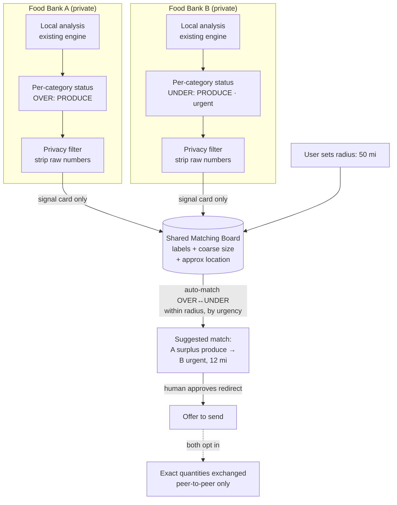

# Feature: Privacy-Preserving Peer Surplus/Shortage Matching Board

## Summary
Let food banks with a **surplus** of an item automatically discover nearby food banks that are **urgently short** of it — within a user-selectable radius — **without exposing any raw operational data.** Only a derived status label ("short on protein" / "surplus produce") is ever shared.

## Problem
- The system today decides for **one warehouse** and can only redirect surplus to a **hardcoded** peer.
- It has no way to know *which* nearby peer actually needs an item.
- Real food banks won't share raw inventory, budget, forecasts, or donor data with peers.

## Proposed feature
- Each food bank reuses its existing local analysis to get a **per-category status**: `UNDER` / `OK` / `OVER`.
- Publish **only a tiny "signal card"** to a shared board — never raw numbers.
- Auto-match `OVER` food banks with nearby `UNDER` ones, per item, ranked by urgency.
- User picks a **radius (miles)** to filter peers.
- Sending stays a **human-approved redirect** (reuses existing action + audit trail).

## Privacy model (core principle)
> **Share the conclusion, not the data.**

| Stays PRIVATE (never leaves the food bank) | PUBLISHED to board (signal card) |
|---|---|
| Inventory pounds, budget, forecasts, donors, thresholds | `PROTEIN: UNDER` |
| Exact shortage/surplus amount | `Gap: LARGE` (coarse bucket) |
| Breach math / weeks-of-supply | `Urgency: HIGH` |
| Exact address | Approximate location (for distance only) |

- Exact quantities are exchanged **only between two matched food banks after both opt in** (progressive disclosure) — never on the public board.
- **Urgent + important** is derived from data we already have: urgency = how soon it breaches; importance = category `priority_weight`.

## How it works

## Steps
1. Each food bank runs its existing local analysis → per-category status.
2. Privacy filter reduces it to a **signal card** (label + urgency + coarse size + approx location).
3. Cards published to the shared **board** (the only data that leaves the building).
4. User sets a **radius**; board filters peers by distance.
5. Board **auto-matches** `OVER` ↔ nearby `UNDER`, per item, ranked by urgency.
6. Surplus food bank clicks **offer to send** — human-approved redirect, logged in audit.
7. **Progressive disclosure:** exact amounts shared only after both sides accept the match.

## Reuses what we already have
- Per-category `UNDER`/`OVER` detection (existing risk engine).
- Category `priority_weight` + breach timing (for urgency/importance).
- `REDIRECT_DONATION` action, human approval, and audit trail.

## New pieces to add
- Opt-in **directory** of participating food banks with approximate locations.
- Lightweight **shared board** storing signal cards only.
- **Consent/handshake** step for progressive disclosure.
- **Radius filter** UI control.

## Out of scope (future)
- Live inventory sharing or full network optimization.
- Automated (non-human) transfers.
- Routing/logistics between food banks.

## Acceptance criteria
- [ ] Board never stores raw inventory, budget, forecasts, donors, or thresholds.
- [ ] A food bank sees only `UNDER`/`OVER` + urgency + coarse size + approx location for peers.
- [ ] Radius control filters matches by distance.
- [ ] Matches auto-rank by urgency (soonest breach + highest priority first).
- [ ] Sending requires human approval and writes an audit event.
- [ ] Exact quantities revealed only after mutual opt-in.
