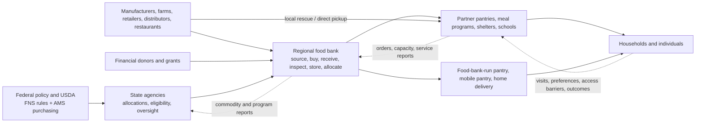
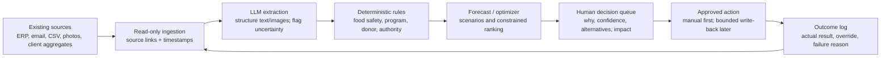

# U.S. Food-Bank Supply Chains: Domain Grounding for the AISCO 2026 Hackathon

**Research date:** July 12, 2026  
**Primary scope:** United States, with an Indiana and Food Finders Food Bank focus  
**Purpose:** Build enough operational, technical, and institutional understanding to choose a real problem before choosing an AI solution.

> **Bottom line:** A food bank is not simply a warehouse with a routing problem. It is the coordinating hub of a decentralized, capacity-constrained, partly regulated, partly donated supply network. Supply is volatile; demand is only partly observable; partner pantries are often the binding bottleneck; and the mission requires balancing quantity, nutrition, preference, equity, freshness, cost, and dignity. The most defensible hackathon project will improve one decision loop using existing records and human approval—not claim to “optimize hunger” end to end.

---

## 1. Executive conclusions

1. **Need remains structurally high.** In 2024, 18.3 million U.S. households—13.7%—were food insecure. Those households contained 47.9 million people, including 14.1 million children. The rate was statistically unchanged from 2023, not a meaningful recovery. Households headed by single mothers, households below the poverty line, Black and Hispanic households, rural households, and residents of principal cities faced much higher rates. ([USDA ERS, 2024 Household Food Security report](https://ers.usda.gov/sites/default/files/_laserfiche/publications/113623/ERR-358.pdf?v=38847))

2. **The charitable system is enormous but is not a substitute for federal nutrition assistance.** Feeding America supported 5.9 billion meals and sourced 7.2 billion pounds of food in FY2025. Its network now describes 250+ food banks, 20+ state associations, and 60,000+ agency partners. Yet Feeding America estimates SNAP provides roughly nine meals for every one meal supplied by its network. ([Feeding America FY2025 report](https://www.feedingamerica.org/sites/default/files/2025-12/FA_25AnnReport_DIGITAL_final.pdf); [Feeding America on SNAP](https://www.feedingamerica.org/take-action/advocate/federal-hunger-relief-programs/snap))

3. **The system is decentralized.** A regional food bank may run a professional warehouse, fleet, procurement team, and ERP, while hundreds of independent churches, nonprofits, schools, shelters, and pantries make last-mile decisions with different hours, refrigeration, vehicles, volunteers, software, and rules. A technically mature food bank does not imply a digitally mature partner network.

4. **Recorded demand is not true demand.** Agency orders are constrained by what the food bank lists, what a pantry can store and transport, grant restrictions, shared-maintenance fees, and what staff expect their clients will accept. Visit records include only people who found the service, could get there, felt comfortable, met local requirements, and arrived while food remained. An AI trained on these records can reproduce access barriers while appearing “data driven.”

5. **Data readiness is two-speed.** Large-bank warehouse records can be quite good: item, lot, source, bin, expiration, order, and movement data often exist. Pantry inventory, unmet preferences, household-level need, route telemetry, spoilage reasons, and cross-system identifiers are far less reliable. In a national survey of 297 pantries, 62.3% used visual inventory assessment, 48.5% used paper and pencil for inventory, and 49.2% tracked important statistics on paper. ([National pantry technology study](https://pmc.ncbi.nlm.nih.gov/articles/PMC11810111/))

6. **AI is present in promising pockets, not as a sector-wide operating layer.** Credible deployments include donation matching, volunteer notification, feedback triage, invoice extraction, and forecasting/optimization pilots. A 2025 systematic review found only five peer-reviewed empirical food-bank/pantry AI studies from 2015–2024, and none adequately addressed fairness, bias, or privacy. ([Systematic review](https://www.mdpi.com/2072-6643/17/9/1461))

7. **The highest-value unknown is often operational context missing from software.** A pantry may have no freezer space today, a volunteer driver may cancel, a truck may lack a liftgate, a donor's “10 pallets” may be mixed and unsorted, or a USDA shipment may arrive damaged. These facts often live in phone calls, texts, email, whiteboards, and staff memory.

8. **The best first AI pattern is a read-mostly exception copilot.** Use an LLM to structure unstructured offers or documents, deterministic rules for food safety and program compliance, optimization for routing/allocation, and a human for consequential approval. Preserve source evidence, uncertainty, overrides, and an audit trail.

9. **Food Finders is a strong local discovery partner.** Its FY2025 report shows 12.1 million pounds distributed, 10.1 million meals, more than 100 partner agencies across 16 Indiana counties, 39,854 volunteer hours, and a material purchased-food share of 24.4%. Its public systems indicate Primarius for food-bank operations, Link2Feed at its food-bank-run pantry, and VolunteerHub for volunteers—suggesting moderate central readiness but unknown downstream readiness. ([Food Finders FY2025 report](https://www.food-finders.org/wp-content/uploads/2026/04/2025-Annual-Report-Final-5-1.pdf); [Link2Feed customer list](https://www.link2feed.com/link2feed-food-bank-customer-list/))

10. **Three problem families deserve validation first:** (a) donation intake and capacity matching, (b) partner-capacity-aware perishable allocation, and (c) procurement gap planning. All are close to the hackathon prompt, consequential, demonstrable, and possible without ranking individual clients.

---

## 2. Important terminology

The words are often used loosely, but the operational distinction matters.

| Term | Operational meaning |
|---|---|
| **Food bank** | A wholesale hub that sources or purchases food, receives and stores it, manages compliance, and distributes to agencies. Some also operate direct programs. |
| **Pantry / agency partner** | A community organization that obtains food from a food bank and/or local donors and distributes groceries to households. It may be volunteer-run and open only a few hours per week. |
| **Meal program / soup kitchen** | A frontline organization serving prepared meals rather than grocery packages. |
| **Neighbor / client / guest** | A person or household receiving food. “Neighbor” and “guest” are commonly used to emphasize dignity. |
| **TEFAP** | The Emergency Food Assistance Program, through which USDA food and administrative funding flow via states to eligible recipient agencies. |
| **USDA commodities** | Foods purchased by USDA under TEFAP or other programs. They bring eligibility, handling, recordkeeping, and disposition requirements. |
| **Retail rescue** | Recovery of surplus food from retailers, restaurants, or other local donors, often picked up directly by an agency rather than passing through the main warehouse. |
| **Agency order** | A pantry's request from the food bank's available catalog. It is not the same as household demand. |
| **Allocation** | A rule or decision that assigns scarce food, trucks, slots, or purchasing funds across agencies or areas. |
| **Client choice** | A pantry model in which households select items, rather than receiving a fixed prepacked box. |
| **FEFO / FIFO** | “First expired, first out” and “first in, first out.” FEFO is usually more appropriate for perishables when usable date data exist. |
| **Pounds-to-meals** | A common reporting convention, often 1.2 pounds per meal. It is an output conversion, not proof that a meal was eaten, nutritious, preferred, or additional. |

The Congressional Research Service gives a useful formal distinction: food banks are generally established wholesale operations supplying pantries and soup kitchens, while the latter directly serve households or meals. It also estimates roughly 370 U.S. food banks in total, about three-quarters affiliated with or partnering with Feeding America. Different public counts use different definitions and network membership, so “200+,” “250+,” and “370” should not be treated as contradictions without checking the denominator. ([CRS, TEFAP: Background and Funding](https://www.congress.gov/crs_external_products/R/HTML/R45408.web.html))

---

## 3. The system from top to bottom

### 3.1 Actors, authority, and incentives

| Actor | Controls | Optimizes for | Information it often lacks |
|---|---|---|---|
| **USDA Food and Nutrition Service (FNS)** | Program rules, funding, TEFAP catalog and allocations | Statutory compliance, national program delivery | Local pantry capacity and household preferences |
| **USDA Agricultural Marketing Service (AMS)** | Commodity procurement and vendor contracts | Timely, compliant purchasing | Receiving-site exceptions until delivery |
| **State agency** | State eligibility method, allocations, contracts, monitoring | Compliance and statewide coverage | Real-time local inventory and need |
| **Feeding America / regional co-ops** | Network services, national sourcing, platforms, cooperative purchasing | Network scale, equitable supply, donor relationships | Every local operational constraint |
| **Food bank** | Donation acceptance, purchasing, warehouse, allocation, routes, agency relationships | Meals/pounds, nutrition, freshness, equity, cost, donor and grant compliance | True unmet demand and real-time partner inventory/capacity |
| **Partner agency** | Local orders, distribution model, hours, intake, client choice | Serve neighbors reliably with limited staff, space, refrigeration, and transport | Future supply and neighborhood demand |
| **Product donor** | What, when, where, condition, and restrictions of donated food | Avoid waste/cost, social impact, simple pickup | Whether the receiving agency can use the food |
| **Financial donor / funder** | Restricted/unrestricted funds and reporting expectations | Demonstrable impact and stewardship | Operational tradeoffs behind headline pounds/meals |
| **Neighbor** | Whether, when, and where to seek help; preferences if choice exists | Accessible, dignified, useful, culturally appropriate food | Accurate inventory, wait, eligibility, hours, and transport options |

No single actor sees the entire network. This is why a “central optimizer” can fail even with mathematically correct logic.

### 3.2 TEFAP flow and why regulation matters

Under TEFAP, FNS sets program policy and state allocations; AMS purchases commodities from approved vendors; state agencies choose and oversee eligible recipient organizations; food banks often receive, store, order, and distribute commodities; and pantries or meal programs serve eligible people. States have meaningful discretion over eligibility and operating procedures. ([CRS TEFAP report](https://www.congress.gov/crs_external_products/R/HTML/R45408.web.html))

In FY2024, USDA reported $461.5 million for TEFAP commodity purchases and $80 million for administrative costs, plus $943 million in additional Commodity Credit Corporation food. More than 130 products were available. ([USDA TEFAP fact sheet](https://www.fns.usda.gov/print/pdf/node/9080))

This creates several design constraints:

- USDA food may be commingled physically with donated or purchased food but still requires distinct records.
- State-specific eligibility and electronic-signature rules make a generic national “eligibility AI” unsafe.
- Disposition of damaged or spoiled USDA food can require authorization; it cannot always be discarded immediately.
- Grant or program restrictions can make two visually identical cases operationally different.
- A food bank may optimize total inventory while violating source-specific rules unless source and lot provenance remain attached.

### 3.3 End-to-end operating cycle

| Stage | What actually happens | Core decisions | Typical records | Common failure modes |
|---|---|---|---|---|
| **1. Need sensing** | Staff combine service visits, agency calls/orders, community data, seasonal knowledge, benefit calendars, and emergencies. | What need is rising, where, and for which food categories? | Client visits, agency orders, Map the Meal Gap, Census, staff notes | Orders and visits understate latent need; data lag; double counts; policy shocks |
| **2. Sourcing** | Food comes from USDA, national/manufacturer donations, farms, retailers, food drives, other banks, and purchases. | Accept, reject, redirect, rescue locally, or buy? | Offer emails, donor portals, packing lists, photos, purchase orders | Missing quantity/date/temperature; unwanted mix; short notice; donation restrictions |
| **3. Inbound planning** | Appointments, docks, trucks, drivers, and temperature zones are scheduled. | Pickup versus donor delivery; which site; when; with what vehicle? | Appointment calendars, routes, texts, donor master | Donor not ready; no liftgate; late truck; capacity unknown; volunteer no-show |
| **4. Receiving and inspection** | Loads are counted/weighed, inspected, temperature-checked, assigned item/lot/source, and accepted or rejected. | Usable? Safe? Which category and date? Quarantine? | Bill of lading, receipt, lot/date/temp, exception photos | Mixed pallets; bad metadata; estimated weights; quality disputes; long exception resolution |
| **5. Putaway and storage** | Pallets/cases move to dry, cooler, or freezer locations; repacking or sorting may occur. | Where to place; what to prioritize; reserve or transfer? | Bins, pallets, lots, movements, inventory counts | Scanner gaps; lot loss; capacity saturation; “inventory” not physically findable |
| **6. Planning and purchasing** | Staff compare expected supply with target assortments and budget; purchase staples or culturally requested items. | What, when, how much, from whom, and with which funds? | Forecasts, price lists, POs, donor pipeline, nutrition categories | Donation volatility; price inflation; case-unit errors; bulk purchases spoil; restricted funds |
| **7. Catalog and agency ordering** | Available products are listed; agencies request cases or receive allocations. | What is visible; fees/grants; limits; allocation of scarce items? | Catalog, request, allocated, picked, cut/substituted quantities | Fast agencies win; low-capacity agencies order less; stock data stale; request ≠ need |
| **8. Picking, packing, and staging** | Orders are picked by staff/volunteers, checked, packed, labeled, and staged by route or pickup. | Pick sequence, substitutions, palletization, cold-chain timing | Pick tickets, scans, shorts, substitutions | Mis-picks; volunteer skill variation; staging congestion; cold items wait too long |
| **9. Transport** | Food bank delivers, agency picks up, or local donors are matched directly to agencies. | Route, stop order, time windows, vehicle, consolidation | Planned/actual routes, proof of delivery, mileage, temperatures | Rural distance; dock hours; failures not recorded; truck/driver constraints |
| **10. Partner receiving** | Agency unloads, stores, and prepares food for distribution. | Accept all? Store where? Serve now or later? | Agency receipt, local inventory—often incomplete | No cooler/freezer; volunteer shortage; order arrives outside hours; product mismatch |
| **11. Distribution to neighbors** | Prepacked boxes, drive-through, client-choice pantry, mobile site, meal program, locker, or delivery. | Eligibility, appointment, assortment, quantity, substitution | Intake, visit, household, service, signature | Long waits; stigma; transport/language/disability barriers; stockouts; digital exclusion |
| **12. Reporting and learning** | Pounds, meals, visits, demographics, waste, grants, and compliance are reported. | Which metric reflects success? What changes next cycle? | ERP, client system, spreadsheets, narratives | Duplicate entry; incompatible IDs; output-only metrics; delayed feedback; shadow systems |
| **13. Reverse logistics** | Recalls, returns, reallocation, spoilage, disposal, and packaging waste are handled. | Transfer, quarantine, notify, dispose, document? | Recall lists, lot trace, disposition approval, waste reason | Traceability gaps; delayed USDA permission; no acknowledgement loop; disposal cost |

### 3.4 Four simultaneous flows

A useful mental model is to track four flows at once:

1. **Physical:** food, pallets, reusable containers, trucks, refrigeration, waste.
2. **Information:** offer details, item/lot/date, inventory, orders, preferences, routes, signatures, exceptions.
3. **Money and entitlement:** donations, grants, procurement budgets, shared-maintenance fees, restricted funds, USDA allocations.
4. **Authority and accountability:** who may accept, allocate, determine eligibility, dispose, contact a client, or approve a purchase.

Many projects optimize the first flow while ignoring the other three. That is a common reason technically impressive prototypes fail to become operating systems.

---

## 4. How food enters and leaves the network

### 4.1 Supply is a portfolio, not one stream

Feeding America's July–December 2025 meal mix illustrates the portfolio: of 3.1 billion meals supported, approximately 1.0 billion came from retail, 674 million from purchased food, 561 million from federal commodities, 422 million from produce donations, 334 million from manufacturing donations, and 102 million were enabled through SNAP-related work. ([Feeding America Spring 2026 impact report](https://www.feedingamerica.org/sites/default/files/2026-04/Spring%20Impact%20Report_2026_Digital_final_0.pdf))

Each stream behaves differently:

- **USDA:** more planned and standardized, but program rules and variable federal supply.
- **National manufacturers/distributors:** large truckloads, donor restrictions, network allocation rules.
- **Retail rescue:** frequent, local, perishable, time-sensitive, often picked up directly by agencies.
- **Farm/produce donations:** seasonal, quality-variable, high handling and cold-chain needs.
- **Food drives:** fragmented assortment, labor-intensive sorting, limited nutrition control.
- **Purchases:** predictable and targeted, but exposed to prices and budget restrictions.
- **Transfers/cooperative buying:** help balance shortages and increase purchasing power, but require coordination and transport.

“Free” donated food has a nonzero—and sometimes high—landed cost: pickup, inspection, sorting, repacking, refrigerated space, labor, allocation, delivery, and disposal. The right question is not “Can we take it?” but “Can the network convert this offer into usable, safe, wanted food before its quality window closes?”

### 4.2 Allocation is inherently multi-objective

A food bank can plausibly optimize any of the following:

- total pounds or meals distributed;
- food-insecure residents served;
- nutrition quality or produce share;
- agency fill rate;
- fairness across counties or agencies;
- culturally appropriate and preferred assortment;
- freshness and shelf life on arrival;
- miles, labor, and warehouse throughput;
- waste avoided;
- response to emergencies;
- compliance with donor, grant, and USDA restrictions.

These objectives conflict. Perfectly equal pounds may send perishables to a pantry unable to refrigerate them. Maximizing throughput may favor large urban agencies. Minimizing miles may disadvantage remote rural communities. Maximizing nutrition scores without preference data may reduce actual use. A model therefore needs explicit, community-approved constraints and tradeoff weights—not an undefined “optimal allocation.”

Feeding America's national donation “Choice System” adds an incentive layer: food banks use need-adjusted synthetic currency to bid for certain donated truckloads, while directed loads follow donor intent. A local forecast or procurement agent that ignores this process may misunderstand why a food bank acquired—or did not acquire—a load. ([Choice System overview](https://ifdaonline.org/wp-content/uploads/2024/02/fano-the-choice-system.pdf); [2024 mechanism study](https://arxiv.org/abs/2409.19087))

### 4.3 Last mile is not one channel

Food may leave through agency pickup, food-bank delivery, a food-bank-run pantry, a mobile pantry, school backpack distributions, senior grocery delivery, home delivery, prepared-meal sites, or direct rescue from donor to agency. Each has different data and constraints. Mobile distributions expand reach but require site permissions, traffic control, weather plans, appointment or queue management, volunteers, and a rapid unload/distribution workflow. Home delivery adds address privacy, failed-delivery rules, proof of delivery, driver screening, and route density. Client choice generates better preference signals and dignity, but can require more space, staffing, replenishment, and inventory accuracy than standardized boxes.

---

## 5. Latest evidence that improvement is needed

### 5.1 Need, reach, and pressure

All dates below distinguish the **publication year** from the **data year**. That matters because the most geographically detailed national data are lagged.

| Measure | Latest defensible figure as of July 12, 2026 | What it means / caveat |
|---|---:|---|
| U.S. food-insecure households | **18.3 million households; 13.7% in 2024** | Statistically unchanged from 13.5% in 2023. ([USDA ERS 2024 report](https://ers.usda.gov/sites/default/files/_laserfiche/publications/113623/ERR-358.pdf?v=38847)) |
| People in food-insecure households | **47.9 million in 2024**, including **14.1 million children** | Household survey estimate; not the same measure as food-bank participation. ([USDA ERS](https://ers.usda.gov/publications/113622)) |
| Very low food security | **7.2 million households; 5.4% in 2024** | Eating patterns were disrupted and food intake reduced at times. |
| Households with children | **6.7 million; 18.4% in 2024** | Children are often shielded before adults, so child-level severe deprivation is lower but still serious. |
| Child very low food security | **751,000 children** lived in households in which at least one child experienced very low food security in 2024 | A severe, narrower measure. |
| Free groceries from charitable providers | **9.616 million households / 25.167 million people in 2024** | 7.2% of households; survey wording changed in 2022, so older comparisons are unsafe. ([USDA 2024 statistical supplement, Table S-11](https://ers.usda.gov/sites/default/files/_laserfiche/publications/113634/AP-126.pdf)) |
| Free meals from charitable providers | **3.284 million households / 7.242 million people in 2024** | Some households used both groceries and meals; do not add them as unique people. |
| Use among food-insecure households | **30.9% received free groceries in 2024**; 35.6% among very-low-food-security households | Shows both substantial reach and a large nonparticipating group. |
| Annual charitable food participation | **More than 50 million people at least once in 2023** | Feeding America estimate includes distributions inside and outside its network and uses a different methodology from USDA's point/period questions. ([Feeding America participation study](https://www.feedingamerica.org/research/charitable-food-assistance-participation)) |
| Feeding America network scale | **5.9 billion meals, 7.2 billion pounds sourced in FY2025** | Network output, not unique people or measured food-security outcomes. ([FY2025 annual report](https://www.feedingamerica.org/sites/default/files/2025-12/FA_25AnnReport_DIGITAL_final.pdf)) |
| Food rescued | **4.3 billion pounds in FY2025**, including more than 1.4 billion pounds facilitated by MealConnect | Avoided waste and supplied food; does not by itself report usable yield or consumption. |
| Geographic coverage | **Every U.S. county and congressional district had residents facing hunger** in Map the Meal Gap 2025, based on 2023 data | The 2026 edition using 2024 data was scheduled for late July 2026 and was not yet available on this research date. ([Map the Meal Gap 2025](https://www.feedingamerica.org/research/map-the-meal-gap/overall-executive-summary)) |
| Local meal-cost benchmark | **$3.58 national average in 2023** | Map the Meal Gap's estimated local meal cost; useful for fundraising and purchasing context, not an individual budget. |
| Rural concentration | **85% of counties with the highest food-insecurity rates were rural** | Small populations and long distances can make per-stop delivery costly while need remains high. |
| Food price pressure | Food-at-home prices were **2.7% higher in May 2026 than May 2025**; USDA forecast **2.8% grocery inflation for 2026** | Affects household purchasing power and food-bank procurement. ([USDA Food Price Outlook, June 25, 2026](https://www.ers.usda.gov/data-products/food-price-outlook/summary-findings)) |
| Food surplus/waste | **73.9 million tons of surplus food in 2023**, 31% of the supply and valued at $382 billion | Includes destinations with different environmental impacts; not all surplus is safe or logistically recoverable. ([ReFED 2025 report](https://refed.org/articles/food-waste-remains-stubbornly-high-despite-signs-of-progress-according-to-new-refed-report/)) |
| SNAP participation | **37.87 million people in February 2026**, preliminary, versus 42.18 million in February 2025 | A 10.2% year-over-year decline; figures are preliminary and revisable. ([USDA SNAP persons table](https://fns-prod.azureedge.us/sites/default/files/resource-files/snap-persons-5.pdf)) |
| Indiana SNAP participation | **530,190 people in February 2026**, preliminary, versus 596,803 one year earlier | An 11.2% decline; it does not prove all leavers lost eligibility or became food-bank clients. |

The hackathon deck's “53 million Americans visit food banks” statistic is traceable to Feeding America's **2021** estimate. It was reasonable for that pandemic-era year, but it should be labeled 2021 rather than presented as current. Feeding America's later study estimated more than 50 million people used charitable food at least once in **2023**. The two estimates should not be compared casually because annual participation, survey question wording, covered providers, and modeling differ. ([2021 methodology report](https://www.feedingamerica.org/sites/default/files/2022-06/Charitable%20Food%20Assistance%20Participation%20in%202021.pdf); [2023 study](https://www.feedingamerica.org/sites/default/files/2024-11/Charitable%20Food%20Assistance%20Participation%20in%202023.pdf))

### 5.2 Disparities hidden by the national average

The 2024 national household rate of 13.7% masks much higher rates for:

- households below the poverty line: **39.4%**;
- households headed by single mothers: **36.8%**;
- Black, non-Hispanic households: **24.4%**;
- Hispanic households: **20.2%**;
- households in principal cities: **16.0%**;
- households outside metropolitan areas: **15.9%**;
- households in the South: **15.0%**.

State averages for 2022–2024 ranged from 9.0% in North Dakota to 19.4% in Arkansas; very low food security ranged from 3.4% in South Dakota to 9.0% in Kentucky. These are multi-year estimates, not real-time operating signals. ([USDA ERS 2024 report](https://ers.usda.gov/sites/default/files/_laserfiche/publications/113623/ERR-358.pdf?v=38847))

Food insecurity is also episodic. Affected households experienced it for an average of about seven months during the year, and roughly three-quarters of households with very low food security experienced that condition in three or more months. A monthly or annual average can therefore miss short, severe shocks.

### 5.3 Access failures even when food exists

A December 2024 national Urban Institute survey found that among food-insecure adults who were not receiving charitable food, only 47% knew where to obtain it and 34% felt comfortable seeking it. Overall, 31% of food-insecure adults reported needing or wanting charitable food but not receiving it; common reasons included discomfort, not knowing where to go, and inability to get there. Among recipients, 51% had difficulty reaching a provider or getting the types and variety of food they wanted, and 21% reported unfair treatment. The reported unfair-treatment rate was 32% among adults with disabilities versus 14% among those without disabilities. ([Urban Institute, June 2, 2025](https://www.urban.org/research/publication/why-many-struggle-access-charitable-food-while-demand-remains-high))

This evidence changes the problem definition. “Match inventory to recorded pantry orders” can improve efficiency while doing nothing for people excluded by location, hours, transportation, disability, language, stigma, or bad information.

### 5.4 Public-benefit policy is an external demand shock

The One Big Beautiful Bill Act, enacted July 4, 2025, made significant SNAP changes, including expanded work requirements, altered federal/state cost sharing, additional noncitizen restrictions, constraints on future Thrifty Food Plan updates, and elimination of mandatory SNAP-Ed funding. Congressional estimates projected substantial federal nutrition-spending reductions over FY2025–FY2034; implementation effects vary by provision and state. ([CRS summary of P.L. 119-21](https://www.congress.gov/crs_external_products/R/HTML/R48552.html))

Even before those changes, the maximum SNAP benefit did not cover the Urban Institute's modestly priced meal benchmark in 99% of U.S. counties in 2024; the average meal cost was $3.41 in the fourth quarter, about 20% above the maximum per-meal benefit. ([Urban Institute SNAP meal-cost tool](https://www.urban.org/data-tools/does-snap-cover-cost-meal-your-county))

For a food bank, policy changes act like a regime shift, not ordinary seasonality. A forecast trained on pre-change data may fail exactly when it is most needed.

### 5.5 The country is losing a core outcome baseline

In September 2025, USDA announced it would terminate future Household Food Security reports and the associated survey after publishing the 2024 results. Feeding America has said its 2026 Map the Meal Gap release will be the last to use the Current Population Survey Food Security Supplement in its established form and is adapting the methodology. ([USDA announcement](https://www.usda.gov/about-usda/news/press-releases/2025/09/20/usda-terminates-redundant-food-insecurity-survey); [Feeding America Spring 2026 report](https://www.feedingamerica.org/sites/default/files/2026-04/Spring%20Impact%20Report_2026_Digital_final_0.pdf))

This is a strategic observability gap: local operational data may improve while the consistent national outcome series disappears. Future claims that a technology “reduced food insecurity” will be harder to benchmark. Projects should therefore predefine local outcome and access measures rather than relying only on national trends.

---

## 6. Recognized problems across the system

### 6.1 Demand, access, and equity

- **Need is only partially observed.** Service and order histories omit people who never reach the system.
- **Geography matters.** Rural areas combine high need, small volumes, long routes, limited public transit, and fewer agencies.
- **Hours and queues exclude people.** A pantry open during working hours may appear underused even when nearby need is high.
- **Dignity and trust affect uptake.** Intake burden, repeated proof, unfair treatment, stigma, or an intrusive digital experience can suppress participation.
- **Disability, language, and digital access change the last mile.** Smartphone-first systems can improve convenience for some while excluding others.
- **Client choice is not universally implemented.** Fixed boxes improve speed but can produce unwanted food and hide preferences.

### 6.2 Supply and donation management

- **Donations are volatile in timing, quantity, quality, and assortment.** A food bank cannot order donated supply like a commercial retailer.
- **Offer information is often incomplete.** Staff may need repeated calls to learn case count, pallet dimensions, temperature, expiration, allergens, pickup window, liftgate, or dock requirements.
- **Large donations can create a capacity crisis.** A nominally valuable load can displace higher-value inventory, require emergency labor, or spoil.
- **Small rescues may be uneconomic.** The gross pounds saved can be less valuable than the driver time, miles, coordination, and failure risk.
- **Nutrition and cultural fit are not guaranteed.** A large volume of one product can improve pounds while failing the actual assortment need.
- **National and local sourcing can collide.** Donor intent, Choice System rules, state commodities, local rescue, and purchasing funds all have different constraints.

### 6.3 Warehouse, inventory, and food safety

- **Mixed-unit data cause errors.** Pallets, cases, inner packs, eaches, and estimated pounds are transformed across receiving, ordering, and reporting.
- **Dates are ambiguous.** “Best if used by,” sell-by, packed-on, freeze-by, and true safety dates are not interchangeable. Except for infant formula, federal law generally does not standardize date labels. ([FDA date-label guidance](https://www.fda.gov/food/consumers/how-cut-food-waste-and-maintain-food-safety))
- **Lot and temperature records depend on disciplined scanning.** A capable WMS cannot correct a lot never captured or a mixed pallet labeled at too coarse a level.
- **Cold storage is scarce.** Produce, dairy, meat, and frozen food can become a throughput liability when cooler/freezer capacity or loading speed is constrained.
- **Food safety is a hard constraint.** FDA donation guidance emphasizes allergen labeling, sound packaging, safe temperatures, trained handlers, suitable transport equipment, and records. Hot food should generally remain at or above 135°F and cold food at or below 41°F. ([FDA donation guidance](https://www.fda.gov/food/retail-food-industryregulatory-assistance-training/key-steps-donating-food-retail-food-establishments))
- **USDA exception handling can be slow.** GAO documented damaged/spoiled deliveries waiting hours at a dock and unusable product occupying cooler/freezer space for up to three months while disposition permission was sought. ([GAO-24-106539](https://www.gao.gov/products/gao-24-106539))

### 6.4 Allocation and partner-network capacity

- **Central inventory is visible; downstream inventory often is not.** The bank may not know what each pantry already has, what will expire, or what local donors delivered.
- **Orders reflect capacity, not only need.** A pantry without a truck, freezer, volunteers, or portal expertise may request less and consequently receive less.
- **First-come/fast-click behavior can favor well-resourced agencies.** Catalog release timing and staff availability become unintended allocation rules.
- **Fairness has no single formula.** Equal pounds, equal nutrition, equal fill rate, equal travel burden, and need-adjusted allocation lead to different outcomes.
- **Restrictions complicate substitutions.** Grant, donor, USDA, dietary, and program rules limit apparently obvious reallocations.
- **Agency health is itself uncertain.** An independent partner may close temporarily, change hours, lose volunteers, or lack leadership continuity without the central system learning quickly.

### 6.5 Transportation and the last mile

- **Routing inputs are incomplete.** Dock hours, unload time, liftgate needs, temperature zones, vehicle height, volunteer availability, and site access may not live in route software.
- **Actual execution is weakly recorded.** Planned stops may exist without reliable arrival, wait, rejection, partial delivery, or failure reasons.
- **Rural efficiency and geographic equity conflict.** Minimizing miles can systematically reduce service to remote areas.
- **Direct rescue fragments visibility.** Food moves from donor to agency without entering the central warehouse; the food bank may receive only delayed aggregate pounds.
- **Mobile pantry operations are events, not ordinary deliveries.** Weather, traffic, site layout, queues, volunteers, and leftover redistribution all matter.
- **Home delivery introduces privacy and failed-delivery issues.** Route efficiency must not expose a household's food-assistance status.

### 6.6 Workforce and organization

- **Volunteers are essential and uncertain.** No-shows, skill differences, age/physical limits, background-check status, and heavy-lifting requirements affect throughput.
- **Nonprofit compensation constrains specialist hiring.** Many organizations cannot sustain dedicated data engineering, optimization, cybersecurity, or product management roles.
- **Institutional knowledge is concentrated.** Experienced dispatchers, buyers, warehouse leads, and agency-relations staff carry tacit exception rules that are not documented.
- **Change has an operating cost.** Feeding America's own technology-migration guide warns that efficiency initially falls after launch and that training, quality assurance, temporary help, leadership buy-in, and stabilization time must be budgeted. ([Feeding America platform migration guide](https://learninghub.feedingamerica.org/best-practices/toolkit/uploads/Platform%20Migration%20Best%20Practices%20-%20Guide_1749475019.pdf))

### 6.7 Governance, compliance, and measurement

- **Federal guidance is fragmented.** GAO found 69 TEFAP and 46 CSFP guidance documents and no consolidated guidance source.
- **Program effectiveness is hard to assess.** GAO found no measurable performance goals and no adequate system for assessing TEFAP/CSFP effectiveness; its recommendations remained open as of December 2025. ([GAO-24-106539](https://www.gao.gov/products/gao-24-106539))
- **Participant counts are incomplete.** Food may be commingled, service is episodic, and nationwide TEFAP participant counts are not available in a consistent operational series.
- **Output metrics dominate.** Pounds, meals, and visits are easier to count than access, preference match, diet quality, consumption, avoided waste, household stability, or health.
- **Privacy practices vary.** Client platforms can store names, dates of birth, addresses, household members, benefit participation, race/ethnicity, dietary restrictions, and sometimes health-referral data.
- **Data ownership and portability are not guaranteed.** Vendor APIs may be available only to a network administrator, and integrations can depend on flat-file exports.

### 6.8 Disaster and shock response

- Disasters can increase need while disrupting roads, power, cold storage, staffing, and normal donations.
- Converging unsolicited donations can overwhelm receiving and sorting.
- Pandemic, government shutdown, benefit-policy changes, inflation, crop events, and retailer behavior create nonstationary supply and demand.
- Internet or cellular outages can disable cloud-only intake, ordering, and routing at the moment an offline workflow is most valuable.

The common thread is that variability is not noise around a stable system—it is the system.

---

## 7. Technology used today

There is no universal food-bank technology stack. A regional bank can have several mature systems while a partner pantry maintains a clipboard and a monthly spreadsheet.

| Capability | Systems documented in use | What they do | Important reality |
|---|---|---|---|
| **Food-bank ERP / warehouse management** | Primarius P2; Ceres; local commercial ERPs; five Microsoft Dynamics 365 pilots | Donors, purchases, receiving, lots, bins/pallets, expiration, inventory, agency orders, grants/fees, accounting | Feeding America began five D365 ERP pilots in April 2026 to test shared process/data standards and possible networkwide rollout. Standardization is not complete. ([Spring 2026 report](https://www.feedingamerica.org/sites/default/files/2026-04/Spring%20Impact%20Report_2026_Digital_final_0.pdf)) |
| **Agency ordering** | Primarius Web Window; Agency Express for Ceres | Lets agencies browse inventory, order, view history/grants, and schedule pickup | This is business-to-business ordering, not household choice. The listed inventory and agency capacity constrain the demand signal. ([Primarius Web Window](https://help.primarius.app/Home/Detail/Primarius-Web-Window); [Ceres glossary](https://wyeceres.wye.com/support/solutions/articles/14000142369-ceres-glossary-v5-0-)) |
| **Lot, expiration, and recall** | Ceres warehouse lots; Primarius inventory | Source, lot, consume-by/expiration, location, movements; optional pallet/RF scanning | Ceres supports mandatory lots, FEFO, and optional pallet tracking, but data quality still depends on receiving and scanning discipline. ([Ceres v6 lot documentation](https://wyeceres.wye.com/support/solutions/articles/14000148021-warehouse-pallets-and-lots-v6-00-11-)) |
| **Food rescue / donation matching** | MealConnect; Share@MealConnect; Food Drop; Food Rescue Hero; local platforms | Donor posts offer/photo/window; system identifies recipients; agency or volunteer accepts and collects | Excellent time-stamped opportunity data can exist, but product condition and receiving capacity remain partly human knowledge. ([MealConnect](https://mealconnect.org/how-it-works); [Food Drop](https://indyfooddrop.org/)) |
| **Client intake and service records** | Service Insights on MealConnect; Link2Feed; Oasis Insight; FreshTrak; PantrySoft; Food Bank Manager | Household/visit/service data, TEFAP/CSFP records, demographics, referrals, sometimes appointments and inventory | Rich and sensitive, but coverage, consent, anonymity, field completeness, and cross-agency visibility differ. |
| **Neighbor discovery / ordering** | OrderAhead; Plentiful; Vivery; local finders | Site/hours discovery, appointments, client-choice orders, messaging | Directory freshness and actual inventory are critical. A polished finder can confidently send someone to a closed or empty site. ([Feeding America choice-tech guide](https://learninghub.feedingamerica.org/best-practices/toolkit/uploads/PDF_Considerations%20for%20Choice%20Technology_1741024280.pdf); [Vivery](https://www.vivery.org/about/)) |
| **Routing and fleet** | Primarius Route; Roadnet; Wise Systems; OnFleet; Route4Me; spreadsheets | Stop planning, optimization, driver workflow, status/proof | Some integrations remain brittle; Ceres-to-Roadnet uses a tab-delimited export and does not automatically export all donor-master changes. ([Ceres Roadnet integration](https://wyeceres.wye.com/support/solutions/articles/14000147443-roadnet-donation-pickup-exports-v6-0-); [Primarius Route](https://help.primarius.app/Home/Detail/Route)) |
| **Analytics and mapping** | Tableau; Power BI; Excel; Map the Meal Gap; vendor dashboards | Distribution, service, geography, fundraising, and performance reporting | Feeding America moved from static studies and spreadsheets toward electronic feeds and dashboards, while describing adoption and interoperability as ongoing work. ([Tableau case study](https://www.tableau.com/solutions/customer/tableau-feeding-america-builds-data-culture-focused-fighting-hunger)) |
| **Volunteer management** | VolunteerHub; CERVIS; Golden; SignUpGenius; local tools | Shifts, waivers, skills, hours, communications | Scheduled capacity is not the same as attendance or task-level productivity. |
| **Fundraising / financial CRM** | Salesforce; Neon One; Virtuous; Classy and others | Financial donors, campaigns, grants, stewardship | Product-donor and financial-donor records are often separate; one “donor 360” rarely exists without integration. ([Ceres donor overview](https://wyeceres.wye.com/support/solutions/articles/14000147409-donor-overview-v6-0-)) |

### 7.1 Pantry digitization baseline

The best national pantry-specific baseline found surveyed 297 U.S. pantries from January through June 2022 and was published online in 2023 / in a 2024 journal issue. It found:

- 62.3% used visual assessment for inventory;
- 48.5% used paper and pencil for inventory;
- 49.2% tracked important statistics on paper;
- 45.1% used a computer application for statistics;
- the main client communication channels were phone (57.5%) and email (32.5%);
- respondents estimated that only about two-thirds of clients had smartphone access;
- small pantries had less device access than medium and large pantries.

The sample underrepresented rural and very small pantries, so it may overstate sector readiness. ([Open-access article](https://pmc.ncbi.nlm.nih.gov/articles/PMC11810111/); [publication record](https://pubmed.ncbi.nlm.nih.gov/39931051/))

### 7.2 Interoperability is a problem, not a checkbox

Common breaks include:

- donor offers in email/photos, receipts in ERP, and pickups in a rescue platform;
- agency request, allocated, picked, shipped, and received quantities stored in different fields or systems;
- a product master using different item IDs after an ERP migration;
- pantry visits in Link2Feed/Service Insights but orders in Primarius/Ceres;
- routes exported as files rather than synchronized records;
- financial donor and product donor identities separated;
- no common location or household identifier across organizations;
- APIs controlled at the network level rather than by the individual pantry;
- “available inventory” that excludes staged, reserved, damaged, quarantined, or not-yet-entered food.

Feeding America's D365 pilots are significant precisely because shared data and process standards are still being worked out. The existence of an ERP should not be mistaken for a clean integrated data platform.

---

## 8. How much AI is involved today?

### 8.1 Evidence-based answer

**There is no reliable national percentage for AI adoption in food banks.** The strongest defensible description is “promising pockets.” Widely deployed digital tools mostly provide transaction processing, matching rules, scheduling, search, messaging, and dashboards. AI/ML is being used or tested for particular decisions, but credible evidence does not show autonomous agents running the end-to-end food-bank supply chain.

The 2025 systematic review finding only five empirical peer-reviewed studies through 2024 is a useful maturity indicator, although it does not count every proprietary deployment. None of the reviewed studies adequately addressed algorithmic fairness, bias, or data privacy. ([Nutrients systematic review](https://www.mdpi.com/2072-6643/17/9/1461))

### 8.2 Documented examples, with evidence quality separated

| Example | What is AI/advanced analytics doing? | Reported result | Evidence and limitation |
|---|---|---|---|
| **Food Rescue Hero** | ML chooses which volunteers to notify about a rescue | In a 592-rescue randomized trial, notification hit rate rose from 46.8% to 65.1% and claim rate from 80.7% to 88.2% | Strongest causal field result found. Claim time did not significantly improve; model performance drifted; notification burden can cause opt-outs. ([CMU dissertation](https://kilthub.cmu.edu/articles/thesis/Learning_and_Planning_Towards_AI_for_Social_Good/23681178); [AAAI paper](https://ojs.aaai.org/index.php/AAAI/article/view/7051)) |
| **RescueLens at 412 Food Rescue** | LLM classifies and summarizes volunteer/donor feedback into operational issue categories | More than 1,200 items processed in production since May 2025; evaluation reported 96% issue recall and 71% precision | Real deployment, but 71% precision requires review; no published causal measure of hours saved or rescue lift. ([AAAI 2026 paper](https://ojs.aaai.org/index.php/AAAI/article/view/41444)) |
| **Purdue + Indy Hunger Network Food Drop** | Recipient selection and SMS acceptance workflow for rejected food loads | Deployed April 2024; simulation showed near-equal allocation at mean distance 1.12× the driver-optimal baseline | Strong local precedent and excellent interview target. Equity/distance results were simulated; no published field before/after outcome was found. ([research paper](https://arxiv.org/abs/2406.06363); [Food Drop FAQ](https://indyfooddrop.org/frequently-asked-questions)) |
| **MealConnect Real-Time redesign** | Need-aware ranking and shorter/multiple agency response windows for local donations | Simulations projected lower loss and better equity; the response-time change was implemented networkwide | Platform scale is real, but no quantified field effect was published for the redesign. ([FY2025 MealConnect report](https://statick2ebfgzr6en2aprod.blob.core.windows.net/docs/MealConnect_FY25_Impact_Report.pdf); [Stanford summary, May 1, 2026](https://www.gsb.stanford.edu/insights/using-data-science-get-food-volunteers-where-theyre-needed-most)) |
| **GRAIL / NYC Roundtable** | AI/OCR extracts purchasing invoices and normalizes procurement data | 8,000 purchases extracted in 10 months versus 4,500 manually logged rows over five years; collaborative purchasing saved about $600,000 in 2025 | Do not attribute all savings to AI; group purchasing existed already. Reported system cost was roughly $100,000 with more investment anticipated. ([Food Bank News, April 21, 2026](https://foodbanknews.org/how-ai-is-showing-up-in-food-banking/); [Roundtable](https://theroundtablenyc.org/strategic-purchasing)) |
| **FoodRL research** | Drift-aware ensemble forecasting using 5–14 years from two food banks | One bank's MAPE improved from 11.43% to 9.77%; models still exceeded 40% error on extreme increases | Preprint/research. The claimed 1.66 million extra meals is modeled, not observed distribution. ([FoodRL preprint](https://arxiv.org/abs/2511.04865)) |
| **Nutrition labels in ordering** | Simple decision support displays nutrition ranks to pantry shoppers/orderers | In 63,922 orders, green-ranked items rose from 39.3% to 45.4%, while red-ranked items fell from 10.5% to 5.1% | Not “agentic AI,” but good evidence that transparent interface changes can outperform complex automation. ([Study abstract](https://pubmed.ncbi.nlm.nih.gov/33243307/)) |

### 8.3 A valuable nondeployment lesson

The FoodGo route optimizer for 412 Food Rescue was technically completed but not integrated. It needed volunteers' future availability and location, and most respondents in a small volunteer survey were unwilling to provide that data. The existing transport failure rate was only about 3%, leaving limited room for improvement. This is a powerful lesson: privacy, participation, baseline performance, and workflow fit can invalidate an apparently good model. ([CMU project report](https://ppms.cit.cmu.edu/media/project_files/Final_Report_-_183_Dynamic_Management_of_Food_Redistribution_for_412_Food_Rescue_Final_Report_Fzytzq2.pdf))

### 8.4 What is not established

No strong evidence was found for widespread, production-grade use of:

- autonomous purchasing and payment;
- autonomous accept/reject decisions for donations;
- autonomous allocation of scarce food across agencies;
- autonomous TEFAP eligibility determinations or denials;
- reliable household-level “need scores” for prioritization;
- LLM-controlled warehouse inventory changes without approval;
- a national food-bank digital twin with live downstream inventory;
- proven causal reduction in household food insecurity attributable to an AI system.

Absence of published evidence does not prove no local organization is experimenting. It means a hackathon claim should be calibrated as a pilot hypothesis, not an established sector capability.

---

## 9. Data readiness for AI

### 9.1 Maturity model

| Level | Characteristics | Typical AI feasibility |
|---|---|---|
| **1. Paper / visual** | Clipboard intake, visual inventory, phone/text scheduling, monthly aggregate reports | Digitization/OCR and simple workflow support; little reliable predictive modeling |
| **2. Siloed digital systems** | ERP/WMS, client tool, volunteer tool, spreadsheets, rescue platform—but limited integration | Read-only joins, exception queues, document extraction, data-quality checks |
| **3. Integrated feeds and BI** | Stable IDs, automated exports/APIs, timestamped movements, dashboards, governance | Forecasting, scenario planning, anomaly detection, decision support |
| **4. Optimization pilots** | Planned versus actual outcomes, capacity signals, explicit objectives, model monitoring | Allocation, procurement, donation matching, routing in shadow mode |
| **5. Bounded automation** | Reliable data contracts, auditability, fail-safe rules, staff ownership, measured outcomes | Low-risk actions may automate; consequential decisions still require human governance |

Most networks span several levels simultaneously. The food bank may be Level 3 while a rural pantry is Level 1.

### 9.2 Domain-by-domain readiness

| Data domain | Typical readiness | Why |
|---|---:|---|
| Large-food-bank warehouse transactions | **Medium–high** | Item, lot, location, source, order, expiration, and movement records can be strong in Ceres/Primarius if scanning is disciplined. |
| Agency order history | **Medium–high** | Digital catalogs create history, but requests are censored by availability, portal behavior, fees, grants, and capacity. |
| Pantry live inventory | **Low** | Visual/paper methods remain common; local donations may never enter the central system. |
| Client visits and household profiles | **Medium, uneven** | Rich records exist in Service Insights, Link2Feed, Oasis, or FreshTrak, but only at participating sites and with varying consent/completeness. |
| True unmet demand | **Low** | People who could not or would not access service are absent; stockouts and suppressed requests are rarely encoded. |
| Donation/rescue opportunities | **Medium–high** | Platforms can capture timestamped offers, matches, acceptance, and pickup; initial descriptions and condition remain noisy. |
| Transportation execution | **Medium, uneven** | Mature fleets may record routes; volunteer/direct-rescue activity and failure reasons are often incomplete. |
| Procurement and price | **Medium** | POs/invoices exist, but units, vendor item mappings, and restricted funding complicate longitudinal analysis. |
| Waste/spoilage | **Low–medium** | Disposition may be recorded, but reason codes, avoidability, and downstream household waste are weak. |
| Nutrition and preference | **Low–medium** | Product nutrition classification may exist; consistent preference, cultural fit, consumption, and health outcomes usually do not. |
| External context | **Medium–high but lagged** | Census, weather, prices, benefit calendars, unemployment, and prior food-insecurity estimates are accessible but not real-time household need. |
| Cross-system interoperability | **Low–medium** | Exports and APIs vary, migrations break IDs, and vendor/network permissions constrain access. |

### 9.3 Client/service data are especially sensitive

Service Insights on MealConnect launched in 2022. Feeding America reported 57 food banks and 1,200 agencies using it by December 2023, with nearly five million visits, 1.1 million individuals, and 400,000 households. A current St. Louis Area Foodbank page reports 70 food banks and more than 3,600 agencies. These figures show growth but still far-from-universal coverage across a 60,000+ agency network; their dates and denominators are not perfectly comparable. ([Feeding America Winter 2023–24 report](https://www.feedingamerica.org/sites/default/files/2024-05/FA_2023-24%20Winter%20Impact%20Report_CP_Supply%20Chain_v3.pdf); [St. Louis Service Insights](https://stlfoodbank.org/service-insights/))

Fields may include name or initials, date of birth, ZIP/address, household members, race/ethnicity, language, visits, benefits, dietary restrictions, and food-insecurity questions. Local implementations may permit anonymous records, progressive intake, or limited cross-agency visibility. Missingness is not random: one-time visitors have fewer fields; people may decline race or health information; and the most digitally excluded sites upload least often. A model must not treat “missing” as neutral.

For a supply-chain hackathon, the safest default is to avoid individual-level client data. Use aggregate agency/service-area signals unless a clearly justified feature requires more and the food bank confirms consent, authority, minimization, retention, and access controls.

### 9.4 Minimum useful dataset for an operational pilot

Ask for **anonymized, exportable records**, preferably 12–24 months or more, with stable IDs and data dictionaries:

1. **Donation offers and receipts:** offered versus accepted/redirected/rejected, source, item/category, pack/case/pounds, lot/date, temperature requirement, pickup window, photos/documents, and reason codes.
2. **Inventory movements:** daily on-hand by item/lot/location/temperature zone, receipts, picks, transfers, adjustments, quarantine, expiry, and write-off reason.
3. **Agency orders:** requested, allocated, substituted, picked, shipped, received, cut/short, grant or fee, pickup/delivery, timestamp.
4. **Agency capacity profile:** hours, service area, vehicle/liftgate, dry/cooler/freezer capacity, average households, distribution model, restrictions, temporary closure, and preferred communication channel.
5. **Transport:** planned and actual stop order, arrival/departure, miles, vehicle, temperature zone, load/unload time, failed/partial stop, and reason.
6. **Purchasing:** PO/invoice, vendor item, normalized pack/unit, case and pound cost, lead time, funding restriction, quantity received, and quality exception.
7. **Volunteers:** scheduled versus attended, skill/role, shift duration, and cancellation—not unnecessary personal details.
8. **Aggregate service:** visits/households by site and week, broad household size, preference or dietary category, stockout/turn-away indicators, and wait time where available.
9. **Waste/recall:** quantity, item/lot, stage, reason, avoidability, disposition approval time, disposal cost, notification, and acknowledgement.
10. **Context:** holidays, school calendars, SNAP issuance/policy events, weather, disasters, local unemployment/prices, and planned pantry closures.

Critical distinctions to preserve:

- **offer ≠ receipt**;
- **request ≠ allocation ≠ pick ≠ shipment ≠ receipt**;
- **book inventory ≠ usable available inventory**;
- **pounds ≠ meals eaten**;
- **visit ≠ unique person ≠ food-insecure resident**;
- **no record ≠ no need**.

### 9.5 Readiness audit before modeling

For every field, measure:

- completeness by site, source, and time—not only overall;
- validity and unit consistency;
- timeliness and back-dated entry;
- duplicate rate and identifier stability;
- changes after software migrations or policy changes;
- whether “zero” means zero, unknown, closed, or not reported;
- whether the field is observed, estimated, defaulted, or staff-entered;
- who can correct it and how corrections are logged;
- what action generated the record, because operational rules can create the apparent pattern.

Do not start with a model. Start with a lineage diagram and a falsifiable statement of what each table actually represents.

---

## 10. Regulatory and governance hard edges

This is not legal advice; it is an operational checklist for discovery. The food bank and state agency must confirm the rule that applies locally.

| Area | Operational implication | Primary source |
|---|---|---|
| **USDA storage and inventory** | Sanitary storage, correct temperature/humidity, theft/spoilage protection, recall procedures, and periodic physical/book reconciliation are required. TEFAP and CSFP inventory-age expectations limit indefinite storage. | [7 CFR §250.12](https://www.ecfr.gov/current/title-7/part-250/section-250.12) |
| **Efficient distribution** | Federal rules permit direct vendor, collective, and split shipments and say recipient preferences should be considered where practical. | [7 CFR §250.13](https://www.ecfr.gov/current/title-7/part-250/section-250.13) |
| **TEFAP eligibility** | States choose methods within federal rules. Residence in the service geography may be used, but minimum-residency, address, or identification-document requirements are restricted. Meal sites serving predominantly needy people do not means-test each person solely to receive a meal. | [7 CFR §251.5](https://www.ecfr.gov/current/title-7/part-251/section-251.5) |
| **Records and privacy** | Household distribution requires program records and retention, while participant data use is restricted. “Collect everything in case AI needs it” conflicts with minimization and trust. | [7 CFR §251.10](https://www.ecfr.gov/current/title-7/part-251/section-251.10) |
| **Civil rights and access** | Federally assisted sites must provide nondiscrimination, public notification, language access, and disability access. | [USDA FNS civil rights](https://www.fns.usda.gov/civil-rights) |
| **Food safety** | Temperature, allergen, packaging, recalled-product separation, transport, and record requirements should be deterministic checks with trained human authority. | [FDA food-donation guidance](https://www.fda.gov/food/retail-food-industryregulatory-assistance-training/key-steps-donating-food-retail-food-establishments) |
| **Donation liability** | The Bill Emerson Good Samaritan framework protects qualifying good-faith donation/distribution except gross negligence or intentional misconduct; the 2023 Food Donation Improvement Act expanded qualifying reduced-price and direct donation pathways. | [USDA Good Samaritan FAQ](https://www.usda.gov/sites/default/files/documents/FAQs-GoodSamaritanAct.pdf); [P.L. 117-362](https://www.congress.gov/bill/117th-congress/senate-bill/5329) |
| **Disaster food** | Existing stocks can support immediate congregate feeding, but household commodity distribution generally needs FNS approval. | [USDA Foods in Disaster Response](https://www.fns.usda.gov/print/pdf/node/21618) |

### A significant traceability blind spot

FDA's Food Traceability Rule exempts qualifying nonprofit food establishments such as food banks and soup kitchens; its definition of “shipping” also excludes the donation of surplus food. Mandatory records can therefore weaken at the donor-to-charity boundary, where custody may become most fragmented. General enforcement has been delayed to July 20, 2028, but voluntary capture of lot/GTIN, date, temperature, transformations, custody, and downstream receipt remains strategically important. ([FDA Traceability Rule FAQ](https://www.fda.gov/food/food-safety-modernization-act-fsma/frequently-asked-questions-fsma-food-traceability-rule))

An AI recall tool cannot infer lineage that was never recorded. Repacking mixed cases may sever lot and allergen associations unless the operating process intentionally preserves them.

---

## 11. “Unknown unknowns”: hidden assumptions to test

The first group below is directly supported by sector evidence. The second group consists of strong operational hypotheses that must be tested with the target food bank. Keeping those categories separate prevents speculation from masquerading as fact.

### 11.1 Evidence-backed blind spots

1. **No comprehensive national operating baseline.** CRS reports there has been no comprehensive national study of emergency feeding organizations since 2000. The 297-pantry technology survey is valuable but not a full network census. ([CRS TEFAP report](https://www.congress.gov/crs_external_products/R/HTML/R45408.web.html))

2. **Outcome measurement is weaker than throughput measurement.** GAO found USDA lacked measurable performance goals and an adequate assessment system for TEFAP and CSFP. A system can distribute more pounds without demonstrating reduced food insecurity. ([GAO-24-106539](https://www.gao.gov/products/gao-24-106539))

3. **The national food-security trend line is being discontinued.** Future technology evaluations lose a common benchmark just as the sector attempts modernization.

4. **Direct rescue creates central blindness.** Donor-to-agency food improves speed but can bypass central inventory, receiving, temperature, lot, and downstream disposition records.

5. **Regulatory traceability can disappear at the donation boundary.** A legal exemption can be an operational data risk.

6. **A sophisticated warehouse may feed a paper-based edge.** Central item-level visibility does not imply partner inventory or client-demand visibility.

7. **Technology adoption itself causes a temporary productivity dip.** Migration and training costs arrive before benefits.

8. **“Rescued” does not mean “used.”** EPA estimated that in 2019 food banks still could not distribute roughly 473,000 tons of excess food; downstream spoilage and household discard are seldom measured end to end. ([EPA food material data](https://www.epa.gov/facts-and-figures-about-materials-waste-and-recycling/food-material-specific-data))

9. **The cold-chain weak point may be after the warehouse.** Volunteer cars, passive coolers, local agency storage, distribution waits, and client travel may sit outside temperature telemetry.

10. **Federal exception workflows create physical congestion.** A documentation or authority delay can occupy a dock or freezer and block other work.

11. **Guidance overload is a systems problem.** GAO counted 69 TEFAP and 46 CSFP guidance documents. Volunteer sites are expected to execute a complex regulated process without enterprise compliance staff.

12. **AI evidence ignores important harms.** The 2025 systematic review found no empirical study adequately evaluating fairness, bias, or privacy.

### 11.2 High-value hypotheses to validate locally

| Hidden assumption | How it can fail | Fast validation test |
|---|---|---|
| **Agency orders equal demand** | Orders are suppressed by stockouts, case limits, fees, pickup ability, portal skill, storage, and expected client acceptance. | Compare request, catalog availability, cuts, stockouts, capacity, and client-choice/preference data; interview low-volume agencies. |
| **No order means no need** | A closed or volunteer-limited pantry produces zero records while need remains. | Join closure/hours/volunteer history to service and order data; call agencies with sudden zeros. |
| **Historic service is a fair allocation base** | Previously underserved rural/new communities receive less because they have less recorded history. | Re-rank using independent population/need and travel-burden measures; review differences with agency-relations staff. |
| **Available ERP inventory is actually usable** | Product is reserved, staged, quarantined, damaged, inaccessible, mislocated, or too close-dated for the receiving agency. | Reconcile a physical sample against book status; measure adjustment and “not found” rates. |
| **Product master units are consistent** | Case pack or pound conversions change by vendor, lot, repack, or migration. | Trace ten high-volume items from invoice/receipt through pick, shipment, and meals report. |
| **Expiration fields have one meaning** | Best-by, sell-by, freeze-by, packed-on, and use-by are mixed; default dates are mistaken for observed dates. | Audit source labels and field definitions for 100 lots; identify defaulting rules. |
| **Food is traceable after repack** | Mixed boxes break original lot, allergen, and date lineage. | Run a mock recall from original lot to every agency and acknowledgement; time it. |
| **A donation's gross pounds reflect value** | Freight, labor, sorting, cold storage, low preference, and disposal can make the net mission value negative. | Calculate landed usable cost and usable yield for the last 20 accepted and declined offers. |
| **Declines are well recorded** | Staff say “no” in calls/texts, so rejected supply and reasons vanish. | Reconcile donor emails/calls with platform/ERP records for one month. |
| **Central staff know pantry capacity** | Hours, freezer space, truck, volunteers, and closures change faster than the agency profile. | Send a weekly one-minute SMS/voice capacity pulse and compare it with the static master. |
| **Route software contains the constraints** | Liftgate, dock, pallet jack, site access, unload time, temperature zones, and driver knowledge live elsewhere. | Shadow a dispatcher and annotate every manual route change for two weeks. |
| **Planned equals completed** | Stops are partial, late, refused, or rescheduled without structured reason codes. | Compare route plans to proof, warehouse adjustments, and agency confirmations. |
| **A client finder is accurate** | Hours or services are stale; food is unavailable; the person is referred to a closed site. | Mystery-shop a sample weekly; measure directory freshness, successful referrals, and turn-aways. |
| **Smartphone access is universal** | Small/rural sites and neighbors without data plans, literacy, language access, or accessible interfaces are excluded. | Offer phone, paper, SMS, and web channels; compare completion and abandonment by channel. |
| **More intake data improves service** | Intrusive questions increase wait, stigma, distrust, or refusal; missingness becomes biased. | Measure completion, abandonment, anonymous service, wait, and complaints before adding fields. |
| **Client choice is always operationally superior** | Choice improves dignity and preference data but can reduce throughput or require more space and inventory accuracy. | Compare wait, throughput, take rate, preference match, and waste—not only satisfaction. |
| **Volunteers are fungible capacity** | Skills, lifting ability, licenses, background checks, and no-shows differ. | Compare scheduled versus actual role-qualified hours and tasks completed. |
| **A forecast's error is stable** | Benefit policy, shutdowns, disasters, inflation, and supplier changes cause abrupt regime shifts. | Back-test around known shocks; publish intervals and a drift trigger instead of a point forecast. |
| **A nutrition score equals household utility** | Missing labels, cultural preferences, allergies, cooking equipment, water/electricity, and storage change usefulness. | Pair product score with preference and preparation feasibility at a sample of distributions. |
| **A lower-mile allocation is equitable** | Remote rural communities are systematically deprioritized. | Show service coverage, fill rate, travel burden, and miles together; obtain a staff/community fairness rule. |
| **The AI recommendation is the hard part** | Staff lack authority, time, trust, or a field in the system to execute it. | For each recommendation, name the approver, next screen/action, turnaround target, and exception path. |
| **The best model will be maintained** | No owner monitors mappings, data drift, prompts, costs, failures, and vendor changes after the event. | Require a named operational owner and a monthly maintenance budget before pilot approval. |

### 11.3 Adversarial scenarios every prototype should survive

- A mixed pallet arrives two hours late with no reliable item list, a close quality date, and a broken seal.
- The freezer is nearly full; a scheduled agency has closed unexpectedly; the usual driver called out.
- A rural agency has high estimated need but low historic orders and no live inventory.
- Internet access fails during a mobile distribution.
- A recall affects product that was repacked into mixed household boxes.
- A government-benefit change makes the last six months of demand history nonrepresentative.
- A donor restricts distribution while a grant restricts transportation reimbursement.
- A neighbor chooses anonymous service, declines demographic fields, or cannot use the web interface.
- Two source systems disagree about case pack and on-hand quantity.
- The model is uncertain, but staff need a decision in ten minutes.

If the demo has no explicit behavior for these cases—abstain, escalate, use an offline fallback, or apply a deterministic rule—it is not yet an operational design.

---

## 12. Indiana and Food Finders: local grounding

### 12.1 Food Finders at a glance

Food Finders Food Bank, headquartered in Lafayette, is the most directly relevant discovery partner for a Purdue-centered hackathon. Its FY2025 reporting period was October 1, 2024 through September 30, 2025. It reported:

- **16 Indiana counties** served;
- **more than 100 partner agencies**;
- **12.1 million pounds** distributed;
- **10.1 million meal equivalents**;
- **39,854 volunteer hours**;
- **34 staff** referenced by the CEO;
- nearly **90,000 residents** in its service area facing food insecurity.

Its reported source mix was approximately:

| Source | Share of FY2025 food |
|---|---:|
| Retail donations | 30.7% |
| Purchased product | 24.4% |
| USDA commodities | 21.1% |
| Feeding America / other food banks | 15.8% |
| Individuals and businesses | 7.1% |
| Food drives | 1.1% |

Percentages total slightly over 100% because the published figures are rounded.

Its distribution mix was:

| Channel | Share |
|---|---:|
| Agency partners | 47.1% |
| Fresh Market and Senior Grocery | 36.0% |
| Mobile pantry | 12.3% |
| Backpack program | 4.6% |

Food Finders also reported monthly truckload mobile pantries, a low-barrier Fresh Market open five days per week, senior delivery, SNAP outreach/resource coordination, and backpack support for about 2,600 children each week across 70 schools. ([Food Finders FY2025 annual report](https://www.food-finders.org/wp-content/uploads/2026/04/2025-Annual-Report-Final-5-1.pdf))

### 12.2 What its public technology footprint suggests

- The agency login routes to a **Primarius** application, indicating a food-bank-specific ERP/agency-ordering environment.
- Link2Feed lists the **Food Finders food-bank-run pantry** as a customer since August 2016, indicating potentially substantial client-service history at that direct program. ([Link2Feed customer list](https://www.link2feed.com/link2feed-food-bank-customer-list/))
- Food Finders uses **VolunteerHub** for volunteer sign-up.

**Readiness inference, not a verified internal audit:** central operations are likely around Level 2–3 in the maturity model—structured systems with some useful history—but partner-edge inventory, route execution, exports/APIs, item/lot completion, cross-system identifiers, and post-migration continuity are unknown. Public logins prove system presence, not data quality or permission to access it.

### 12.3 Why the local operation is an unusually good problem-discovery setting

- A 24.4% purchased-food share makes procurement gap planning financially and operationally meaningful.
- Retail at 30.7% makes short-window donation intake, matching, and rescue coordination relevant.
- USDA at 21.1% makes program provenance and exception workflows nontrivial.
- Nearly half of distribution flows through independent agencies, while 52.9% flows through food-bank-operated direct/mobile/backpack channels; this creates a valuable comparison between centrally visible and decentralized flows.
- Sixteen counties create urban–rural allocation and route tradeoffs.
- A small paid staff relative to network scale makes staff-time savings meaningful, but maintenance burden must remain low.

### 12.4 Indiana comparators

Two nearby examples show why local context matters:

- Gleaners Food Bank of Indiana reported 102.3 million meal equivalents in its 2025 impact report across partner, on-site pantry, mobile, and home-delivery channels, illustrating a much larger network and a different operating scale. ([Gleaners 2025 highlights](https://www.gleaners.org/key-takeaways-from-gleaners-2025-impact-report/))
- Hoosier Hills Food Bank reported 5.10 million pounds in 2025, down 12% from 2024 because of supply rather than demand, while purchased food rose 38%. It reported delivering 85% of its food and estimated that a rural route saved partners more than 79,000 miles and 1,800 hours annually. ([Hoosier Hills 2025 annual report](https://hhfoodbank.org/wp-content/uploads/Annual-Report-2025.pdf))

A solution tuned for a huge Indianapolis operation may not fit Food Finders or a smaller rural bank. The hackathon deck explicitly encourages solutions for a specific food bank; that is a strength, not a limitation, if the transferable decision pattern is clear.

---

## 13. Opportunity map for the hackathon

The deck asks for an AI-agent solution that materially improves accepting donations, purchasing, warehousing, allocation, packing, distribution, or delivery. The opportunities below stay inside that scope.

Scores are an initial research screen, **not** a substitute for Food Finders interviews. A higher score is more favorable; “safety/adoption” means lower harm and organizational risk.

| Opportunity | Mission impact | Problem evidence | Likely data access | 2–3 day demo | Safety / adoption | Main uncertainty |
|---|:---:|:---:|:---:|:---:|:---:|---|
| **A. Donation intake and landed-value copilot** | 5 | 5 | 4 | 5 | 4 | How many offers occur outside MealConnect/Primarius, and are decline reasons recoverable? |
| **B. Partner-capacity-aware perishable allocation** | 5 | 5 | 3 | 4 | 3 | Whether current pantry inventory/capacity can be collected cheaply enough |
| **C. Procurement gap and cooperative-buy copilot** | 4 | 4 | 4 | 4 | 4 | Whether invoice/PO units and funding restrictions are consistently encoded |
| **D. USDA/vendor receiving-exception agent** | 4 | 5 | 4 | 5 | 5 | Local frequency and whether federal/state workflow access is possible |
| **E. Cross-system data-quality and reconciliation steward** | 4 | 5 | 5 | 4 | 5 | Less visually exciting unless tied to a costly operational exception |
| **F. Expiry/recall lineage and transfer copilot** | 5 | 4 | 3 | 4 | 4 | Lot/date coverage after repack and direct rescue |
| **G. Cold-chain route and dispatch copilot** | 4 | 4 | 3 | 5 | 4 | Planned-versus-actual route telemetry and hidden dispatcher constraints |
| **H. Demand scenario and equitable allocation tool** | 5 | 5 | 2 | 4 | 2 | True demand is weakly observed; fairness definition requires community governance |
| **I. Verified agency capacity/directory agent** | 4 | 5 | 3 | 5 | 4 | Response burden and how often partners update changing conditions |
| **J. Volunteer role-capacity scheduler** | 3 | 4 | 3 | 4 | 4 | Baseline no-show/skill problem may be small or handled adequately today |

### 13.1 Candidate A — Donation intake and landed-value copilot

**Problem statement:** Sourcing staff receive time-sensitive donation offers through portals, email, photos, attachments, calls, and texts. The nominal pound value does not reveal usable life, food-safety completeness, pickup cost, warehouse/cold capacity, partner demand, nutrition fit, or disposal risk. Missing information creates calls and delays; accepting the wrong load can reduce mission capacity.

**Agent job:**

1. Extract structured fields from an email, photo, packing list, or donor form.
2. Ask only for missing decision-critical fields.
3. Apply deterministic safety, donor, and program rules.
4. Check truck/dock/cold capacity, usable life, current/expected inventory, partner capability, and approximate transport/handling cost.
5. Present ranked options: accept centrally, accept partially, send direct to specific capable agencies, transfer to another bank, or decline.
6. Show evidence, uncertainty, net usable value, and the staff approver; record the final decision and reason.

**Why AI is justified:** unstructured documents and explanations suit an LLM; spatial/packing/allocation choices suit conventional optimization; rules remain deterministic. It connects a decision loop rather than inventing a new system of record.

**Avoid duplicating MealConnect:** target offers outside the platform, pre-acceptance landed value, or internal capacity-aware review; integrate with MealConnect rather than pitch “a new donation marketplace.”

**Pilot metrics:** median offer-to-decision time; missing-field calls; usable pounds accepted; pickup miles per usable pound; rejection/redirect reasons captured; spoilage from accepted loads; staff override; unsafe recommendation count.

### 13.2 Candidate B — Partner-capacity-aware perishable allocation

**Problem statement:** The food bank knows its own stock but may not know each pantry's current inventory, cooler/freezer headroom, vehicle, hours, volunteers, or local donations. Allocating from historic orders can favor high-capacity agencies and send perishables where they cannot be used.

**Agent job:**

- collect a one-minute weekly or offer-specific capacity pulse by SMS, voice, web, or staff entry;
- combine that pulse with expiry, agency orders, service-area need, route, and restrictions;
- propose FEFO transfers/allocations under explicit fairness constraints;
- explain tradeoffs and provide a low-tech response channel;
- learn from acceptance, refusal, actual receipt, and spoilage without punishing low-capacity sites.

**Pilot metrics:** perishable spoilage; days of usable life on receipt; fill/cut rate; declined allocations; agency response burden; rural/urban service coverage; nutrition/preference match; override by reason.

**Central risk:** capacity is not need. The agent must treat lack of storage/transport as a barrier to remedy, not evidence that the community deserves less food.

### 13.3 Candidate C — Procurement gap and cooperative-buy copilot

**Problem statement:** Donated and USDA supply do not reliably produce the target assortment. Buyers must decide what staples, protein, produce, or culturally relevant items to purchase across vendors, pack sizes, lead times, grants, shelf life, and volatile prices. Food Finders purchased 24.4% of its FY2025 food, making this a material decision.

**Agent job:** normalize quotes/invoices and case units; compare forecast supply against a staff-defined category/nutrition floor; detect price and pack anomalies; propose quantities and cooperative-buy opportunities; show budget, storage, and shelf-life effects. No automatic purchase or payment.

**Pilot metrics:** buyer hours; normalized price accuracy; cost per usable serving; stockout days by category; fill rate; emergency buys; purchased-food spoilage; recommendation acceptance and savings.

### 13.4 Candidate D — Receiving-exception workflow agent

**Problem statement:** Damaged, unsafe, late, or disputed deliveries trigger fragmented evidence gathering and long state/federal/vendor handoffs, while trucks and food occupy scarce docks and cold storage. GAO has already quantified the failure.

**Agent job:** guide photos, seal/BOL, temperature and condition capture; distinguish a pre-unloading delivery issue from a post-unloading complaint; assemble a complete evidence packet; route the case; monitor timers; maintain one status view; preserve named human authority for accept, reject, quarantine, or dispose.

**Why it is hackathon-friendly:** bounded workflow, clear before/after time metric, document-heavy agent behavior, strong authoritative evidence, low need for client PII. It may be too narrow if Food Finders sees few events, so validate frequency and severity.

### 13.5 Candidate E — Cross-system exception and data-quality steward

**Problem statement:** Primarius, Link2Feed, rescue, volunteer, route, invoice, and spreadsheet records represent different events and may disagree. Staff manually reconcile units, duplicates, stale agency records, delayed uploads, and missing lots before any advanced model can be trusted.

**Agent job:** read exports; map stable fields; detect inconsistent units/IDs/dates, duplicate records, stale agency hours, request-to-shipment gaps, and unmatched direct-rescue receipts; create an evidence-backed correction queue; never silently overwrite a source system.

**Make it mission-visible:** connect each discrepancy to its consequence—unavailable inventory advertised, recall location unknown, route wasted, report overstated, or partner underserved.

### 13.6 Other viable directions

- **Recall copilot:** lot-to-agency/box trace, multilingual notices, acknowledgement, unresolved queue.
- **Route/dispatch copilot:** cold zones, time windows, unload time, dock/liftgate constraints, volunteer capacity, and dispatcher approval.
- **Verified partner directory:** freshness pulse, closure detection, actual-service confirmation, offline/phone channel.
- **Mobile pantry event planner:** site, appointment/queue, assortment, truck, volunteers, weather, leftovers, and post-event reconciliation.
- **Warehouse expiry work queue:** “ship soon / verify date / transfer / quarantine” with source records and staff approval.

### 13.7 Directions to avoid as a first build

- A generic “find free food” chatbot without verified, frequently refreshed hours and availability.
- A new donation marketplace that merely recreates MealConnect or Food Drop.
- A dashboard that reports pounds but does not change a decision or close an exception.
- A demand forecast with no owner, action threshold, uncertainty, or shock/drift plan.
- Autonomous TEFAP eligibility approval or denial.
- Client “deservingness,” fraud, or risk scoring.
- Fully autonomous allocation of scarce food.
- Personalized medical nutrition without clinical oversight.
- An LLM deciding food safety, recall disposition, inventory write-off, payment, or purchasing.
- A route optimizer that ignores actual unload, failure, temperature, and dispatcher constraints.

---

## 14. Recommended system pattern

### 14.1 Division of labor

- **LLM:** parse email, documents, photos, free text; summarize exceptions; generate questions and explanations.
- **Rules engine:** allergens, temperatures, program eligibility, inventory status, required evidence, approval authority, donor/grant restrictions.
- **Operations-research model:** packing, routing, matching, purchase quantities, allocation tradeoffs.
- **Human:** accept/reject/quarantine/dispose, financial commitment, scarce-food allocation, sensitive outreach, and override.

Calling every component “AI” obscures safety. Use the simplest reliable mechanism for each subproblem.

### 14.2 Production guardrails

1. Start **read-only and in shadow mode** against prior or live decisions.
2. Display source records, timestamps, transformations, rule/model version, confidence, and missing fields.
3. Abstain when required data are absent or conflicting.
4. Make overrides easy and collect a reason without punishing staff.
5. Preserve offline/paper/phone fallback.
6. Avoid individual client PII unless strictly necessary; aggregate supply-chain signals by default.
7. Do not make food access conditional on digital consent or complete demographics.
8. Define explicit fairness constraints with staff and community representatives.
9. Monitor outcomes by rurality, agency capacity, language/disability channel, and other relevant access dimensions.
10. Guarantee full export, stable IDs, audit logs, retention/deletion controls, and a practical exit path.
11. Name the post-hackathon owner and maintenance budget.
12. Red-team shock, outage, recall, incomplete-data, and adversarial-document cases.

### 14.3 Evaluation that judges can believe

Use a hierarchy rather than one headline metric.

| Layer | Example measures |
|---|---|
| **Safety and compliance** | unsafe recommendations; required fields missed; temperature/lot coverage; recall trace time; unauthorized actions |
| **Decision quality** | precision/recall of useful exceptions; accepted recommendation; override and reason; forecast interval coverage; constraint violations |
| **Operational** | time to decision; staff touches; dock wait; order fill/cut/substitution; inventory age; spoilage; miles; cost per usable pound/serving |
| **Access and equity** | geographic/need-adjusted coverage; rural fill rate; travel burden; failed referral; turn-away; partner capacity burden |
| **Food utility** | usable shelf life on receipt; nutrition/category mix; preference match; household take/use/waste sample |
| **Adoption** | weekly active staff; time saved net of review; training; response burden; offline completion; support tickets |
| **Mission** | additional usable food delivered to previously unmet need; food-security/access outcome where a valid local measure exists |

For a hackathon demo, distinguish three numbers:

- **Observed baseline** from real historical data;
- **Back-tested or simulated improvement** under explicit assumptions;
- **Actual field impact**, which can be claimed only after a pilot.

Never relabel simulated meal equivalents as meals actually delivered or eaten.

---

## 15. Discovery plan before committing to a solution

### 15.1 People to interview

At minimum, speak separately with:

- sourcing/donation relations;
- purchasing/finance;
- warehouse receiving and inventory lead;
- transportation/dispatch and a driver;
- agency relations;
- a large professionally staffed pantry;
- a small or rural volunteer-run pantry;
- direct-program/Fresh Market staff;
- data/IT/reporting owner;
- food-safety/compliance owner;
- ideally, a neighbor advisory group or client-experience lead.

Managers describe the designed process; frontline staff reveal the operating process; partner agencies reveal the downstream process; neighbors reveal whether the output is useful and accessible.

### 15.2 High-yield interview questions

1. Walk through the last three unusually difficult loads, stockouts, late routes, or partner exceptions.
2. Which five decisions consume the most staff time each day? What evidence and authority do they require?
3. Where do email, phone, text, paper, whiteboards, or “someone just knows” override the official system?
4. What percentage of donation offers are accepted, redirected, partially accepted, or declined? Are reasons captured?
5. Can you calculate the landed usable value of a free load after transport, labor, storage, and spoilage?
6. Which ERP/WMS and version is authoritative? What exports, APIs, replicas, and vendor restrictions exist?
7. Are request, allocated, picked, shipped, and received quantities stored separately?
8. What percentage of agencies order digitally? What percentage have current item-level inventory?
9. How are case limits and scarce-item allocations decided? How are new and rural agencies treated?
10. What physical constraints are missing from software: dock hours, liftgate, pallet jack, truck zones, unload time, freezer, volunteer skills?
11. Can you identify every downstream location for a lot within two hours? What breaks after repack or direct rescue?
12. How consistent are lot, date, temperature, spoilage, and decline reason fields?
13. How many years of comparable history survived migrations and policy changes?
14. How are anonymous records, duplicates, consent, and cross-agency visibility handled in client systems?
15. Which decisions must remain human-approved? Who is the named approver?
16. What happens during power, internet, freezer, truck, driver, or volunteer failure?
17. Which KPI is most frustrating or misleading? Which outcome would leadership actually fund?
18. What would a successful 30-day pilot change, and what maximum daily review burden is acceptable?
19. Who would own the tool after the hackathon, and what would make them turn it off?

### 15.3 One-hour process walk

Ask staff to show—not describe—one recent transaction across systems:

1. original offer/order/document;
2. acceptance or purchase decision;
3. ERP receipt and item/lot/date;
4. putaway and inventory status;
5. agency request/allocation;
6. pick and shipment;
7. route or pickup confirmation;
8. agency receipt/service record;
9. final report and any manual reconciliation.

Record every re-entry, unit conversion, missing identifier, phone call, spreadsheet, and decision that depends on memory. That trace will usually reveal a better project than a generic brainstorming session.

### 15.4 Problem-selection gate

Do not commit until the candidate passes all eight questions:

1. Is the problem frequent or high-severity in the target food bank?
2. Is there a named decision owner who wants help?
3. Can the current baseline be measured?
4. Do the required inputs exist or can they be collected with low burden?
5. Does AI add value beyond a form, rule, or spreadsheet?
6. Can the first version be read-only with human approval?
7. Can mission and equity effects be measured, not only throughput?
8. Can a believable prototype be demonstrated with de-identified or synthetic data?

---

## 16. Hackathon-ready framing template

Use this structure after the Food Finders interview:

> **For** [specific role] **who must** [decision/job] **when** [trigger], **the current process** [systems, calls, documents] **fails because** [measured gap]. This causes [time/cost/waste/access/safety effect]. We will build a **human-approved agent** that [bounded actions] using [available data], while [hard constraints and privacy rule]. In a historical/shadow evaluation, success is [primary metric] with guardrails [safety, equity, override, abstention].

Example—not yet a validated claim:

> For Food Finders sourcing and operations staff who must decide whether and where to accept short-notice retail/manufacturer offers, the current process may span email, photos, Primarius, route schedules, and staff calls. Missing shelf-life, capacity, and landed-cost information can delay a decision or send food to the wrong bottleneck. We will build a read-only copilot that structures the offer, requests missing fields, applies safety rules, and ranks central receipt, partial receipt, direct agency match, transfer, or decline. Staff approve every action. We will back-test decision time, usable pounds, miles per usable pound, spoilage, unsafe recommendations, and overrides.

---

## 17. What “significant grounding” still requires

Public research establishes the architecture and recurring problems, but it cannot answer the most important local questions:

- exact Primarius modules/version, exports, and data quality;
- proportion of partner agencies using digital ordering and client systems;
- real-time versus monthly downstream inventory visibility;
- frequency and cost of donation declines, misdirected offers, and receiving exceptions;
- request/allocation/fill/substitution completeness;
- route planned-versus-actual data and hidden physical constraints;
- spoilage by stage and reason;
- Food Finders' actual fairness policy and target nutrition/assortment standards;
- where staff maintain shadow spreadsheets and exception knowledge;
- legal/data-sharing terms for Link2Feed, Primarius, MealConnect, and partner records;
- the role and readiness of each partner agency type;
- which pain point staff would adopt a tool to solve now.

Those are not research failures. They are the discovery boundary between sector knowledge and the target organization's operating truth.

---

## 18. Recommended next move

Run a 60–90 minute Food Finders process session before locking the idea. Bring three concept cards—**donation intake/landed value**, **partner-capacity-aware perishable allocation**, and **procurement gap planning**—plus the receiving-exception option. Ask staff to rank the last month's real exceptions, then request a small de-identified export for the top workflow.

The most defensible thesis for this hackathon is:

> **Do not build an AI that claims to optimize the food-bank system. Build one auditable agent that closes a fragmented decision loop, measures the result, and leaves consequential judgment with the people accountable for the mission.**

---

## 19. Core source guide

These are the most useful starting sources, beyond the citations embedded throughout this brief:

- [USDA ERS Household Food Security in the United States in 2024](https://ers.usda.gov/sites/default/files/_laserfiche/publications/113623/ERR-358.pdf?v=38847) — latest official household outcome baseline.
- [USDA 2024 statistical supplement](https://ers.usda.gov/sites/default/files/_laserfiche/publications/113634/AP-126.pdf) — charitable grocery/meal participation tables.
- [CRS TEFAP: Background and Funding](https://www.congress.gov/crs_external_products/R/HTML/R45408.web.html) — governance, definitions, formulas, and evidence gaps.
- [GAO-24-106539](https://www.gao.gov/products/gao-24-106539) — performance, guidance, and delivery-exception failures.
- [Feeding America FY2025 annual report](https://www.feedingamerica.org/sites/default/files/2025-12/FA_25AnnReport_DIGITAL_final.pdf) — network scale and source/rescue data.
- [Feeding America Spring 2026 report](https://www.feedingamerica.org/sites/default/files/2026-04/Spring%20Impact%20Report_2026_Digital_final_0.pdf) — latest meal-source mix and D365 pilots.
- [Map the Meal Gap 2025](https://www.feedingamerica.org/research/map-the-meal-gap/overall-executive-summary) — county-level 2023 need and meal-cost estimates.
- [National pantry technology study](https://pmc.ncbi.nlm.nih.gov/articles/PMC11810111/) — manual/digital readiness at the pantry edge.
- [Urban Institute charitable-food access study](https://www.urban.org/research/publication/why-many-struggle-access-charitable-food-while-demand-remains-high) — nonparticipation, access, and unfair treatment.
- [Food-bank operations research chapter](https://par.nsf.gov/servlets/purl/10639835) — multi-objective operational challenges and research agenda.
- [AI systematic review](https://www.mdpi.com/2072-6643/17/9/1461) — current empirical AI evidence and gaps.
- [Food Finders FY2025 annual report](https://www.food-finders.org/wp-content/uploads/2026/04/2025-Annual-Report-Final-5-1.pdf) — local scale, source, program, and channel mix.

### Source limitations

- Feeding America figures often describe its network, not every independent U.S. food bank.
- “Meals supported” is a conversion and can include SNAP-enabled meals; categories can overlap.
- Map the Meal Gap 2025 was published in 2025 using 2023 data.
- The national pantry technology survey used 2022 data and underrepresented small/rural sites.
- Vendor documentation describes capabilities, not implementation quality or usage at every client.
- Proprietary AI case studies can omit failures and counterfactuals; simulation is not field impact.
- Local technology presence was inferred from public portals/customer lists and must be verified with Food Finders.

