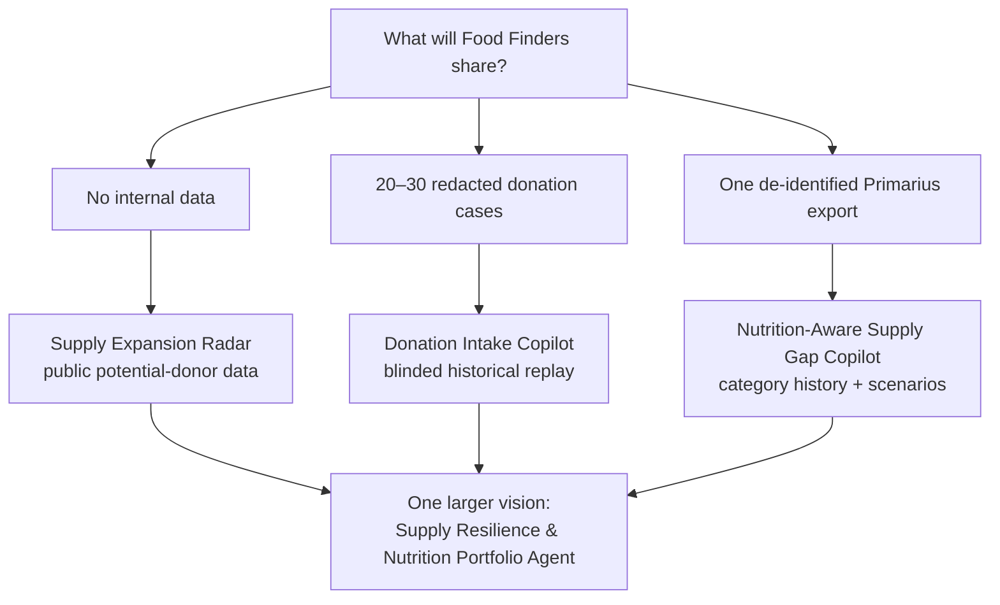

# Food-Bank Hackathon Decision Memo

**Research current through July 12, 2026**  
**Question:** Should the team pursue a practical data-constrained solution, a grand innovative concept, or something else?

## 1. Decision

Do **not** choose between a practical solution and a grand vision. The strongest strategy is:

> **A narrow working agent that accepts messy/manual data today, plus a clearly separated vision for how the same event layer becomes a regional food-supply resilience system later.**

Recommended balance:

- **Approximately 70% of the pitch:** a real Food Finders workflow, working demo, explicit data inputs, human approval, and honest quantified evaluation.
- **Approximately 30%:** the transformative supply-resilience network the wedge could enable after integrations and better data exist.

This recommendation follows from three separate findings:

| Uncertainty | Evidence-based verdict | Confidence |
|---|---|---:|
| Are food-bank systems/data good enough for AI? | **Uneven, but sufficient for a thin-slice agent.** Do not assume APIs or clean history. Start with email, PDFs, photos, manual entry, or one CSV. | High |
| Is incoming supply/flexible money a real problem? | **Yes at sector level and plausibly at Food Finders.** But “incoming supply” contains several different root causes; donor awareness is only one. | High for supply/funding; medium for awareness; local priority unvalidated |
| Will judges prefer innovation over applicability? | **Applicability is strongly signaled and historically rewarded.** Ambitious vision differentiates, but a grand idea alone is a riskier First Prize strategy. | High |

---

## 2. Why the data concern is valid—but not fatal

### 2.1 The honest technology picture

Food Finders appears to use Primarius centrally and Link2Feed in its food-bank-run pantry, so structured transaction and service records probably exist. Public evidence does **not** establish the API, export permissions, field completeness, identifier stability, or partner-agency coverage.

At the pantry edge, the national baseline is weak: in a 297-pantry survey using January–June 2022 data, 62.3% used visual inventory assessment, 48.5% used paper and pencil for inventory, and 49.2% tracked important statistics on paper. ([National pantry technology survey](https://pmc.ncbi.nlm.nih.gov/articles/PMC11810111/))

Fresh Reddit accounts show that this is not merely historical:

- A small pantry in March 2026 reported that all donations were logged on paper because it had no handhelds or extra computers. It wanted a shared Google Sheet to trade 200 pounds of slow-moving beans for another pantry's expiring crackers. ([r/googlesheets](https://www.reddit.com/r/googlesheets/comments/1robz89/very_small_inventory_for_a_food_panty_is_this_a/))
- A pantry manager in June 2025 described manually counting category inventory into Google Sheets, with high labor and repeated errors. ([r/InventoryManagement](https://www.reddit.com/r/InventoryManagement/comments/1lni9xt/best_inventory_procedure_for_food_pantries/))
- Another food-bank program described tracking cases and individual units on paper and manually converting between them. ([r/excel](https://www.reddit.com/r/excel/comments/yil09f/non_profit_foodbank_needs_assistance/))

These are self-selected anecdotes, not prevalence estimates, but they match the national survey mechanism: the downstream network often lacks reliable live inventory.

### 2.2 The architectural response

Do not make “Food Finders gives us an API” a prerequisite for the hackathon.

Use an integration ladder:

1. **Manual upload or entry:** email, photo, PDF, spreadsheet, or form.
2. **One-time CSV export:** enough for historical replay or a shadow recommendation.
3. **Scheduled read-only export:** suitable for a real pilot.
4. **Read-only API/database replica:** useful after access and governance are established.
5. **Approved write-back:** only after field validation, auditability, and ownership exist.

The pitch should say:

> We do not assume Food Finders has an AI-ready data warehouse. The agent creates value from information staff already receive—emails, PDFs, photographs, manual entries, and exports—while creating the clean, auditable event history needed for more advanced decisions later.

### 2.3 What can be proven at each access level

| Data available | What can be built | What can honestly be claimed |
|---|---|---|
| **No internal Food Finders data** | Synthetic but locally calibrated scenario; public annual mix; sample offers; public nutrition/pricing/geography | Functional behavior and sensitivity—not local savings or impact |
| **20–30 reconstructed cases** | Historical replay of donation or purchase decisions | Extraction accuracy, missing-field detection, agreement/override, estimated decision time |
| **8–12 weeks of category-level inventory/receipts/distributions** | Nutrition-gap planning and shock scenarios | Back-tested gap visibility and action recommendations; not causal mission impact |
| **Recurring read-only CSV** | Shadow-mode weekly decision queue | Actual review burden, decision latency, overrides, false alerts, and accepted recommendations |
| **Integrated live pilot** | Bounded action with human approval | Field outcomes such as time saved, usable pounds, cost, spoilage, or fill rate |

A polished synthetic demo is acceptable if every assumption is labeled. Inventing a “27% improvement” from synthetic data is not.

---

## 3. Testing the Food Finders employee's diagnosis

The employee's view survives the scan, but it needs sharper wording.

### 3.1 What the evidence supports

**Supply and flexible funding are genuine problems.** Food Finders' FY2025 source portfolio was 30.7% retail donations, 24.4% purchased product, 21.1% USDA commodities, 15.8% Feeding America/other banks, and smaller individual/business and food-drive shares. A disruption to any major stream is material. ([Food Finders FY2025 annual report](https://www.food-finders.org/wp-content/uploads/2026/04/2025-Annual-Report-Final-5-1.pdf))

The newly published USDA report explicitly states that direct purchasing lets food banks select exact products based on household needs, nutrition goals, and cultural appropriateness. ([USDA ERS, July 2, 2026](https://www.ers.usda.gov/media/29309/err-359.pdf?v=42860)) Food Finders' public member material similarly says purchased products cover items greatly needed by agencies but not generally available from donors. ([Food Finders member qualifications](https://www.food-finders.org/wp-content/uploads/2021/04/Member-Qualifications.pdf))

The current Indiana evidence is unusually strong. In early 2026, Mother Hubbard's Cupboard reportedly received 9,422 pounds of TEFAP food in January–February versus 49,225 pounds one year earlier; Hoosier Hills received roughly 34,000 versus 143,000 pounds over the comparable period. The organizations described rising demand and the difficulty of sustainably purchasing lost staple food. ([Indiana Public Media, March 5, 2026](https://www.ipm.org/news/2026-03-05/food-banks-short-on-food-amid-stall-in-federal-funding))

Reddit staff and client accounts triangulate the mechanisms:

- In a February 2025 r/nonprofit discussion, operators described record distributions alongside declining donations, sponsorships, grants, and concern that demand would exceed resources. ([Thread](https://www.reddit.com/r/nonprofit/comments/1j0h51w/impacts_on_food_insecurity/))
- In an October 2025 donor discussion, the dominant advice was cash because food banks can buy wholesale and use funds to balance donation gaps; commenters also cautioned that the answer depends on the specific pantry. ([r/Frugal](https://www.reddit.com/r/Frugal/comments/1ofy66m/best_foods_to_donate_to_a_food_pantry/))
- A recent client discussion showed that more calories are not automatically more utility: people described excessive carbohydrates, missing meal-completing ingredients, short usable life, dietary mismatch, and distribution times conflicting with work. ([r/povertykitchen](https://www.reddit.com/r/povertykitchen/comments/1r07xvm/issues_with_food_banks/))

### 3.2 What “incoming supply” might actually mean

| Possible root cause | Observable evidence | Different solution |
|---|---|---|
| Federal/USDA volume declined | Expected versus received truckloads/pounds | Scenario planning, purchasing/fundraising—not donor awareness |
| Existing retail donors underperform | Donation trend by store, manager turnover, missed pickups | Relationship/training and performance agent |
| Businesses do not know they can donate | Prospect-to-contact-to-onboarding funnel | Donor discovery and human-approved outreach |
| Offers arrive but response is slow | Offer, response, acceptance, pickup timestamps | Intake and coordination agent |
| Donations are unusable or wrong assortment | Rejection, sorting, spoilage, nutrition/category reason | Offer qualification and landed-value agent |
| Pickup/cold storage/labor is inadequate | Declines by vehicle, space, staffing, or date window | Capacity coordination or capital—not merely AI |
| Cash is insufficient/restricted | Budget by funding type, unfilled purchase gaps | Fund development, procurement, cooperative buying |
| Purchasing is inefficient | Prices, normalized packs, emergency buys, vendor lead time | Procurement copilot |

The current defensible problem statement is therefore:

> Food banks must continuously turn volatile federal, retail, manufacturer, agricultural, and cash streams into a nutritionally useful assortment. Donor turnover, incomplete offers, response delays, limited trucks/cold storage/labor, funding restrictions, and partner capacity cause available supply to be missed, become unusable, or fail to close the right nutrition gaps.

### 3.3 Awareness is plausible, but it is not established as the primary lever

ReFED estimates that only 12% of 14.5 million tons of surplus food that could be donated was donated in 2023. It specifically highlights education, infrastructure, donor coordination, and the distinction between food recovery and ordinary charitable assistance. ([ReFED, September 16, 2025](https://refed.org/articles/beyond-the-summit-reimagining-food-rescue/))

Food Bank News reports that donation behavior can weaken after frequent grocery-store staff turnover; recurring visits, training, photos, store-level metrics, and prompt pickup matter. ([Retail recovery, May 28, 2025](https://foodbanknews.org/retail-recovery-helps-buoy-food-banks-in-tough-time/); [food sourcing, November 3, 2025](https://foodbanknews.org/food-sourcing-in-a-time-of-funding-scarcity/))

But Food Finders already publishes most-needed items, runs food-and-fund drives, offers GiveHealthy online drives, and participates in major retailer campaigns. ([Food Finders Get Involved](https://www.food-finders.org/get-involved/)) A generic awareness chatbot, wishlist, or campaign page would duplicate existing mechanisms.

The useful AI question is narrower: **Can an agent identify which donor relationships or nutrition categories are underperforming and recommend the next specific, executable action?**

### 3.4 Supply volume is not enough

A June 2026 nonprofit worker described a business pickup containing opened items, improperly frozen prepared food, and partially eaten food—an extreme anecdote, but a vivid example of a donation transferring disposal work to the charity. ([r/nonprofit](https://www.reddit.com/r/nonprofit/comments/1u3ykqb/why_do_businesses_donate_literal_trash/))

Another pantry discussion described abundant canned goods that could not be shelved quickly enough because of staffing, while produce ran out rapidly. ([r/nonprofit](https://www.reddit.com/r/nonprofit/comments/15rt9d3/no_limits_food_pantry/)) A client reported receiving roughly 100 pounds of peaches and other perishables they could not store, creating household waste. ([r/Frugal](https://www.reddit.com/r/Frugal/comments/1hwna53/food_bank_giving_out_pallets_of_unsorted/))

These anecdotes reveal the critical distinction:

> **Gross inbound pounds ≠ usable, wanted, safely handled nutrition delivered.**

---

## 4. What the frontline scan actually establishes

| Theme | Evidence strength | Implication for the hackathon |
|---|---:|---|
| Supply scarcity and funding volatility | Strong, current, convergent | Worth solving, especially under USDA/policy disruption |
| Flexible cash enables exact assortment | Strong qualitative and practitioner support | Purchasing belongs in the solution, not only donations |
| Donor awareness/turnover affects recovery | Moderate–strong | Treat as relationship performance, not generic marketing |
| Trucks, freezers, docks, labor, and response speed bind | Strong | Capacity must be checked before matching/acceptance |
| Donation quality and household fit vary greatly | Strong qualitative; prevalence unknown | Optimize usable nutrition, not pounds |
| Data maturity is heterogeneous | Strong national baseline plus current anecdotes | Manual/CSV-first architecture is necessary |
| Hours, transport, stigma, and digital access suppress observed demand | Strong survey/client evidence | Do not train on visits/orders as “true need” |
| Workforce burnout and training constrain adoption | Moderate, recurring | Net staff burden is a core KPI |

### Selection-bias warning

Reddit identities, roles, and locations are unverified. Posts are self-selected; unusually positive and negative experiences attract attention. Client-focused communities overrepresent recipient experience, while r/nonprofit overrepresents staff and volunteers rather than regional food-bank executives. Shutdown and policy shocks distort late-2025 threads. Conversely, Food Bank News tends to profile larger innovators and successful programs.

Use these sources to identify mechanisms and interview hypotheses—not to estimate prevalence or declare Food Finders' top problem.

---

## 5. What data can actually be accessed

### 5.1 Food Finders' core system is accessible—but permission is the constraint

Primarius 2 can export grids as CSV, TSV, or Excel and can export raw report data to Excel. It also documents a broad JSON API covering receipts, inventory, products, orders, agencies, routes, donations, nutrition, warehouses, and vehicles. Live API use, however, requires a food-bank-created user, endpoint permissions, an additional paid seat, and preferably a paid sandbox or mirrored database. Primarius also advises that live API pulls occur after business hours. ([P2 exports](https://help.primarius.app/Home/Detail/P2-Basics-1); [reports](https://help.primarius.app/Home/Detail/Reports); [API access](https://help.primarius.app/Home/Detail/connecting-to-an-azure-database); [endpoint documentation](https://demo.primarius.app/primarius/api/documentation/))

That means:

- **A one-file, read-only sidecar MVP is practical.**
- **A live API integration is an unnecessary hackathon risk.**
- System capability does not prove Food Finders field completeness or permission to access it.

Link2Feed offers organization data exports and a paid differential REST export API, but its records can be personally identifiable and Food Finders is publicly listed for its food-bank-run pantry—not necessarily the complete agency network. Avoid client-level data for this supply-chain MVP. ([Link2Feed API](https://www.link2feed.com/products/add-on-features/api-integrations/); [security and data ownership](https://www.link2feed.com/security-features/); [customer list](https://www.link2feed.com/link2feed-food-bank-customer-list/))

MealConnect's workflow is public, but no open transaction API/export documentation was found. Its terms restrict copying site materials. Do not make scraping an MVP dependency. ([MealConnect terms](https://mealconnect.org/terms))

### 5.2 Useful public sources for a zero-partner-data prototype

| Public source | What it provides | Honest use |
|---|---|---|
| [EPA Excess Food Opportunities Map](https://www.epa.gov/sustainable-management-food/excess-food-opportunities-map) | Downloadable facility-level potential food generators and modeled excess-food estimates | Rank donor prospects; never call modeled potential a live donation |
| [USDA FoodData Central](https://fdc.nal.usda.gov/api-guide/) | CC0 nutrient/product data by API or download | Map product descriptions to nutrition categories, with ambiguity flags |
| [Healthy Eating Research nutrition-ranking implementation guide](https://learninghub.feedingamerica.org/best-practices/toolkit/uploads/5-IMPL~2_1656531591.PDF) | Deterministic Choose Often/Sometimes/Rarely criteria and food-bank system guidance | Create an explainable nutrition profile rather than an opaque AI score |
| [USDA WBSCM public data structures](https://www.fns.usda.gov/usda-foods/wbscm/data) | USDA product/order schemas and material references | Create realistic federal incoming-supply events; local records still require authorization |
| [USDA Food Price Outlook](https://ers.usda.gov/data-products/food-price-outlook) and [MyMarketNews API](https://mymarketnews.ams.usda.gov/mymarketnews-api) | Public price trends and market reports | Purchase-scenario benchmarks, not Food Finders' contracted prices |
| [Feeding America Data Commons](https://datacommons.feedingamerica.org/about), ACS, Food Environment Atlas | Geographic need and context | Equity/context layer, not weekly demand or individual need |
| OpenStreetMap | Locations and small-scale routing | Distance estimate with attribution; never upload confidential client addresses to a public geocoder |
| [openFDA food enforcement API](https://open.fda.gov/apis/food/enforcement/) and [FSIS recall API](https://www.fsis.usda.gov/science-data/developer-resources/recall-api) | Public recalls | Deterministic warning layer; not a complete food-safety decision |

### 5.3 The data-contingent MVP plan

This removes the need to gamble on data access before choosing a direction.



#### If Food Finders provides no internal data: Supply Expansion Radar

Use the EPA potential-generator dataset, the 16-county service area, public business/agricultural information, distance, cold-chain burden, and public Food Finders needs to rank **prospective** donors. Produce a staff-reviewable lead brief and a disposition workflow: already known, new, unsuitable, contact, interested, converted.

Claim only lead prioritization. The first real validation is whether the top 20 prospects are new, plausible, and worth contacting—not pounds “recovered” in a simulation.

#### If Food Finders provides 20–30 redacted offer decisions: Donation Intake Copilot

Have the agent extract item, quantity, date, temperature, pickup window, and restrictions; identify missing information; recommend accept, partial accept, redirect, or decline; and compare with the actual staff decision. Ask staff to score usefulness and disagreement reasons.

This often produces a stronger test than thousands of inventory rows because it evaluates the exact decision loop.

#### If Food Finders provides one de-identified P2 export: Nutrition-Aware Supply Gap Copilot

Ask for receipts, distributions, purchases, adjustments, and waste over 12–24 months if available. Minimum fields:

```text
record_type
transaction_date
product_id
product_description
food_category
source_type
quantity_cases
weight_pounds
storage_type
nutrition_rank
unit_cost_or_value
agency_id_hashed
requested_quantity
shipped_quantity
lot_or_best_by_date
adjustment_reason
```

The agent can measure category/source volatility, identify recurring nutrition gaps, estimate weeks of supply, replay shortages, and compare targeted donation versus purchasing scenarios.

If the file contains only receipts but not distributions or requested/shipped quantities, it can characterize incoming volatility but cannot prove that a supply gap affected service.

### 5.4 Synthetic-data rules

If synthetic data are necessary:

- calibrate source proportions to Food Finders' published report;
- use real public USDA product structures and nutrition records;
- enforce `opening + receipts − distributions − waste = closing inventory`;
- keep case/pound transforms internally consistent;
- apply valid storage and shelf-life logic;
- mark every field `public`, `synthetic`, `staff-provided`, or `assumed`;
- never generate fake client records that resemble real people;
- never use synthetic results as evidence of forecast accuracy or local impact.

---

## 6. What the competition appears to reward

There is no published numeric 2026 rubric. However, the available evidence is unusually consistent.

### 6.1 Direct 2026 signals

The supplied deck says:

- build an AI-agent solution that “substantially improve[s] or transform[s]” food-bank supply chains;
- solutions for a specific food bank are encouraged;
- talk to a food-bank supply-chain team;
- solve a **real problem**;
- quantify both the problem and solution.

The organizer's current announcement adds special interest in disruption events and Black Swan risk, while saying nontechnical participation is welcome. ([2026 announcement](https://www.linkedin.com/posts/edmund-zagorin-41291b13_the-ai-supply-chain-hackathon-food-banks-activity-7476050448899100673-JQZ-))

The official event page permits either a software demo or a novel policy/cooperation solution. That means a concept-only proposal is **eligible**, not that it is the safest winning strategy.

### 6.2 Historical winning evidence

In 2025, the judges' top prize went to Ignis, a dynamic freight-route optimization proposal. The organizer explicitly credited “detailed feasibility,” quantified benefits, and presentation. The Creativity winner demonstrated a functioning callable phone agent rather than only slides. ([2025 winners](https://www.linkedin.com/posts/edmund-zagorin-41291b13_well-there-you-have-it-the-2025-ai-objectives-activity-7301384875465445377-HXBq))

The official 2023 recap says winning submissions presented specific product solutions with working prototypes and showed detailed domain knowledge, feasibility, and instrumentation of real-time data collection. It simultaneously praises root-cause analysis, feedback loops, sociotechnical thinking, and short/medium/long-term solutions. ([2023 AISCO report](https://static1.squarespace.com/static/6086fb0cbf366f6273c435e5/t/66673ab30c63b90f39fd3d70/1718041268358/AISCO_Hackathon_Report.pdf))

### 6.3 Strategic inference

The panel includes a former food-bank chief supply-chain officer, procurement/product leaders, agent engineers, and AI ethics/social-impact experts. That combination is likely to test:

- whether the workflow and decision owner are real;
- whether the proposal is genuinely agentic rather than a chatbot/dashboard;
- whether data and integrations are credible;
- whether benefits are quantified without invention;
- whether humans retain authority over safety, money, and scarce food;
- whether the concept scales into a resilient and prosocial system.

A grand control tower that assumes clean APIs is vulnerable. A tiny automation with no larger mission is forgettable. A functioning wedge plus a system vision satisfies both sides.

---

## 7. Recommended concept: Supply Resilience & Nutrition Portfolio Agent

### 7.1 Problem statement

Food Finders cannot choose the timing and mix of retail, USDA, manufacturer, farm, and community donations. Unrestricted funding gives it control, but purchasing budgets are limited. Staff must continuously determine:

- which nutrition categories are at risk;
- whether a new in-kind offer actually closes a useful gap;
- whether Food Finders or a partner can handle it;
- whether to accept, redirect, purchase, transfer, or make a targeted donor/fund ask;
- how the plan changes under a supply shock.

Today, the information can be spread across P2 exports, emails, packing lists, price sheets, phone calls, and staff knowledge.

### 7.2 Working wedge

The minimum coherent demo answers one question:

> **Given current category inventory, expected arrivals, a nutrition target, available budget, and a new offer, what is the best staff-approved action to close the next supply gap?**

Inputs can be manual or files:

- one inventory/category snapshot;
- expected USDA/donated arrivals;
- nutrition targets defined through transparent rules;
- a small vendor price list or public benchmark;
- one incoming offer email, photo, or packing list;
- basic storage/transport capacity.

The agent:

1. extracts and normalizes the offer;
2. flags missing decision-critical facts;
3. maps inventory and the offer to nutrition categories;
4. identifies gaps and weeks of supply;
5. applies safety, storage, date, restriction, and budget rules;
6. compares accept, partial accept, redirect, transfer, purchase, or targeted ask;
7. shows reasoning, uncertainty, data provenance, and alternatives;
8. requires a human decision and records the reason.

This is agentic because it gathers evidence, invokes data and rules, evaluates options, requests missing information, and maintains a decision state. It is not autonomous because consequential actions remain approved.

### 7.3 Innovation layer

The same event model can expand into:

- donor/store performance and relationship-change detection;
- public-data prospect discovery;
- targeted food-versus-fund campaigns;
- nutrition-aware procurement and cooperative buying;
- partner storage/vehicle/cold-capacity matching;
- cross-food-bank transfers;
- scenario planning for USDA reductions, demand spikes, disasters, or donor loss;
- a clean longitudinal supply-decision history that did not previously exist.

The public organizer's emphasis on disruption/Black Swan risk makes the scenario layer especially relevant. For example, demonstrate how the plan changes if USDA arrivals fall 30%, retail donations fall 15%, or a freezer becomes unavailable. Label these as scenarios, not predictions.

### 7.4 Why this is stronger than a generic awareness agent

- It incorporates the Food Finders employee's two points: incoming supply and flexible money.
- It does not assume that every additional donation is useful.
- It avoids duplicating Food Finders' existing most-needed list, GiveHealthy drive, or MealConnect.
- It has a useful zero-data module, a stronger one-file module, and a credible integration roadmap.
- It optimizes a **portfolio of supply actions**, not only pounds or donor clicks.
- It can create better structured data while providing immediate decision support.

### 7.5 Metrics

Do not invent uplift. Show an impact equation and fill it with real values only when available.

| Layer | Measures |
|---|---|
| Agent quality | extraction accuracy; missing-field recall; correct rule application; abstention; staff agreement/override |
| Decision speed | offer-to-decision time; staff touches; time to produce purchase/ask plan |
| Supply quality | gap days by nutrition category; weeks of supply; usable shelf life; accepted/redirected/declined reason |
| Financial | cost per usable nutritious pound/serving; emergency purchase premium; budget used; restricted versus flexible funds |
| Operations | pickup miles; cold/storage capacity violation; spoilage; processing burden |
| Resilience | performance under explicit supply/demand shocks; alternative sources identified; time to replan |
| Adoption | net review time; percentage recommendations actionable; false alerts; named owner |

---

## 8. Immediate validation request

Ask Food Finders for either of two low-risk options:

> Could you provide either (1) one de-identified Primarius export covering receipts and distributions for the last 12–24 months, with no client names or addresses, or (2) 20–30 redacted incoming donation offers together with the final staff decision? We will work read-only, use the files only for the hackathon, and clearly separate historical replay from actual impact.

Also ask the original contact:

1. When you say incoming supply, which stream declined: retail, USDA, manufacturer, farms, food drives, or cash?
2. Is missed supply unknown, offered but not collected, collected but unusable, or simply unavailable?
3. What are the top five reasons an offer is declined or partially accepted?
4. Which nutrition categories are chronically purchased, and what was spent on each?
5. Would $100,000 of unrestricted funds or one refrigerated truck create more usable food? Why?
6. How many donor stores went silent after a manager or staff change?
7. Does P2 capture offers and declines, or only receipts? If only receipts, missed supply is invisible.
8. Which partner cold-storage, vehicle, and operating-capacity facts are available digitally versus known by phone?

Interview at least the sourcing manager, purchasing lead, receiving/warehouse lead, one driver, agency-relations staff, and three different partner pantries. One employee is a valuable local signal, but not a complete process map.

---

## 9. Go/no-go decision

Proceed with this direction if at least one is true:

- Food Finders supplies a small export or redacted cases;
- staff confirm a recurring nutrition-category or offer-decision problem;
- the public-data radar produces genuinely new and operationally plausible prospects;
- the demo can show a real decision, evidence, uncertainty, and human approval.

Pivot if:

- Food Finders says supply planning and donor acquisition already work well;
- there is no decision owner willing to review recommendations;
- the only available “impact” is fictional synthetic uplift;
- the concept reduces to generic outreach, a dashboard, or a duplicate marketplace;
- the required data are individual client records rather than supply-chain events.

## 10. Final stance

Your uncertainty is not a reason to stop. It should become part of the design:

- **No assumption of clean data:** upload-first and read-only.
- **No assumption that awareness is the root cause:** decompose and test it.
- **No assumption that judges want only science fiction:** use historical evidence favoring feasibility.
- **No sacrifice of innovation:** make the practical wedge the first module of a larger resilience system.

The pitch should be ambitious about the system it could enable and conservative about what the current evidence proves.

