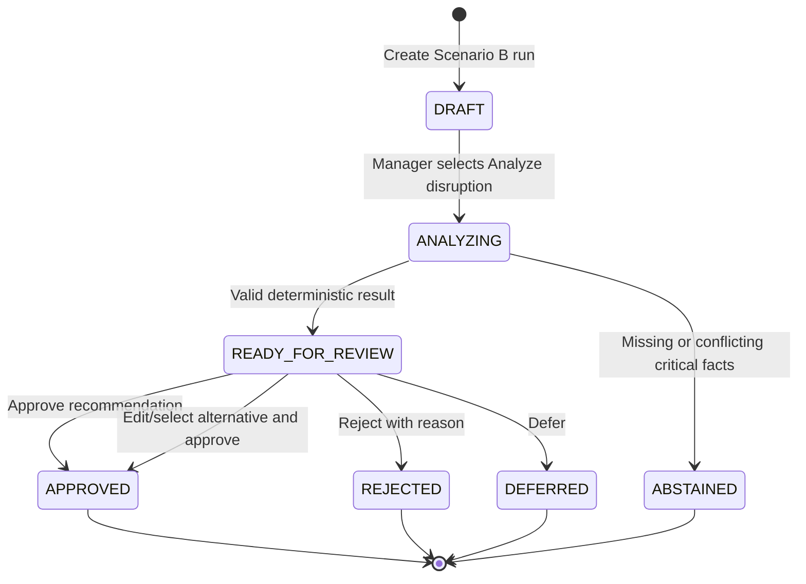

# Scenario B Blueprint: Short-Life Produce Offer

**Status:** Proposed implementation blueprint for team validation
**Scenario ID:** `SCN-B-SHORT-LIFE-PRODUCE`
**Data mode:** Fully synthetic and explicitly labeled
**Primary operator:** Food-bank supply-planning manager
**Primary decision:** What should the food bank do with a 20,000 lb short-life refrigerated produce offer?
**Authority note:** Until this blueprint is approved and incorporated into the numbered build contract, `BUILD_CONTEXT/00_BUILD_CONTRACT.md` through `06_ACCEPTANCE_EVALUATION_AND_DEMO.md`, the schemas, fixtures, and golden outputs remain authoritative.

---

## 1. Executive summary

This scenario demonstrates one complete, human-approved decision loop:

1. A simulated donor portal sends the food bank a structured offer for **20,000 lb of refrigerated produce** that has **five days of usable life**.
2. The application displays the original incident notification and the verified fields extracted from it.
3. The AI retrieves a read-only snapshot of the food bank's relevant operational state: current inventory, planned inbound, recent distribution, forecast, refrigerated capacity, available budget, category thresholds, and catalogued response opportunities.
4. The deterministic decision engine performs every arithmetic calculation, inventory projection, capacity check, expiry simulation, constraint evaluation, score, and rank.
5. The AI receives the engine's immutable recommendation package. It explains the result in manager-facing language without inventing or recalculating any number.
6. The manager reviews the evidence and may approve, edit, select an alternative, reject, or defer.
7. Approval changes only the local synthetic run. No real donor, peer, warehouse, vehicle, pantry, or purchasing system is contacted.

The expected result is to recommend accepting **10,000 lb**, because that quantity fits the remaining refrigerated capacity, is projected to be distributed before expiry, and prevents the modeled produce shortage. Full acceptance is rejected because it would exceed refrigerated capacity and produce excessive modeled expiry spoilage.

### Meaning of "AI learns"

In this blueprint, "AI learns about the incident and the bank" means **run-time retrieval and reasoning over verified records**. It does not mean model training, fine-tuning, persistent memory, or automatic policy learning.

At the beginning of every run, the application constructs a versioned bank-state snapshot. The AI may read that snapshot through bounded, read-only tools. The AI never becomes the source of truth for inventory, capacity, demand, cost, policy, or calculations.

---

## 2. Real-world grounding

Large, time-sensitive food offers are operationally realistic. Feeding America describes MealConnect as a platform where retailers, farmers, restaurants, suppliers, and other food businesses post surplus food and pickup information for food banks or agency partners. Feeding America also notes that produce, dairy, and meat can spoil quickly and that some food banks may not have sufficient refrigerated or frozen space.

Grounding sources:

- [Feeding America: What is MealConnect?](https://www.feedingamerica.org/hunger-blog/what-mealconnect-learn-about-feeding-americas-food-rescue-platform)
- [Feeding America: Corporate food donations](https://www.feedingamerica.org/ways-to-give/corporate-and-foundations/product-partner)
- [Feeding America: What to donate and what to avoid](https://www.feedingamerica.org/hunger-blog/what-donate-food-bank-and-what-avoid)

These sources establish that surplus-food offers, pickup coordination, short usable life, and refrigerated-capacity limitations are real operational concerns. They do **not** establish the synthetic quantities, dates, costs, thresholds, or projected outcomes in this demo.

---

## 3. Scenario story

### 3.1 Planning context

- Planning date: Monday, August 3, 2026.
- Mode: offline verified demo mode by default.
- Organization: one fictional regional food bank.
- Warehouse: one fictional central warehouse.
- Planning horizon: four Monday-start weeks.
- Units: category-level whole pounds.

### 3.2 Incident

The food bank receives this simulated donor-portal notification:

> **Short-life produce offer**
> A synthetic donor offers 20,000 lb of refrigerated produce for immediate receipt. Remaining usable life is five days. A response is required by August 3, 2026 at 20:00 UTC.

The incident is represented by two linked records:

1. A displayable evidence record that preserves what the operator received.
2. A structured pending-offer record used by validation and calculation.

The offer is pending. It does not enter inventory merely because the incident was received.

### 3.3 What changed from the ordinary plan

The ordinary Week-1 produce receipt `INB-DONATION-PRODUCE-201`, containing 10,000 lb with seven days of usable life, is removed by the scenario overlay. Instead, the food bank must decide what to do with the new 20,000 lb, five-day offer.

This creates two connected problems:

1. **If the offer is ignored or declined**, modeled Week-1 produce inventory falls below the staff-defined minimum.
2. **If the full offer is accepted**, the warehouse exceeds refrigerated capacity and some of the accepted offer remains at expiry.

The useful decision is therefore not simply "accept free food" or "decline risky food." The system must compare feasible dispositions using the current warehouse state.

---

## 4. Incident communication and ingestion

### 4.1 Chosen P0 incident channel

Use a **simulated structured donor portal** as the Scenario B incident channel.

This is the best P0 choice because:

- it is consistent with documented food-rescue platforms;
- it can be displayed clearly during the demo;
- it avoids pretending that every donor uses email;
- it minimizes ambiguous extraction fields;
- it matches the repository's current trusted structured Scenario B offer.

The Decision workspace should display:

- source label: `Simulated donor portal`;
- received timestamp;
- response deadline;
- original notification text;
- offer ID and evidence ID;
- a `Verified offer facts` section;
- a persistent `Synthetic` label.

### 4.2 Required incident fields

| Field | Scenario B value | Why it is required |
|---|---:|---|
| `offer_id` | `OFFER-B-PRODUCE-20000` | Stable identity and audit linkage |
| `category_id` | `PRODUCE` | Selects policy, forecast, inventory, and storage type |
| `gross_quantity_lb` | `20000` | Capacity and action quantity basis |
| `arrival_week_start` | `2026-08-03` | Determines planning bucket |
| `usable_life_days` | `5` | Expiry projection |
| `storage_type` | `REFRIGERATED` | Capacity constraint |
| `expected_usable_yield_ratio` | `1.0` | Converts gross to usable pounds |
| `food_safety_status` | `KNOWN_ALLOWED_FOR_SIMULATION` | Explicit modeling precondition; never inferred by AI |
| `response_deadline` | `2026-08-03T20:00:00Z` | Human decision urgency |
| `evidence_ids` | `EVD-B-PRODUCE-OFFER` | Provenance and explanation |
| `record_version` | `1` | Reproducibility |

### 4.3 AI's incident role

For the structured portal path, the AI does not need to calculate or infer the offer fields. The trusted application layer supplies the validated incident envelope as part of the server-owned evaluation context. The Decision workspace obtains the same staged incident from the run state. This does not add an incident-retrieval tool to the frozen LLM tool registry.

The incident envelope includes:

- raw displayable evidence;
- verified structured fields;
- trust level;
- source IDs;
- record versions;
- content hash;
- missing/conflicting-field findings;
- synthetic flag.

The AI may summarize: "A 20,000 lb refrigerated produce offer is available today with five days of usable life." It may not change the quantity, life, category, deadline, safety status, or source.

### 4.4 Future email or free-text adapter

Email is a valid future incident channel, but it is not required for Scenario B P0. If an email demo is later added:

1. Store the full synthetic email as `UNTRUSTED_TEXT` evidence.
2. Allow the LLM to extract only an allowlisted schema.
3. Preserve exact source spans for every extracted field.
4. Reconcile extracted facts against any trusted offer record.
5. Never let an email supply a food-safety decision, probability, policy, action, or authorization.
6. Abstain when a decision-critical field is missing or conflicting.
7. Provide an exact offline cached extraction so the demo works without network access.

Adding this email path to Scenario B would require a deliberate versioned update to the current data contract, fixture, evidence, golden output, and tests. It must not be silently inserted into the existing scenario.

---

## 5. Actors and authority

| Actor/component | Responsibility | Explicitly cannot do |
|---|---|---|
| Simulated donor portal | Supplies the offer notification and structured fields | Approve the food bank's decision |
| Food-sourcing/receiving staff | Confirm offer identity, condition prerequisites, usable-life fact, and safety eligibility outside the AI | Delegate food-safety judgment to the LLM |
| AI orchestration layer | Read the incident, request allowed state/analysis tools, and explain verified results | Calculate, invent facts, change policy, create actions, or execute a decision |
| Deterministic decision engine | Forecast, project, simulate, check constraints, score, rank, and produce immutable results | Contact a donor, approve an action, or write to an external system |
| Supply-planning manager | Review evidence and approve, edit, choose an alternative, reject, or defer | Modify cost, date, evidence, probability, or action type through free text |
| Persistence layer | Store immutable run metadata and append-only events | Rewrite prior events or fixtures |

### Human decision points

Humans are in the loop at three times:

1. **Before analysis:** staff confirm that the offer record contains the required operational facts and that food-safety eligibility is known for simulation.
2. **After recommendation:** the manager reviews the incident, state, calculations, constraints, recommendation, alternatives, uncertainty, and deadline.
3. **At final disposition:** the manager explicitly approves, edits and approves, selects an alternative, rejects, or defers.

Even after approval, the P0 application records only a simulated outcome. Real execution remains a separate human-controlled workflow.

---

## 6. What bank state the system needs

The system should not attempt to know "everything about the food bank." It should retrieve the **minimum complete state that can change this decision**. Every simulated field adds a validation and explanation burden, so fields without a defined calculation or constraint are excluded.

### 6.1 Required state domains

#### A. Current usable inventory

Required for all six categories because category coverage is a cross-category comparison. Lot identity must be retained internally for first-expiring-first-out allocation.

| Category | Starting usable inventory |
|---|---:|
| Protein | 30,000 lb |
| Produce | 15,000 lb |
| Dairy | 9,000 lb |
| Grains | 45,000 lb |
| Staples and mixed meals | 40,000 lb |
| Snacks and discretionary | 30,000 lb |

For Scenario B's refrigerated peak, Produce and Dairy are the directly relevant starting categories.

#### B. Recent distribution history

The engine needs the last four completed weekly distributions for each category. It uses them to create the frozen operational forecast.

| Category | Last four weekly distributions | Forecast mean |
|---|---|---:|
| Protein | 8,500; 9,000; 9,500; 9,000 | 9,000 lb/week |
| Produce | 13,000; 14,000; 15,000; 14,000 | 14,000 lb/week |
| Dairy | 5,500; 6,000; 6,500; 6,000 | 6,000 lb/week |
| Grains | 9,500; 10,000; 10,500; 10,000 | 10,000 lb/week |
| Staples and mixed meals | 8,500; 9,000; 9,500; 9,000 | 9,000 lb/week |
| Snacks and discretionary | 3,500; 4,000; 4,500; 4,000 | 4,000 lb/week |

The forecast is an operational estimate of future distribution, not a claim of complete community demand.

#### C. Planned inbound

The engine needs every confirmed, probable, and unconfirmed arrival across the four-week horizon, including:

- category;
- gross quantity;
- expected arrival week;
- status and deterministic probability;
- storage type;
- usable yield;
- usable life;
- evidence and version.

Scenario B specifically:

- removes the ordinary 10,000 lb Week-1 produce receipt;
- retains 14,000 lb confirmed produce receipts in Weeks 2, 3, and 4;
- retains the 6,000 lb confirmed Week-1 dairy receipt;
- uses all refrigerated arrivals when testing capacity.

#### D. Warehouse resources

| Resource | Value | Decision use |
|---|---:|---|
| Dry capacity | 150,000 lb | Cross-category capacity validation |
| Refrigerated capacity | 40,000 lb | Binding Scenario B constraint |
| Frozen capacity | 50,000 lb | Cross-category capacity validation |
| Flexible planning budget | $20,000 | Cost feasibility and efficiency |
| Minimum modeled pickup | 1,000 lb | Physical-action lower bound |
| Planning horizon | Four weeks | Projection boundary |

#### E. Minimal staff-defined policy

Scenario B cannot determine whether 1,000 lb of ending produce is acceptable without a threshold. Therefore, policy cannot be omitted. It may be hard-coded as synthetic configuration, but it must exist and be visible.

Produce configuration:

- essential assortment: `true`;
- priority weight: `5`;
- minimum weeks of supply: `0.5`;
- target weeks of supply: `1.0`;
- primary storage type: `REFRIGERATED`;
- default usable yield: `1.0`.

These values are synthetic staff-defined demonstration settings. They are not Food Finders policy or clinical nutrition guidance.

#### F. Available action opportunities

The system needs a closed, evidence-backed action catalog. For each action it needs:

- stable action ID and type;
- subject offer ID;
- fixed initial quantity;
- legal edit range and increment;
- arrival timing;
- storage effect;
- direct cost;
- success probability where applicable;
- usable life/yield;
- operational-burden class;
- destination ID where applicable;
- supporting evidence;
- human-approval requirement.

Scenario B activates only:

- partial acceptance of 10,000 lb;
- full acceptance of 20,000 lb;
- redirect request for 20,000 lb to one named synthetic peer;
- decline;
- monitor.

#### G. Evidence and versions

Every input and output must carry stable source IDs and versions. The AI explanation may cite only IDs returned in the deterministic package.

### 6.2 Operational data intentionally excluded from P0

The following data should **not** be simulated for this scenario because the current calculations and action catalog do not use them:

- volunteer count;
- staff schedules;
- truck count or routes;
- dock appointments;
- pallet dimensions or case counts;
- partner-pantry refrigeration;
- household or client records;
- exact produce varieties;
- demographic or individual nutrition data;
- real donor identities;
- real peer inventory;
- disposal outcomes.

This is data minimization, not an oversight. For example, a volunteer count is relevant only if the system models an action such as emergency sorting or accelerated distribution and defines a labor requirement. If that action is later added, a versioned contract must define fields such as available labor hours, required labor hours, time window, source, and pass/fail rule. A decorative volunteer number must not influence recommendations.

---

## 7. Canonical scenario snapshot

The application layer should construct one immutable engine input from validated records. Conceptually:

```json
{
  "run": {
    "run_id": "RUN-SYNTHETIC-...",
    "scenario_id": "SCN-B-SHORT-LIFE-PRODUCE",
    "planning_date": "2026-08-03",
    "forecast_week_starts": [
      "2026-08-03",
      "2026-08-10",
      "2026-08-17",
      "2026-08-24"
    ],
    "synthetic": true
  },
  "incident": {
    "offer_id": "OFFER-B-PRODUCE-20000",
    "category_id": "PRODUCE",
    "gross_quantity_lb": 20000,
    "arrival_week_start": "2026-08-03",
    "usable_life_days": 5,
    "storage_type": "REFRIGERATED",
    "expected_usable_yield_ratio": "1.0",
    "food_safety_status": "KNOWN_ALLOWED_FOR_SIMULATION",
    "response_deadline": "2026-08-03T20:00:00Z",
    "evidence_ids": ["EVD-B-PRODUCE-OFFER"]
  },
  "warehouse": {
    "warehouse_id": "WH-CENTRAL-01",
    "planning_budget_usd": "20000.00",
    "capacity_lb": {
      "DRY": 150000,
      "REFRIGERATED": 40000,
      "FROZEN": 50000
    },
    "minimum_pickup_lb": 1000
  },
  "inventory_lots": [],
  "historical_distribution": [],
  "planned_inbound": [],
  "category_policies": [],
  "enabled_actions": [],
  "evidence_records": [],
  "versions": {},
  "hashes": {}
}
```

This is a conceptual aggregate, not a replacement for the existing normalized schemas. The implementation should use closed Pydantic models and validated repository entities rather than untyped dictionaries.

---

## 8. How the AI obtains the bank state

### 8.1 Safe orchestration model

The AI should not manually copy numbers from several tools into a self-authored calculation request. That creates an avoidable hallucination and integrity boundary.

Use this flow instead:

1. The application creates a run and freezes its base snapshot and staged scenario overlay.
2. The AI adapter receives the `run_id`, validated synthetic incident context, and frozen tool definitions.
3. The manager's `POST /api/v1/runs/{run_id}/evaluate` request starts the server-owned evaluation; `evaluate_scenario` is not an LLM tool.
4. The backend resolves all records and constructs canonical parameters from trusted repositories.
5. In live mode, the AI may select only the next permitted read-only analysis tool in the frozen sequence. In offline mode, the backend invokes the same deterministic functions without an LLM.
6. The engine returns a deterministically hashed result package.
7. The AI explains only the final verified recommendation package.

The practical meaning of "the AI feeds the math engine" is therefore: **the AI can initiate an allowed analysis stage, while the trusted backend assembles the engine inputs**.

### 8.2 Frozen read-only analysis tools

Use the exact tool protocol already defined in `BUILD_CONTEXT/04_DECISION_AND_AGENT_CONTRACT.md`:

| Ordered tool | Purpose | Returns |
|---|---|---|
| `validate_scenario` | Validate the resolved analysis snapshot | Findings, counts, and snapshot hash |
| `forecast_distribution` | Read historical distribution and calculate the forecast | Source weeks, mean, forecast, and stability |
| `project_inventory` | Project baseline or one evaluated action | Inventory, inbound, distribution, expiry, WOS, and storage peaks |
| `detect_supply_risks` | Detect and order risks | Risks, priority inputs, primary risk, and evidence |
| `list_candidate_actions` | Load enabled catalog choices | Action facts, legal grids, evaluated-action IDs, and evidence |
| `check_action_constraints` | Check every candidate in one batch | Pass/fail results, observed values, limits, and reasons |
| `simulate_action_impact` | Simulate feasible candidates from the same snapshot | After projections, deltas, and score-component inputs |
| `rank_feasible_actions` | Score and rank feasible actions | Components, exact scores, ranks, confidence inputs, and IDs |
| `get_recommendation_package` | Retrieve the immutable review result | Recommendation, alternatives, rejected actions, constraints, and evidence |

The incident, current inventory, inbound plan, warehouse resources, and policies are not exposed through additional ad hoc LLM tools. They enter through the validated incident context and the frozen tools above. Adding another LLM-callable tool requires an explicit contract and version update.

Every response includes `analysis_snapshot_hash`, `input_hash`, `output_hash`, versions, and source IDs. The backend rejects skipped stages, invented IDs, and stale run revisions.

### 8.3 What the AI may say

The AI may explain:

- what offer arrived;
- what bank-state fields mattered;
- why full acceptance failed;
- why partial acceptance ranked first;
- what alternatives remain;
- what is uncertain or simplified;
- that manager approval is required;
- that all results are synthetic.

The AI may not:

- do arithmetic in model-generated reasoning;
- create or edit a quantity, cost, date, capacity, probability, threshold, or score;
- invent a donor, destination, action, or source;
- decide food safety;
- claim a redirect completed;
- approve or execute an action;
- claim real waste reduction or real people served.

---

## 9. Deterministic math and decision engine

### 9.1 Engine responsibility

The deterministic engine handles **both simple arithmetic and decision analysis**. A separate optimization solver is not required for this frozen Scenario B.

The engine performs:

- addition, subtraction, multiplication, division, minimum, maximum, and decimal rounding;
- four-week distribution forecasting;
- lot-based inventory projection;
- FEFO allocation;
- capacity-stress calculations;
- expiry-spoilage projection;
- weeks-of-supply and target-gap calculations;
- risk detection and priority calculation;
- hard-constraint checks;
- action simulation;
- normalized scoring;
- deterministic ranking;
- confidence calculation;
- before/after comparison.

All calculations use deterministic decimal arithmetic. The frontend and LLM do not recalculate values.

### 9.2 Calculation order

```text
validate assets and resolved scenario
forecast weekly distribution
project no-intervention baseline
simulate full-accept offer reference
detect and order risks
load enabled catalog actions
validate fixed action quantities
check hard constraints
simulate each feasible action from the same starting snapshot
calculate score components
rank feasible actions
calculate recommendation confidence
build immutable recommendation package
```

### 9.3 Forecast

For Produce:

```text
forecast = (13,000 + 14,000 + 15,000 + 14,000) / 4
         = 14,000 lb/week
```

The same 14,000 lb forecast is used in Weeks 1 through 4. The system does not recursively learn from simulated weeks.

### 9.4 No-intervention baseline

The ordinary Week-1 produce receipt is removed and the pending offer is not yet accepted:

```text
Week-1 beginning produce inventory = 15,000 lb
Week-1 confirmed produce inbound   =      0 lb
Week-1 forecast distribution       = 14,000 lb
Week-1 ending produce inventory    =  1,000 lb
Week-1 ending WOS                  = 1,000 / 14,000
                                  = 0.071428...
```

Since `0.071428... < 0.5`, Produce breaches the synthetic minimum.

Target inventory is:

```text
1.0 target WOS x 14,000 lb/week = 14,000 lb
gap to target = 14,000 - 1,000 = 13,000 lb
```

### 9.5 Full-accept reference: capacity

Refrigerated starting and confirmed Week-1 load before the offer:

```text
Produce starting inventory = 15,000 lb
Dairy starting inventory   =  9,000 lb
Dairy Week-1 inbound       =  6,000 lb
Baseline refrigerated peak = 30,000 lb
```

Full acceptance adds the gross 20,000 lb before distribution:

```text
full-accept peak = 30,000 + 20,000 = 50,000 lb
capacity         = 40,000 lb
overflow         = 10,000 lb
```

### 9.6 Full-accept reference: expiry

The five-day offer expires in Week 1. FEFO distributes the known-expiry offer lot before starting inventory with no in-horizon expiry fact:

```text
accepted offer                  = 20,000 lb
offer attributed to W1 delivery = 14,000 lb
offer remaining at expiry       =  6,000 lb
spoilage rate                   = 6,000 / 20,000 = 0.30
```

The usable-life rule permits no more than 10% projected expiry spoilage:

```text
allowed maximum = 20,000 x 0.10 = 2,000 lb
observed         = 6,000 lb
```

Full acceptance fails `STORAGE_CAPACITY` and `USABLE_LIFE`.

### 9.7 Primary risk

```text
overflow ratio = 10,000 / 40,000 = 0.25
spoilage rate  =  6,000 / 20,000 = 0.30

priority = 80 + 9 x max(0.25, 0.30)
         = 82.7
```

`SHORT_LIFE_CAPACITY` is the primary risk. The Produce shortage remains a supporting secondary risk.

### 9.8 Partial-accept simulation

The initial catalog action accepts 10,000 lb:

```text
refrigerated peak = 30,000 + 10,000 = 40,000 lb
```

It fits exactly.

```text
produce available = 15,000 + 10,000 = 25,000 lb
distribution      = 14,000 lb
ending inventory  = 11,000 lb
ending WOS        = 11,000 / 14,000 = 0.785714...
```

The 10,000 lb accepted offer lot is fully attributed to distribution before expiry. Modeled incremental offer-expiry spoilage is zero. The ending WOS is above the 0.5 minimum.

### 9.9 Hard constraints

Every action must pass, where applicable:

- action exists and is enabled;
- quantity is within catalog bounds and increment;
- action category matches the risk;
- cost is within remaining budget;
- required arrival is in the horizon;
- refrigerated peak stays within 40,000 lb;
- projected offer-expiry spoilage is at most 10%;
- pickup is at least 1,000 lb where applicable;
- food-safety eligibility is explicitly known;
- evidence is complete;
- human approval remains required.

Constraint checks happen before scoring. An infeasible action receives no score or rank.

### 9.10 Scoring and ranking

Feasible actions receive this deterministic score:

```text
score = 100 x (0.45R + 0.20M + 0.10T + 0.10P + 0.10E + 0.05S)
```

Where:

- `R`: primary-risk resolution;
- `M`: local mission/assortment gain;
- `T`: timeliness;
- `P`: catalog reliability;
- `E`: cost, waste, and storage efficiency;
- `S`: operational simplicity.

Frozen results:

| Action | Feasible | Score | Rank |
|---|---:|---:|---:|
| Accept 10,000 lb | Yes | 86.75 | 1 |
| Request redirect of 20,000 lb | Yes | 82.42 | 2 |
| Decline 20,000 lb | Yes | 80.00 | 3 |
| Accept all 20,000 lb | No | Not scored | None |
| Monitor | No | Not scored | None |

The recommendation is `ACT-B-PARTIAL-PRODUCE-10000`, with frozen confidence `HIGH` and value `0.894228...`.

### 9.11 This is not solver optimization

Scenario B currently performs deterministic **catalog enumeration and ranking**. It does not ask a solver to discover a quantity.

The 10,000 lb initial quantity is a human-authored catalog action. The engine proves that it is feasible and ranks it. A manager may preview another legal 1,000 lb increment, but the backend must fully revalidate and resimulate it.

Do not present Scenario B as mathematical optimization. Accurate judge-facing wording is:

> "The system deterministically simulates and ranks the response options available in this synthetic scenario under storage, usable-life, budget, timing, evidence, and human-approval constraints."

### 9.12 Future solver boundary, not P0

If the team later wants the engine to discover the acceptance quantity, introduce a new versioned `SolverOptimizationStrategy`. A possible future model would define:

- decision variable `q` on a 1,000 lb grid from 0 to 20,000;
- refrigerated peak constraint;
- usable-life/spoilage constraint;
- food-safety and evidence constraints;
- optional labor/throughput constraints if validated data exist;
- a human-approved objective function.

The objective and constraints must be defined in validated code/configuration, not invented dynamically by an LLM. This change requires new schemas, fixtures, golden outputs, tests, and claim language. It is intentionally outside the present blueprint's implementation scope.

---

## 10. Recommendation package

The engine returns an immutable package containing:

- run, scenario, recommendation, risk, action, and evaluated-action IDs;
- incident summary and source IDs;
- bank-state snapshot summary;
- primary and secondary risks;
- four-week baseline projection;
- full-accept reference projection;
- selected-action projection;
- hard-constraint passes and failures;
- feasible alternatives in deterministic order;
- rejected actions with stable reason codes;
- exact score components, score, and confidence;
- conservative/expected comparison metrics;
- assumptions and simplifications;
- version bundle and canonical hashes;
- `requires_human_approval = true`;
- `synthetic = true`.

The AI converts this package into concise prose. If the LLM is unavailable or violates the output contract, an offline template renders the same numbers, ranking, evidence, and state.

### Expected manager-facing recommendation

> **Recommended response: accept 10,000 lb of the produce offer.** The full 20,000 lb would raise refrigerated peak inventory to 50,000 lb against 40,000 lb of capacity and leave 6,000 lb at expiry in this simulation. Accepting 10,000 lb keeps the peak at 40,000 lb, projects no incremental offer-expiry spoilage, and leaves 11,000 lb of produce after Week-1 distribution. Manager approval is required. No external action has been taken.

The exact UI copy may be shorter, but every number must come directly from the engine package.

---

## 11. Possible decisions and effects

### 11.1 Approve the recommended partial acceptance

- Manager explicitly approves 10,000 lb.
- Backend revalidates the recommendation revision and action.
- A confirmed synthetic offer lot is applied to the after-state.
- Budget remains $20,000.
- Refrigerated peak becomes 40,000 lb.
- Produce ending inventory becomes 11,000 lb per modeled week.
- Remaining modeled Scenario B risks are resolved.
- Append manager and simulated-outcome events.

### 11.2 Edit and approve

- Manager may change only `requested_quantity_lb` on the legal 1,000 lb grid.
- Backend recomputes every constraint, projection, score, and confidence.
- Quantity above 10,000 lb fails refrigerated capacity in the frozen snapshot.
- Manager sees the preview before confirmation.
- A reason is required.

### 11.3 Select redirect

- The full 20,000 lb redirect request is a feasible alternative.
- Modeled direct cost is $400.
- No local inventory or storage is added.
- Approval records only a simulated redirect request.
- The system does not read or modify peer inventory and does not claim the redirect completed.
- A manager reason is required because this is not the top action.

### 11.4 Select decline

- No local inventory, storage load, or cost is added.
- The offer is resolved locally as declined.
- The system makes no claim about food disposal, recovery, or use elsewhere.
- The Produce shortage remains unresolved in the comparison.
- A manager reason is required because this is not the top action.

### 11.5 Reject

- Projection remains unchanged.
- Override reason is required.
- No offer action is applied.
- Append rejection event.

### 11.6 Defer

- Projection remains unchanged.
- Risk stays open.
- Optional note is recorded.
- The system must show the response deadline and must not imply that deferral extends it.

### 11.7 Full acceptance and monitor

These are visible rejected options, not selectable recommendations:

- Full acceptance fails `STORAGE_CAPACITY` and `USABLE_LIFE`.
- Monitor fails `MONITOR_NOT_SAFE` because the decision is immediate and the baseline Produce breach occurs in Week 1.

---

## 12. Run lifecycle and human approval



The manager acts after the engine reaches `READY_FOR_REVIEW` and before any simulated action is applied. The AI has no decision-write tool.

---

## 13. Backend architecture

### 13.1 Layers

```text
API / transport
  -> application use cases and state machine
      -> repositories and snapshot builder
      -> deterministic domain engine
      -> optional AI adapter for extraction/explanation
      -> append-only event store
```

### 13.2 Recommended modules

```text
backend/
  domain/
    models/
      incident.py
      offer.py
      inventory.py
      inbound.py
      warehouse.py
      policy.py
      action.py
      risk.py
      recommendation.py
    forecasting.py
    projection.py
    expiry.py
    capacity.py
    risks.py
    constraints.py
    simulation.py
    scoring.py
    confidence.py
    comparison.py
  application/
    create_run.py
    evaluate_run.py
    preview_action.py
    record_decision.py
    fold_run_state.py
  repositories/
    contract_assets.py
    runs.py
    events.py
  agents/
    interface.py
    offline_adapter.py
    live_adapter.py
    verified_explanation.py
  api/
    routes/
    schemas/
  persistence/
    sqlite.py
    migrations/
```

### 13.3 Pure-engine rule

Domain calculation modules must not import:

- FastAPI;
- SQLite;
- an LLM/provider SDK;
- environment variables;
- frontend code;
- network clients;
- system clock or randomness without explicit injected values.

They accept typed inputs and return typed deterministic outputs.

---

## 14. API workflow

### 14.1 Create run

```text
POST /api/v1/runs
```

Request identifies Scenario B and carries an idempotency key. The backend:

- validates all contract assets;
- freezes the base snapshot;
- stores the Scenario B overlay as staged/unapplied;
- creates a `DRAFT` run;
- returns the original incident display and run ID.

### 14.2 Evaluate

```text
POST /api/v1/runs/{run_id}/evaluate
```

The backend atomically:

- resolves the staged overlay;
- validates the incident and bank state;
- runs the deterministic pipeline;
- stores risks and recommendation events;
- returns `READY_FOR_REVIEW` or `ABSTAINED`.

The request must not carry client-supplied inventory, capacity, cost, scores, or policies.

### 14.3 Preview manager edit

```text
POST /api/v1/runs/{run_id}/action-previews
```

Input contains only:

- recommendation ID;
- expected revision;
- catalog action ID;
- requested whole-pound quantity.

The endpoint is read-only and non-persisting. It revalidates and simulates the quantity.

### 14.4 Record decision

```text
POST /api/v1/runs/{run_id}/decisions
```

Allowed decision types:

- `APPROVE`, for the recommended action or an already evaluated feasible alternative;
- `EDIT_AND_APPROVE`;
- `REJECT`;
- `DEFER`.

The backend independently revalidates before applying an approved simulated outcome. Idempotency prevents duplicate application.

### 14.5 Read-only review

```text
GET /api/v1/runs/{run_id}
GET /api/v1/runs/{run_id}/comparison
GET /api/v1/runs/{run_id}/events
GET /api/v1/runs/{run_id}/export.json
GET /api/v1/runs/{run_id}/export.csv
```

---

## 15. Persistence and audit

Use local SQLite with immutable run metadata and append-only events.

Expected canonical Scenario B approval sequence:

1. `RUN_CREATED`
2. `SCENARIO_VALIDATED`
3. `RISK_DETECTED`
4. `RECOMMENDATION_PREPARED`
5. `MANAGER_APPROVED`
6. `SIMULATED_ACTION_APPLIED`

Each event includes:

- event ID and sequence;
- run and scenario IDs;
- UTC timestamp from the injected clock;
- before and after run-state hashes;
- applicable contract, overlay, input, and output hashes;
- source IDs;
- version bundle;
- request and idempotency IDs where applicable;
- manager decision and reason where applicable;
- synthetic flag.

No event is updated or deleted. Reset creates a new run and preserves prior history.

---

## 16. Validation, failure, and abstention behavior

The engine must stop and abstain rather than guess when any decision-critical field is missing or conflicting, including:

- offer quantity;
- category;
- arrival/pickup window;
- usable life;
- storage type;
- food-safety eligibility;
- current inventory;
- refrigerated capacity;
- required evidence;
- action record or destination evidence.

Examples:

| Failure | Required behavior |
|---|---|
| Portal message says 20,000 lb but structured record says 12,000 lb | Abstain and identify quantity conflict |
| Usable life missing | Abstain and request usable-life fact |
| Food-safety eligibility unknown | Abstain; do not evaluate acceptance |
| Refrigerated capacity missing | Abstain; cannot test local acceptance |
| Redirect destination evidence missing for an enabled action | Treat required evidence as incomplete and abstain; do not silently drop the action or invent peer capacity |
| LLM changes a number or ID | Discard its output and use verified offline explanation |
| Live provider unavailable | Run deterministic engine and offline explanation unchanged |
| Repeated evaluation request | Replay canonical result without duplicate events |
| Stale decision revision | Return conflict and require manager re-review |

The error/abstention response names the exact field paths and evidence IDs needed to proceed.

---

## 17. Demo experience

### 17.1 Draft screen

Show:

- persistent simulation notice;
- Scenario B name and run ID;
- simulated donor-portal notification;
- received timestamp and response deadline;
- verified offer fields;
- current Produce inventory and recent distribution context;
- `Analyze disruption` as the only primary action.

Do not show a recommendation before analysis.

### 17.2 Analysis trace

After the manager selects `Analyze disruption`, show compact verified stages:

1. Offer verified.
2. Bank-state snapshot loaded.
3. Distribution forecast calculated.
4. Inventory and refrigerated capacity projected.
5. Offer dispositions simulated.
6. Constraints checked.
7. Feasible actions ranked.

Do not display chain-of-thought. Display tool-stage names, verified status, source IDs, and concise results.

### 17.3 Review screen

Above the fold, show:

- primary risk: `Short-life capacity risk`;
- full-offer result: 50,000 lb peak vs 40,000 lb capacity;
- modeled offer-expiry remainder: 6,000 lb;
- recommended response: accept 10,000 lb;
- recommended result: 40,000 lb peak, zero incremental offer-expiry spoilage, 11,000 lb ending Produce;
- `Approve simulated action`;
- human-approval and no-external-action language.

Below or in disclosures, show:

- redirect and decline alternatives;
- rejected full acceptance and monitor with reason codes;
- formula inputs and sources;
- assumptions and limitations;
- all six-category comparison table.

### 17.4 Approval confirmation

Repeat:

- action ID;
- quantity;
- cost;
- timing;
- expected simulated effect;
- statement that no order, pickup, donor contact, peer transfer, or notification will occur.

### 17.5 Result and audit

After approval, show:

- baseline vs approved Produce trajectory;
- refrigerated peak before/reference/approved;
- modeled expiry spoilage before/reference/approved;
- remaining budget;
- remaining risks;
- link to append-only audit events.

---

## 18. Acceptance tests

### 18.1 Contract and data

- All Scenario B fixtures validate locally without network access.
- Overlay removes only `INB-DONATION-PRODUCE-201`.
- Active offer/action/evidence IDs resolve exactly once.
- All records remain labeled synthetic.
- Current inventory equals final historical ending inventory.
- Last-four-week forecasts exactly match frozen values.

### 18.2 Arithmetic

- Produce forecast is exactly 14,000 lb/week.
- Baseline Week-1 ending Produce is exactly 1,000 lb.
- Baseline Produce WOS is exactly `1/14` before display rounding.
- Full-accept refrigerated peak is exactly 50,000 lb.
- Full-accept overflow is exactly 10,000 lb.
- Full-accept offer-expiry spoilage is exactly 6,000 lb.
- Partial-accept refrigerated peak is exactly 40,000 lb.
- Partial-accept ending Produce is exactly 11,000 lb.
- Partial-accept offer-expiry spoilage is exactly zero.

### 18.3 Constraints and ranking

- Full acceptance fails `STORAGE_CAPACITY` and `USABLE_LIFE`.
- Partial acceptance passes every hard constraint.
- Redirect and decline are feasible.
- Monitor fails `MONITOR_NOT_SAFE`.
- Feasible ranking is partial, redirect, decline.
- Scores exactly match 86.75, 82.42, and 80.00 before display formatting.
- Recommendation is `ACT-B-PARTIAL-PRODUCE-10000`.

### 18.4 AI integrity

- Offline and live paths return identical deterministic numeric output and ordering.
- LLM cannot supply replacement inventory, capacity, policies, actions, or scores.
- Changed numbers, invented IDs, or fake evidence cause verified fallback.
- Original incident text is treated as evidence, never as an instruction.
- No chain-of-thought is displayed or stored.

### 18.5 Human decision

- Approval requires explicit confirmation.
- Edit preview does not mutate state.
- Edited quantity is independently revalidated at decision time.
- Non-top alternative approval requires a reason.
- Reject requires a reason.
- Defer preserves the open risk.
- Retried decision with the same idempotency key applies at most once.
- No external operational write occurs.

### 18.6 Audit and reset

- Audit events are append-only and correctly ordered.
- Every displayed number has deterministic provenance.
- Reset creates a new clean run.
- Previous run and audit remain unchanged after reset and restart.

---

## 19. Implementation sequence for Codex/Claude

1. Read the numbered `BUILD_CONTEXT/` documents in order.
2. Validate all schemas, base fixtures, Scenario B overlay, and Scenario B golden output before writing application code.
3. Implement closed typed models and repository adapters.
4. Implement historical expansion and exact four-week forecast.
5. Implement lot-based projection, FEFO, expiry, and aggregate capacity peak.
6. Implement Scenario B risk detection.
7. Implement hard constraints and stable failure codes.
8. Implement action effects for partial accept, full accept, redirect, decline, and monitor.
9. Implement deterministic scoring, ranking, and confidence.
10. Reproduce the Scenario B golden output exactly.
11. Implement immutable run snapshots, SQLite events, revisions, hashes, and idempotency.
12. Implement create, evaluate, preview, decision, comparison, event, and export APIs.
13. Implement offline verified explanation from the recommendation package.
14. Add optional live LLM adapter only after deterministic tests pass.
15. Implement the donor-portal incident display and Decision workspace states.
16. Add integration, golden, offline parity, failure, accessibility, and end-to-end tests.
17. Rehearse the complete Scenario B path with network disconnected.

Do not change a fixture, score, constraint, or golden output merely to make an implementation test pass. Report contradictions explicitly.

---

## 20. Deliberate limitations and judge-safe claims

### The demo may claim

- It reads a simulated structured donation offer.
- It retrieves a versioned synthetic food-bank state.
- It deterministically forecasts category distribution.
- It simulates predefined response options under capacity, usable-life, budget, evidence, and approval constraints.
- It recommends a safe modeled partial quantity from the fixed catalog.
- It shows alternatives, rejected actions, evidence, uncertainty, and human approval.
- Its numeric result is independent of the LLM.

### The demo may not claim

- It connected to MealConnect, a donor, Food Finders, or another food bank.
- It learned from real food-bank data.
- It optimized a real food-bank network.
- It independently determined food safety.
- It knew real volunteer, pantry, truck, or household state.
- It prevented real waste, saved money, distributed food, or served people.
- A simulated redirect was completed.
- The synthetic thresholds are validated food-bank policy.

---

## 21. Source files already present in the repository

This blueprint is based on:

- `BUILD_CONTEXT/00_BUILD_CONTRACT.md`
- `BUILD_CONTEXT/03_DATA_AND_SCENARIO_CONTRACT.md`
- `BUILD_CONTEXT/04_DECISION_AND_AGENT_CONTRACT.md`
- `BUILD_CONTEXT/05_ARCHITECTURE_AND_RUNBOOK.md`
- `BUILD_CONTEXT/fixtures/scenarios/scenario_b.json`
- `BUILD_CONTEXT/fixtures/pending_donation_offers.json`
- `BUILD_CONTEXT/fixtures/historical_weekly_category_flow.json`
- `BUILD_CONTEXT/fixtures/planned_inbound.json`
- `BUILD_CONTEXT/fixtures/warehouse.json`
- `BUILD_CONTEXT/fixtures/category_policies.json`
- `BUILD_CONTEXT/fixtures/candidate_actions.json`
- `BUILD_CONTEXT/fixtures/evidence_records.json`
- `BUILD_CONTEXT/golden/scenario_b.golden.json`

---

## 22. Validation decisions required from the team

Before treating this blueprint as implementation authority, confirm:

1. Use the simulated structured donor portal, not email, for Scenario B P0.
2. Preserve the current fixed-action enumeration and ranking approach; do not add solver optimization yet.
3. Keep the 10,000 lb partial action as a human-authored catalog choice.
4. Keep the existing synthetic Produce policy: 0.5 minimum WOS and 1.0 target WOS.
5. Exclude volunteer, routing, pallet, pantry, and household data from Scenario B P0.
6. Preserve the current exact Scenario B golden output and ranking.
7. Keep all manager actions simulation-only, with no external write.

Once these decisions are approved, implementation can proceed without inventing additional scenario facts.
